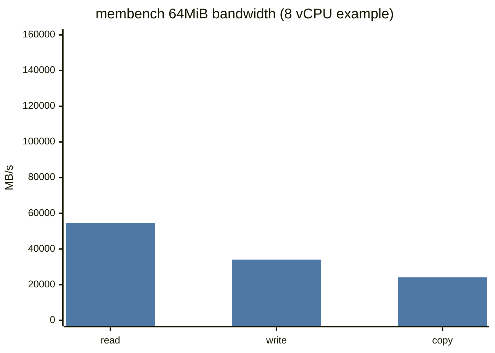
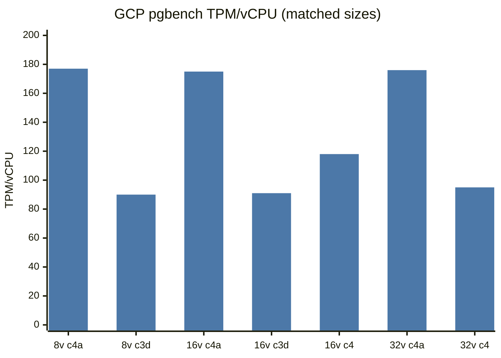

# AMD vs Graviton pgbench crossover — cause analysis

> **Finding under test:** On AWS, for 8/16/32 vCPU instances the latest AMD (e.g. `c8a`) beats the latest Graviton (e.g. `c9g`) on heavy read-only pgbench, while at ≥64 vCPUs Graviton wins. The same size-dependent flip does **not** appear on GCP, where latest ARM (Axion `c4a`) beats latest AMD (`c3d`) even at small sizes.

**Data sources:** Spare Cores catalog (`~/tmp/sc-data-all.db`) + `sc-inspector-data` raw outputs for GCP rows not yet ingested. Extracted tables live in [`amd-vs-graviton-analysis/`](amd-vs-graviton-analysis/).

**Workloads compared:**
- `pgbench:heavy_read_only:peak` / `:single` (TPM)
- `stress_ng:best1` / `bestn` (div16) + full-thread `cpu`, `memcpy`, `stream` from `stressng_benchmarks`
- `membench` bandwidth/latency across working-set sizes
- PassMark memory suite + Redis RPS (supporting shared-memory evidence)
- **vLLM CPU serving** (`sc-inspector-data/.../vllm/stdout`, not yet in catalog) + catalog `llm_speed` (llama.cpp-style)

---

## Executive summary

1. **The AWS crossover is real and sharp:** `c8a` (EPYC 9R45 / Turin) leads by **+12–24%** at 2–32 vCPUs, is roughly tied at 48, then **loses by 4 / 18 / 21%** at 64 / 96 / 192.
2. **It is not a raw-CPU story.** stress-ng div16 and the stress-ng `cpu` stressor show AMD ahead by **~1.88×** and **~5–6×** at *every* size. Single-connection pgbench also stays AMD-favoring (**~1.15–1.26×**) at every size.
3. **It is a multi-client scaling cliff on AMD.** Per-vCPU pgbench TPM on `c8a` falls from **242 → 151** (−38%) from 8→192 vCPUs; `c9g` stays nearly flat (**204 → 191**, −7%).
4. **Memory-subsystem microbenchmarks track the flip:** stress-ng `memcpy`, membench DRAM **write/copy**, and PassMark memory latency all favor Graviton, and AMD’s relative `memcpy` weakens further as size grows — the same direction as pgbench.
5. **vLLM (memory-intensive LLM serving) agrees with the memory story, not with stress-ng:** peak output throughput already favors `c9g` from ~8 vCPUs (ratio ≈0.99 → 0.80 at 192). Single-stream decode favors Graviton at *every* size. On GCP, Axion beats Genoa ~2× at 16 vCPU — same as pgbench.
6. **GCP has no crossover** because Axion’s memory system dominates Genoa so strongly that ARM wins pgbench by **~1.9–2.0× per vCPU** even where AMD still wins pure ALU stress-ng.

**Best causal reading:** small-size pgbench is largely **cache/ALU bound** (Turin’s per-core win), while large-size multi-client pgbench becomes **shared-memory / coherency / DRAM-write bound**, where Neoverse-V3’s memory path stays efficient and Turin CCD-cross traffic + weaker write bandwidth erode AMD’s lead. Purely memory-bound serving (vLLM) never gives AMD that small-size refuge.

---

## 1. Instance identities

| Cloud | Family | CPU | ISA | L2 / core | L3 topology (guest view) | Memory notes |
|-------|--------|-----|-----|-----------|--------------------------|--------------|
| AWS | `c8a` | AMD EPYC **9R45** (Turin) | x86_64 | 1 MiB | 32 MiB per CCX; total L3 grows with CCD count | DDR5-6400 advertised |
| AWS | `c9g` | AWS **Neoverse-V3** | arm64 | **2 MiB** | 48 MiB shared (96 MiB once 2 complexes appear) | PassMark DRAM latency ≪ AMD |
| AWS | `c8g` | Neoverse-V2 (Graviton4) | arm64 | 2 MiB | 36 MiB shared | Control: never overtakes `c8a` on pgbench |
| GCP | `c4a-*` | Google Axion **Neoverse-V2** | arm64 | 2 MiB | ~80 MiB L3 (where reported) | DRAM BW ≫ `c3d` |
| GCP | `c3d-*` | AMD EPYC **9B14** (Genoa) | x86_64 | 1 MiB | 32 MiB CCX | Much weaker DRAM BW in membench |

Matched compute sizes used for AWS: 2, 4, 8, 16, 32, 48, 64, 96, 192 vCPUs (`large` … `48xlarge`). Metal SKUs excluded.

---

## 2. Confirming the pgbench phenomenon (AWS)

### Peak heavy RO TPM

| vCPUs | c8a TPM | c9g TPM | c8a/c9g | c8a TPM/vCPU | c9g TPM/vCPU | Winner |
|------:|--------:|--------:|--------:|-------------:|-------------:|:------:|
| 2 | 492 | 397 | 1.239 | 246.0 | 198.5 | c8a |
| 4 | 974 | 824 | 1.182 | 243.5 | 206.0 | c8a |
| 8 | 1,940 | 1,634 | 1.187 | 242.5 | 204.2 | c8a |
| 16 | 3,818 | 3,250 | 1.175 | 238.6 | 203.1 | c8a |
| 32 | 7,239 | 6,477 | 1.118 | 226.2 | 202.4 | c8a |
| 48 | 10,047 | 9,720 | 1.034 | 209.3 | 202.5 | c8a |
| 64 | 12,207 | 12,671 | 0.963 | 190.7 | 198.0 | **c9g** |
| 96 | 15,577 | 19,041 | 0.818 | 162.3 | 198.3 | **c9g** |
| 192 | 29,046 | 36,644 | 0.793 | 151.3 | 190.9 | **c9g** |

```mermaid
---
config:
  themeVariables:
    xyChart:
      plotColorPalette: "#c44e52, #4c78a8"
---
xychart-beta
    title "pgbench heavy RO peak TPM (AWS)"
    x-axis [2, 4, 8, 16, 32, 48, 64, 96, 192]
    y-axis "TPM" 0 --> 40000
    line "c8a AMD" [492, 974, 1940, 3818, 7239, 10047, 12207, 15577, 29046 "c8a"]
    line "c9g Grav" [397, 824, 1634, 3250, 6477, 9720, 12671, 19041, 36644 "c9g"]
```

_Crossover between 48 and 64 vCPUs (annotated on the ratio chart below)._

```mermaid
---
config:
  themeVariables:
    xyChart:
      plotColorPalette: "#59a14f"
---
xychart-beta
    title "c8a/c9g pgbench peak ratio (>1 = AMD wins)"
    x-axis [2, 4, 8, 16, 32, 48, 64, 96, 192]
    y-axis "ratio" 0.7 --> 1.3
    line "c8a/c9g" [1.239, 1.182, 1.187, 1.175, 1.118, 1.034, 0.963, 0.818, 0.793 "ratio"]
```

### Per-vCPU efficiency (the smoking gun)

Relative to each family’s own 8-vCPU baseline:

| vCPUs | c8a TPM/v | vs 8v | c9g TPM/v | vs 8v |
|------:|----------:|------:|----------:|------:|
| 8 | 242.5 | 1.000 | 204.2 | 1.000 |
| 16 | 238.6 | 0.984 | 203.1 | 0.994 |
| 32 | 226.2 | 0.933 | 202.4 | 0.991 |
| 48 | 209.3 | 0.863 | 202.5 | 0.991 |
| 64 | 190.7 | 0.787 | 198.0 | 0.969 |
| 96 | 162.3 | 0.669 | 198.3 | 0.971 |
| 192 | 151.3 | 0.624 | 190.9 | 0.934 |

```mermaid
---
config:
  themeVariables:
    xyChart:
      plotColorPalette: "#c44e52, #4c78a8"
---
xychart-beta
    title "pgbench TPM per vCPU (efficiency)"
    x-axis [8, 16, 32, 48, 64, 96, 192]
    y-axis "TPM/vCPU" 140 --> 260
    line "c8a" [242.5, 238.6, 226.2, 209.3, 190.7, 162.3, 151.3 "c8a"]
    line "c9g" [204.2, 203.1, 202.4, 202.5, 198.0, 198.3, 190.9 "c9g"]
```

AMD starts higher but collapses; Graviton is flatter and crosses AMD’s per-vCPU line near 64.

### Control: `c8a` vs `c8g` (Graviton4 / V2)

`c8a` stays ahead of `c8g` at **every** size (ratio 1.57 → 1.07). The AWS flip is therefore specific to **c9g / Neoverse-V3**, not “any Graviton.”

| vCPUs | c8a | c8g | c8a/c8g |
|------:|----:|----:|--------:|
| 8 | 1,940 | 1,314 | 1.476 |
| 32 | 7,239 | 5,206 | 1.391 |
| 64 | 12,207 | 10,128 | 1.205 |
| 96 | 15,577 | 15,103 | 1.031 |
| 192 | 29,046 | 27,093 | 1.072 |

---

## 3. stress-ng: rules out “AMD is slower at large sizes”

### div16 best1 / bestn (catalog scores)

| vCPUs | best1 c8a/c9g | bestn c8a/c9g | parallel efficiency c8a | c9g |
|------:|--------------:|--------------:|------------------------:|----:|
| 8 | 1.879 | 1.877 | ~1.00 | ~1.00 |
| 32 | 1.881 | 1.880 | ~1.00 | ~1.00 |
| 64 | 1.870 | 1.891 | ~1.00 | ~1.00 |
| 96 | 1.884 | 1.827 | ~0.97 | ~1.00 |
| 192 | 1.891 | 1.798 | ~0.94 | ~0.99 |

```mermaid
---
config:
  themeVariables:
    xyChart:
      plotColorPalette: "#c44e52, #4c78a8"
---
xychart-beta
    title "stress-ng bestn (div16) — AMD wins everywhere"
    x-axis [2, 4, 8, 16, 32, 48, 64, 96, 192]
    y-axis "bogo ops/s" 0 --> 720000
    line "c8a" [7518, 15072, 30083, 59719, 120279, 179310, 238556, 350849, 683823 "c8a"]
    line "c9g" [4001, 8025, 16027, 32048, 63992, 96125, 126149, 192014, 380394 "c9g"]
```

ALU-heavy stress-ng **never** reproduces the pgbench crossover. If anything, AMD’s absolute multi-core compute lead is enormous at 192 vCPUs too.

### Full-thread `cpu` vs `memcpy` (from `stressng_benchmarks`)

| vCPUs | cpu c8a/c9g | memcpy c8a/c9g | stream c8a/c9g |
|------:|------------:|---------------:|---------------:|
| 2 | 5.86 | **0.84** | 7.28 |
| 8 | 5.92 | **0.84** | 0.56 |
| 16 | 5.85 | **0.83** | 0.90 |
| 32 | 5.78 | **0.83** | 1.04 |
| 48 | 5.84 | **0.79** | 0.87 |
| 64 | 5.57 | **0.76** | 1.76 |
| 96 | 4.81 | **0.67** | 1.30 |
| 192 | 5.01 | **0.71** | 1.28 |

```mermaid
---
config:
  themeVariables:
    xyChart:
      plotColorPalette: "#e15759, #76b7b2, #59a14f"
---
xychart-beta
    title "c8a/c9g microbench ratios (pgbench + memcpy + stress best1)"
    x-axis [2, 4, 8, 16, 32, 48, 64, 96, 192]
    y-axis "ratio (>1 AMD)" 0.5 --> 2.0
    line "pgbench peak" [1.239, 1.182, 1.187, 1.175, 1.118, 1.034, 0.963, 0.818, 0.793 "pg"]
    line "memcpy N" [0.843, 0.818, 0.841, 0.834, 0.830, 0.793, 0.760, 0.670, 0.714 "mc"]
    line "stress best1" [1.878, 1.877, 1.879, 1.883, 1.881, 1.880, 1.870, 1.884, 1.891 "st"]
```

**Interpretation:** compute stressors stay AMD-dominated; the memory-movement stressor (`memcpy`) stays Graviton-dominated and *worsens* for AMD with size — same qualitative shape as pgbench peak ratio (though memcpy never crosses 1.0 because Graviton already wins memcpy at small sizes).

---

## 4. membench: cache win for AMD, DRAM write/latency win for Graviton

### Cache-resident read (32 KiB) — AMD usually ahead

| vCPUs | c8a MB/s | c9g MB/s | c8a/c9g |
|------:|---------:|---------:|--------:|
| 8 | 1,052,218 | 889,841 | 1.18 |
| 32 | 4,186,119 | 3,545,974 | 1.18 |
| 64 | 7,276,317 | 7,040,687 | 1.03 |
| 96 | 6,200,872 | 10,617,018 | **0.58** |
| 192 | 18,665,291 | 20,029,342 | 0.93 |

Small-size cache BW mirrors the AMD pgbench lead; at the largest SKUs Graviton catches up even in L1-sized tests (likely aggregate interconnect / uncore effects).

### DRAM window (64 MiB) — writes tell the story

| vCPUs | read c8a/c9g | write c8a/c9g | copy c8a/c9g | lat ratio (higher=AMD better) |
|------:|-------------:|--------------:|-------------:|------------------------------:|
| 4 | 0.49 | **0.29** | 0.37 | 0.70 |
| 8 | 0.37 | **0.22** | 0.34 | 1.11 |
| 16 | 0.59 | **0.37** | 0.55 | 0.67 |
| 32 | 1.20 | **0.76** | 0.97 | 0.65 |
| 64 | 1.24 | **0.59** | 0.76 | 1.00 |
| 96 | 1.42 | **0.57** | 0.80 | 0.43 |
| 192 | 1.42 | **0.57** | 0.79 | 0.45 |



_At 8 vCPUs: c8a bars above are dwarfed by c9g read/write/copy ≈ 147800 / 154309 / 71843 MB/s._

```mermaid
---
config:
  themeVariables:
    xyChart:
      plotColorPalette: "#4c78a8, #c44e52"
---
xychart-beta
    title "DRAM write BW @ 64MiB (MB/s)"
    x-axis [4, 8, 16, 32, 48, 64, 96, 192]
    y-axis "MB/s" 0 --> 700000
    line "c9g" [127306, 154309, 183351, 167050, 167641, 310859, 334796, 660990 "c9g"]
    line "c8a" [36680, 34018, 68445, 126934, 159214, 184090, 190856, 376456 "c8a"]
```

Notable asymmetry: AMD can win **DRAM read** at ≥32 vCPUs, yet remains far behind on **write** and usually **copy**. Multi-client Postgres (even “read-only”) still dirties proc/buffer headers, updates stats, and pays coherency writebacks — write/copy paths matter.

### PassMark memory latency (single-number corroboration)

| Instance | c8a lat (lower better) | c9g lat | AMD/Grav (inverted: >1 AMD better) |
|----------|-----------------------:|--------:|-----------------------------------:|
| 2xlarge (8) | 87.0 | 30.2 | 0.35 |
| 8xlarge (32) | ~same gap | | ~0.33 |
| 24xlarge (96) | | | ~0.33 |

Graviton’s DRAM latency advantage is roughly **3×** and size-invariant — a standing tax on AMD for any miss-heavy shared structure.

### Working-set sweep at 8 & 64 vCPUs (read BW)

```mermaid
---
config:
  themeVariables:
    xyChart:
      plotColorPalette: "#c44e52, #4c78a8"
---
xychart-beta
    title "membench read BW vs size @ 8 vCPU (MB/s)"
    x-axis ["32K", "1M", "2M", "8M", "16M", "32M", "64M", "128M"]
    y-axis "MB/s" 0 --> 1100000
    line "c8a" [1052218, 919122, 849406, 184497, 82124, 57484, 54599, 53377 "c8a"]
    line "c9g" [889841, 672064, 553268, 0, 177900, 145967, 147800, 143302 "c9g"]
```

_At 8 vCPU AMD dominates while the working set fits in private caches; once past ~8–16 MiB Graviton pulls ahead. (c9g 8M point missing in catalog → plotted as 0.)_

```mermaid
---
config:
  themeVariables:
    xyChart:
      plotColorPalette: "#c44e52, #4c78a8"
---
xychart-beta
    title "membench read BW vs size @ 64 vCPU (MB/s)"
    x-axis ["32K", "1M", "2M", "16M", "32M", "64M", "128M"]
    y-axis "MB/s" 0 --> 7500000
    line "c8a" [7276317, 5745925, 5069712, 602585, 430857, 405854, 395858 "c8a"]
    line "c9g" [7040687, 5197384, 1928518, 375064, 329739, 328068, 314537 "c9g"]
```

At 64 vCPU the mid-size (2 MiB) cliff is harsher on Graviton (still only 48→96 MiB L3 complex), but AMD’s absolute DRAM write disadvantage remains.

---

## 5. Single-connection pgbench: AMD never loses

| vCPUs | c8a single TPM | c9g single TPM | ratio |
|------:|---------------:|---------------:|------:|
| 2 | 240 | 210 | 1.14 |
| 8 | 250 | 214 | 1.17 |
| 32 | 247 | 201 | 1.23 |
| 64 | 255 | 202 | 1.26 |
| 96 | 251 | 200 | 1.26 |
| 192 | 244 | 212 | 1.15 |

Single-connection RO stays on AMD’s side at every size. The crossover therefore requires **concurrency** (many backends contending on shared state), not a regression in AMD’s per-thread Postgres path.

---

## 6. Supporting workload: Redis RPS (same shape)

| Size | c8a/c9g redis:rps | c8a/c9g redis:rps-extrapolated |
|------|------------------:|-------------------------------:|
| large (2) | 1.48 | 1.31 |
| 2xlarge (8) | 1.45 | 1.29 |
| 8xlarge (32) | 1.46 | 1.30 |
| 16xlarge (64) | 1.24 | 1.13 |
| 24xlarge (96) | 1.10 | 1.04 |
| 48xlarge (192) | 1.02 | **0.97** |

Redis — another shared-heap, many-client service — shows the **same compression of AMD’s lead** with size, and the extrapolated score flips at 192. That is independent confirmation that the issue is not Postgres-specific SQL, but **highly concurrent shared-memory services**.

---

## 7. Supporting workload: vLLM (memory-intensive)

vLLM CPU serving results live in inspector-data (`vllm/stdout` NDJSON) for essentially the full `c8a` / `c9g` / `c8g` ladder; they are **not** yet ingested as `benchmark_score` rows. Catalog **does** have related `llm_speed:*` (llama.cpp GGUF) scores.

Setup on these runs: model **SmolLM2-135M-Instruct**, `mode=cpu`, chat workload, autoconfig sweep (`tuning_version=9`). Metrics below are peak `output_throughput` (tokens/sec) for fixed **prompt=256 / output=128**.

### Peak serving throughput (strategy=`throughput`)

| vCPUs | c8a tok/s | c9g tok/s | c8a/c9g | Winner |
|------:|----------:|----------:|--------:|:------:|
| 4 | 425 | 416 | 1.023 | c8a (tie) |
| 8 | 752 | 761 | 0.988 | **c9g** |
| 16 | 938 | 1,157 | 0.811 | **c9g** |
| 32 | 1,826 | 2,111 | 0.865 | **c9g** |
| 48 | 2,624 | 2,835 | 0.925 | **c9g** |
| 64 | 3,331 | 3,997 | 0.833 | **c9g** |
| 96 | 4,596 | 5,732 | 0.802 | **c9g** |
| 192 | 8,433 | 10,592 | 0.796 | **c9g** |

```mermaid
---
config:
  themeVariables:
    xyChart:
      plotColorPalette: "#c44e52, #4c78a8"
---
xychart-beta
    title "vLLM peak output throughput (tok/s, p256/o128)"
    x-axis [4, 8, 16, 32, 48, 64, 96, 192]
    y-axis "tokens/sec" 0 --> 11000
    line "c8a" [425, 752, 938, 1826, 2624, 3331, 4596, 8433 "c8a"]
    line "c9g" [416, 761, 1157, 2111, 2835, 3997, 5732, 10592 "c9g"]
```

```mermaid
---
config:
  themeVariables:
    xyChart:
      plotColorPalette: "#59a14f, #e15759"
---
xychart-beta
    title "c8a/c9g ratios: pgbench peak vs vLLM peak (>1 = AMD)"
    x-axis [4, 8, 16, 32, 48, 64, 96, 192]
    y-axis "ratio" 0.7 --> 1.3
    line "pgbench" [1.182, 1.187, 1.175, 1.118, 1.034, 0.963, 0.818, 0.793 "pg"]
    line "vLLM" [1.023, 0.988, 0.811, 0.865, 0.925, 0.833, 0.802, 0.796 "vl"]
```

Longer prompts (1024/256) look the same or worse for AMD (ratio 0.93 → 0.74). Peak `total_throughput` at 192 vCPU is **0.74×** vs Graviton.

### Single-stream decode (strategy=`synchronous`)

| vCPUs | c8a tok/s | c9g tok/s | c8a/c9g |
|------:|----------:|----------:|--------:|
| 4 | 97 | 120 | 0.81 |
| 8 | 97 | 128 | 0.76 |
| 16 | 107 | 175 | 0.61 |
| 32 | 111 | 185 | 0.60 |
| 64 | 110 | 182 | 0.60 |
| 96 | 110 | 189 | 0.58 |
| 192 | 109 | 188 | 0.58 |

Unlike pgbench’s single-connection path (AMD always wins), **vLLM single-stream decode favors Graviton at every size**. That matches a bandwidth/latency-bound token-generation loop more than an ALU-bound Postgres executor.

### Catalog `llm_speed` (llama.cpp) — prefill vs generate

`llm_speed:prompt_processing` (prefill, tokens=512) still favors AMD, but the lead **compresses with size** — same qualitative memory-pressure pattern:

| vCPUs | llama-7b prompt c8a/c9g | llama-7b text_gen @128 (noisy) |
|------:|------------------------:|-------------------------------:|
| 16 | 2.79 | 0.78 |
| 32 | 2.48 | 1.58 |
| 64 | 1.99 | 6.81† |
| 96 | 1.56 | 2.02 |
| 192 | 1.27 | 2.91 |

† `text_generation` absolute scores jump around across sizes (likely threading/batch config sensitivity); treat generate ratios as secondary to vLLM serving and to prompt-processing.

### GCP vLLM snapshot

| Instance | Peak output tok/s |
|----------|------------------:|
| `c4a-standard-16` | 756 |
| `c3d-standard-16` | 375 |
| Ratio Axion/Genoa | **2.01** |

Same ~2× ARM win as GCP pgbench at 16 vCPU — again memory-path dominance, no small-size AMD comeback.

### How this fits the causal model

| Workload | Small SKU winner | Large SKU winner | Bound on |
|----------|------------------|------------------|----------|
| stress-ng div16 / `cpu` | AMD | AMD | ALU |
| pgbench single | AMD | AMD | per-thread Postgres |
| pgbench multi peak | **AMD** | **Graviton** | cache → shared mem |
| Redis RPS | AMD | ~tie / slight Grav | shared heap |
| **vLLM serving** | **~Graviton** | **Graviton** | DRAM / memcpy-like |
| **vLLM sync decode** | **Graviton** | **Graviton** | DRAM latency/BW |

vLLM is the clean “memory-intensive application” control: it never shows the AMD small-size win that pgbench does, and it widens Graviton’s lead with size — consistent with membench write/copy and stress-ng `memcpy`, not with stress-ng `cpu`.

---

## 8. Topology notes (necessary but not sufficient)

| Family | First multi-socket | First multi-NUMA (guest) | L3 growth |
|--------|--------------------|--------------------------|-----------|
| c8a | 192 vCPU (2S) | 192 | L3 slices grow 32→768 MiB total |
| c9g | always 1S in sample | 64 & 192 (2 nodes) | 48 MiB until second complex (96 MiB) |
| c8g | 192 | 192 | 36 MiB (72 at 192) |

The pgbench flip at **64** coincides with `c9g` exposing 2 NUMA nodes, but:
- `c9g.24xlarge` (96) reports 1 NUMA node yet **widens** Graviton’s lead, and
- `c8a` is still single-NUMA at 64/96 while already losing.

So NUMA node count alone does not explain it. More plausible is AMD’s **CCD/CCX private L3**: once backends and buffer headers span many CCDs, invalidation/writeback traffic grows faster than on Graviton’s larger shared L3 + stronger DRAM write path.

---

## 9. GCP contrast — why there is no crossover

### pgbench (from inspector-data; not all rows in DB yet)

Per-vCPU normalized nearest-size ARM vs AMD:

| ARM instance | TPM | vCPU | AMD neighbor | TPM | vCPU | ARM/AMD per-vCPU |
|--------------|----:|-----:|--------------|----:|-----:|-----------------:|
| c4a-highmem-8 | 1,418 | 8 | c3d-highmem-8 | 716 | 8 | **1.98** |
| c4a-standard-16 | 2,807 | 16 | c3d-standard-16 | 1,452 | 16 | **1.93** |
| c4a-standard-32 | 5,632 | 32 | c3d-highcpu-16 ×2 norm | — | — | **~1.93** |
| c4a-highcpu-64 | 11,268 | 64 | c3d-highcpu-90 | 7,943 | 90 | **2.00** |



Axion wins at **small and large** alike. Older Ampere `t2a` only barely beats `c3d` at 16 vCPU (1.11×) — the “ARM always wins on GCP” claim is specifically about **Axion**, not all ARM.

### GCP stress-ng vs membench (16 vCPU)

| Metric | c4a-standard-16 | c3d-standard-16 | winner |
|--------|----------------:|----------------:|:------:|
| stress `cpu` @1 | 367 | 1,670 | **AMD 4.6×** |
| stress `cpu` @16 | 5,818 | 20,046 | **AMD 3.4×** |
| stress `memcpy` @16 | 12,226 | 3,412 | **ARM 3.6×** |
| membench read 64 MiB | 237,139 | 37,325 | **ARM 6.4×** |
| membench write 64 MiB | 204,492 | 12,777 | **ARM 16×** |
| pgbench peak | 2,807 | 1,452 | **ARM 1.93×** |

On GCP the pattern is even clearer: **ALU stress-ng still loves AMD**, but DRAM bandwidth is so one-sided toward Axion that pgbench (and memcpy) follow memory, not div16.

### Why AWS ≠ GCP for this finding

| Factor | AWS c8a vs c9g | GCP c3d vs c4a |
|--------|----------------|----------------|
| AMD generation | **Turin** (strongest) | **Genoa** (prior gen) |
| ARM generation | **V3** (c9g) | **V2 Axion** |
| AMD single-thread gap vs ARM | Huge (stress best1 ~1.88×, cpu ~5×) | Still huge on cpu (~4.5×) |
| DRAM write / memcpy | Graviton ahead, moderate | Axion **massively** ahead |
| Net on small pgbench | AMD compute win dominates | ARM memory win already dominates |
| Net on large pgbench | Memory/coherency dominates → flip | ARM still dominates |

So the AWS size flip is a **knife-edge** between Turin’s compute lead and V3’s memory/scaling lead. GCP pairs a weaker AMD with an ARM platform whose memory subsystem leaves no room for a small-size AMD comeback on this workload.

---

## 10. Causal model

```text
                    ┌─────────────────────────────┐
   small N clients  │  Working set ≈ private L1/L2 │
   / small SKUs     │  + modest shared L3          │
                    │  Bound on: ALU / decode /    │
                    │  branch (stress-ng cpu/div16)│
                    │  ⇒ Turin (c8a) wins           │
                    └──────────────┬──────────────┘
                                   │ as vCPUs & clients grow
                                   ▼
                    ┌─────────────────────────────┐
   large N clients  │  Many backends × shared      │
   / large SKUs     │  Postgres structures         │
                    │  Bound on: cache coherency,  │
                    │  DRAM writes, memcpy-like    │
                    │  movement, remote L3 (CCDs)  │
                    │  ⇒ Neoverse-V3 (c9g) wins    │
                    └─────────────────────────────┘
```

**Evidence mapping**

| Hypothesis | Verdict | Evidence |
|------------|---------|----------|
| AMD compute gets worse at large sizes | **Rejected** | stress best1/bestn & `cpu` ratios flat/high |
| Postgres single-thread path favors Graviton at large | **Rejected** | single TPM AMD-favoring at all sizes |
| Multi-client scaling differs | **Accepted** | TPM/vCPU cliff on c8a only |
| Memory bandwidth/latency drives large-size outcome | **Accepted** | memcpy, DRAM write/copy, PassMark lat, Redis, **vLLM** |
| Pure NUMA node count | **Weak / insufficient** | Flip while c8a still 1-NUMA; c9g lead grows on 1-NUMA 96xl |
| “All Graviton beat AMD at large” | **Rejected** | c8g never beats c8a on pgbench |
| Same flip on GCP Axion vs AMD | **Rejected** | Axion ~2× at 8 through 64+ vCPU (pgbench + vLLM) |
| Memory-bound apps should flip like pgbench | **Partially** | vLLM favors Graviton even at small sizes — no AMD refuge |

---

## 11. Practical takeaways

1. **For AWS pgbench-like OLTP RO:** prefer `c8a` up through ~32–48 vCPUs; prefer `c9g` from 64 vCPUs up (and increasingly so at 96/192).
2. **For AWS vLLM/CPU LLM serving:** prefer `c9g` across the size range we measured (already ahead by 8 vCPUs).
3. **Do not use stress-ng div16/bestn alone** to pick between these SKUs for databases or LLM serving — it systematically overstates AMD’s advantage for memory-bound / shared-memory services.
4. **membench DRAM write + stress-ng memcpy + vLLM** are better leading indicators for this class of workloads than ALU stressors.
5. **On GCP**, for pgbench and vLLM, Axion `c4a` is the default vs Genoa `c3d` across the sizes we measured; there is no AMD small-size refuge comparable to AWS Turin vs Graviton V3.
6. Generational caveat: comparing AWS Turin↔V3 is not the same silicon matchup as GCP Genoa↔Axion V2 — the AWS pgbench flip is a property of *that* pair.

---

## 12. Method notes

- AWS scores: `benchmark_score` where `vendor_id='aws'`, `resource_type='SERVER'`, families `c8a`/`c9g`/`c8g`, excluding `metal`.
- GCP pgbench/membench/stress: parsed from `sc-inspector-data/data/gcp/**` (compute-instance pgbench rows largely absent from the snapshot DB; DBaaS `db-c4a-*` rows exist separately and were not used for the compute comparison).
- **vLLM:** parsed from `sc-inspector-data/data/{aws,gcp}/**/vllm/stdout` NDJSON; peak = max `output_throughput` for the stated prompt/output shape. Not present in `benchmark_score` as of this DB snapshot. Related catalog metrics: `llm_speed:prompt_processing` / `llm_speed:text_generation`.
- Charts follow the mermaid `xychart-beta` style used in [`RESULTS.md`](RESULTS.md), with series labels on the final point for readability.
- Raw extracts: [`amd-vs-graviton-analysis/scores.csv`](amd-vs-graviton-analysis/scores.csv), [`amd-vs-graviton-analysis/gcp_scores.csv`](amd-vs-graviton-analysis/gcp_scores.csv).

---

## 13. Open questions / follow-ups

1. Pin Postgres backends + memory with NUMA interleave vs compact on `c8a.16xlarge+` and re-measure — does the cliff shrink?
2. Breakdown pgbench wait events (`LWLock`, `buffer_mapping`, spinlocks) at 32 vs 96 vCPU on both families.
3. Re-run after GCP Turin-class AMD lands, to see whether a size flip appears once AMD compute catches Turin-level while keeping Genoa-like memory topology.
4. Check whether `c9g`’s 64-vCPU 2-NUMA presentation is a packaging artifact and how it interacts with the Postgres memory allocator.
5. Ingest vLLM serving scores into the catalog so size ladders are queryable without parsing NDJSON; compare larger CPU models once available.
