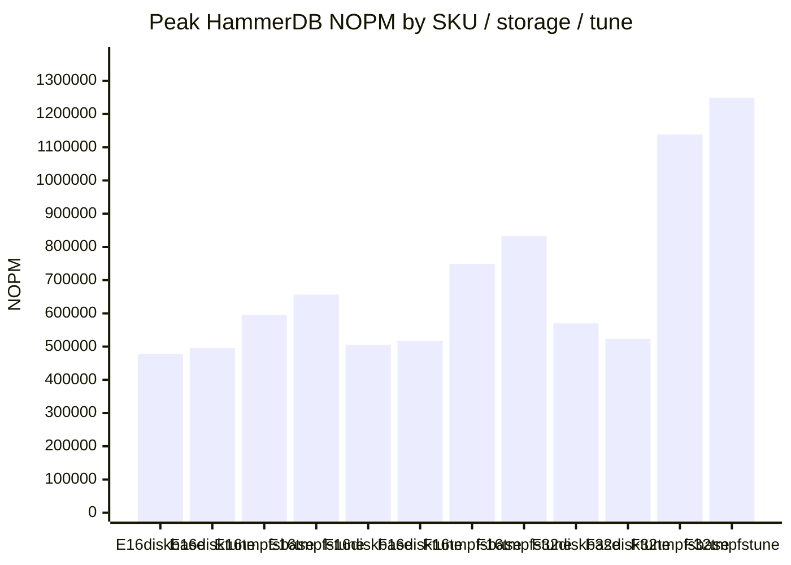
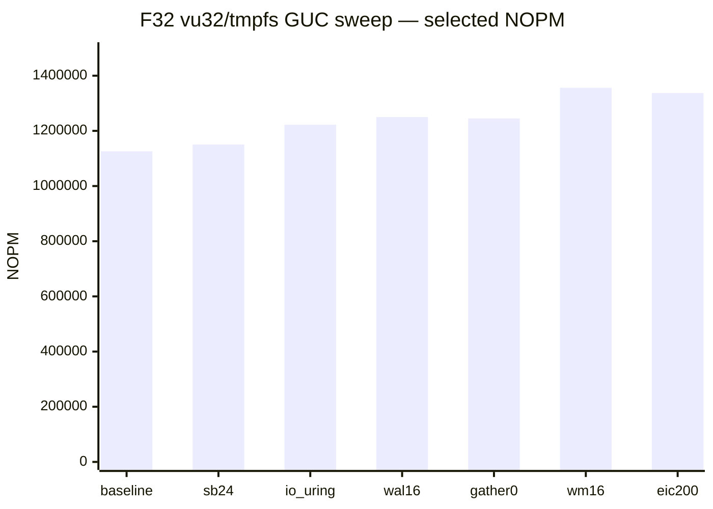

# Database benchmark results — run3

Baseline (25%/75% buffers, default I/O) vs host-tuned GUCs ([`pg_tune_gucs.py`](scripts/pg_tune_gucs.py), `io_uring` when available). All containers `--privileged`. HammerDB TPROC-C + BenchBase wikipedia/ycsb. Disk = anonymous Docker volume on Premium_LRS; tmpfs = `max(16, 50% RAM)` on `/var/lib/postgresql`.

> **Status:** run3 complete on E16 / F16 / F32 (8 suites × 3 SKUs, all rungs ok).

## Setup

| Item | Value |
|------|-------|
| Workloads | HammerDB TPROC-C; BenchBase wikipedia + ycsb |
| VU / terminal ladder | 4, 8, 16, 32, 64 |
| WH / schema sizing | 5 WH/VU (HammerDB); BenchBase SF matched to same footprint |
| Rampup / duration | 2 min / 5 min |
| Postgres | `postgres:18`, `synchronous_commit=off` |
| Baseline GUCs | 25% `shared_buffers`, 75% `effective_cache_size` |
| Tuned GUCs | `--pg-tune-host` (io_uring, OLTP sweep winners) |
| Region | Azure NewZealandNorth |

| SKU | vCPUs | RAM | baseline SB | tuned SB (disk) | tuned SB (tmpfs) |
|-----|-------|-----|-------------|-----------------|------------------|
| E16as_v6 | 16 | 126 GiB | 31 GB | 31 GB | 12 GB (10% cap) |
| F16ams_v6 | 16 | 126 GiB | 31 GB | 31 GB | 12 GB (10% cap) |
| F32ams_v6 | 32 | 252 GiB | 62 GB | 62 GB | 24 GB (10% cap) |

## Peak HammerDB NOPM

| SKU | Storage | Baseline peak | Tuned peak | Δ |
|-----|---------|---------------|------------|---|
| E16 | disk | 478,643 (vu16) | 495,548 (vu16) | +3.5% |
| E16 | tmpfs | 594,626 (vu16) | 656,556 (vu16) | +10.4% |
| F16 | disk | 505,046 (vu16) | 516,934 (vu16) | +2.4% |
| F16 | tmpfs | 748,911 (vu16) | 832,165 (vu16) | +11.1% |
| F32 | disk | 569,925 (vu16) | 523,248 (vu16) | -8.2% |
| F32 | tmpfs | 1,138,242 (vu32) | 1,249,245 (vu32) | +9.8% |



_Each bar is labeled on the x-axis._

## Peak BenchBase TPM

| SKU | Storage | WL | Baseline peak | Tuned peak | Δ |
|-----|---------|----|---------------|------------|---|
| E16 | disk | wikipedia | 527,038 (vu16) | 506,826 (vu16) | -3.8% |
| E16 | disk | ycsb | 5,124,619 (vu16) | 3,799,978 (vu16) | -25.8% |
| E16 | tmpfs | wikipedia | 533,647 (vu16) | 536,364 (vu16) | +0.5% |
| E16 | tmpfs | ycsb | 7,315,777 (vu32) | 7,464,667 (vu16) | +2.0% |
| F16 | disk | wikipedia | 765,140 (vu16) | 728,429 (vu16) | -4.8% |
| F16 | disk | ycsb | 4,608,459 (vu16) | 3,896,383 (vu8) | -15.5% |
| F16 | tmpfs | wikipedia | 799,750 (vu16) | 797,790 (vu16) | -0.2% |
| F16 | tmpfs | ycsb | 8,042,367 (vu32) | 7,853,204 (vu32) | -2.4% |
| F32 | disk | wikipedia | 822,666 (vu32) | 829,322 (vu32) | +0.8% |
| F32 | disk | ycsb | 3,782,995 (vu8) | 3,698,095 (vu8) | -2.2% |
| F32 | tmpfs | wikipedia | 950,716 (vu32) | 946,274 (vu32) | -0.5% |
| F32 | tmpfs | ycsb | 11,939,674 (vu32) | 12,674,274 (vu32) | +6.2% |

## HammerDB — disk

### baseline

| SKU | vCPUs | VU | WH | VU/vCPU | NOPM | TPM | NOPM/VU | Build (s) |
|-----|-------|----|----|---------|------|-----|---------|-----------|
| E16 | 16 | 4 | 20 | 0.25 | 268,403 | 616,472 | 67100.8 | 85.3 |
| E16 | 16 | 8 | 40 | 0.5 | 372,917 | 859,343 | 46614.6 | 103.0 |
| E16 | 16 | 16 | 80 | 1 | 478,643 | 1,100,224 | 29915.2 | 225.7 |
| E16 | 16 | 32 | 160 | 2 | 382,906 | 879,967 | 11965.8 | 400.7 |
| E16 | 16 | 64 | 320 | 4 | 209,903 | 482,034 | 3279.7 | 777.3 |
| F16 | 16 | 4 | 20 | 0.25 | 269,496 | 621,305 | 67374.0 | 85.9 |
| F16 | 16 | 8 | 40 | 0.5 | 408,368 | 939,648 | 51046.0 | 102.6 |
| F16 | 16 | 16 | 80 | 1 | 505,046 | 1,157,239 | 31565.4 | 217.1 |
| F16 | 16 | 32 | 160 | 2 | 504,899 | 1,158,969 | 15778.1 | 389.7 |
| F16 | 16 | 64 | 320 | 4 | 281,172 | 645,234 | 4393.3 | 798.5 |
| F32 | 32 | 4 | 20 | 0.125 | 266,643 | 614,747 | 66660.8 | 86.5 |
| F32 | 32 | 8 | 40 | 0.25 | 367,413 | 843,594 | 45926.6 | 107.1 |
| F32 | 32 | 16 | 80 | 0.5 | 569,925 | 1,313,730 | 35620.3 | 246.1 |
| F32 | 32 | 32 | 160 | 1 | 526,278 | 1,206,341 | 16446.2 | 442.6 |
| F32 | 32 | 64 | 320 | 2 | 438,387 | 1,004,702 | 6849.8 | 889.0 |

```mermaid
---
config:
  themeVariables:
    xyChart:
      plotColorPalette: "#4e79a7, #f28e2b, #e15759"
---
xychart-beta
    title "NOPM vs VU (disk, baseline)"
    x-axis [vu4, vu8, vu16, vu32, vu64]
    y-axis "NOPM" 0 --> 627000
    line "E16" [268403, 372917, 478643, 382906, 209903 "E16"]
    line "F16" [269496, 408368, 505046, 504899, 281172 "F16"]
    line "F32" [266643, 367413, 569925, 526278, 438387 "F32"]
```

### tuned

| SKU | vCPUs | VU | WH | VU/vCPU | NOPM | TPM | NOPM/VU | Build (s) |
|-----|-------|----|----|---------|------|-----|---------|-----------|
| E16 | 16 | 4 | 20 | 0.25 | 263,472 | 607,435 | 65868.0 | 84.5 |
| E16 | 16 | 8 | 40 | 0.5 | 409,443 | 943,029 | 51180.4 | 102.2 |
| E16 | 16 | 16 | 80 | 1 | 495,548 | 1,140,401 | 30971.8 | 168.1 |
| E16 | 16 | 32 | 160 | 2 | 476,296 | 1,097,086 | 14884.2 | 370.6 |
| E16 | 16 | 64 | 320 | 4 | 390,769 | 900,008 | 6105.8 | 681.8 |
| F16 | 16 | 4 | 20 | 0.25 | 268,544 | 617,969 | 67136.0 | 84.8 |
| F16 | 16 | 8 | 40 | 0.5 | 485,326 | 1,114,544 | 60665.8 | 103.3 |
| F16 | 16 | 16 | 80 | 1 | 516,934 | 1,186,184 | 32308.4 | 185.6 |
| F16 | 16 | 32 | 160 | 2 | 499,077 | 1,148,433 | 15596.2 | 376.9 |
| F16 | 16 | 64 | 320 | 4 | 310,893 | 713,111 | 4857.7 | 709.8 |
| F32 | 32 | 4 | 20 | 0.125 | 259,253 | 595,316 | 64813.2 | 84.5 |
| F32 | 32 | 8 | 40 | 0.25 | 455,188 | 1,047,287 | 56898.5 | 119.3 |
| F32 | 32 | 16 | 80 | 0.5 | 523,248 | 1,202,873 | 32703.0 | 200.9 |
| F32 | 32 | 32 | 160 | 1 | 451,681 | 1,039,473 | 14115.0 | 442.3 |
| F32 | 32 | 64 | 320 | 2 | 432,615 | 994,145 | 6759.6 | 784.8 |

```mermaid
---
config:
  themeVariables:
    xyChart:
      plotColorPalette: "#4e79a7, #f28e2b, #e15759"
---
xychart-beta
    title "NOPM vs VU (disk, tuned)"
    x-axis [vu4, vu8, vu16, vu32, vu64]
    y-axis "NOPM" 0 --> 576000
    line "E16" [263472, 409443, 495548, 476296, 390769 "E16"]
    line "F16" [268544, 485326, 516934, 499077, 310893 "F16"]
    line "F32" [259253, 455188, 523248, 451681, 432615 "F32"]
```

### Baseline vs tuned (disk)

| SKU | VU | Baseline NOPM | Tuned NOPM | Δ |
|-----|----|---------------|------------|---|
| E16 | 4 | 268,403 | 263,472 | -1.8% |
| E16 | 8 | 372,917 | 409,443 | +9.8% |
| E16 | 16 | 478,643 | 495,548 | +3.5% |
| E16 | 32 | 382,906 | 476,296 | +24.4% |
| E16 | 64 | 209,903 | 390,769 | +86.2% |
| F16 | 4 | 269,496 | 268,544 | -0.4% |
| F16 | 8 | 408,368 | 485,326 | +18.8% |
| F16 | 16 | 505,046 | 516,934 | +2.4% |
| F16 | 32 | 504,899 | 499,077 | -1.2% |
| F16 | 64 | 281,172 | 310,893 | +10.6% |
| F32 | 4 | 266,643 | 259,253 | -2.8% |
| F32 | 8 | 367,413 | 455,188 | +23.9% |
| F32 | 16 | 569,925 | 523,248 | -8.2% |
| F32 | 32 | 526,278 | 451,681 | -14.2% |
| F32 | 64 | 438,387 | 432,615 | -1.3% |

## HammerDB — tmpfs

### baseline

| SKU | vCPUs | VU | WH | VU/vCPU | NOPM | TPM | NOPM/VU | Build (s) |
|-----|-------|----|----|---------|------|-----|---------|-----------|
| E16 | 16 | 4 | 20 | 0.25 | 271,218 | 623,024 | 67804.5 | 72.5 |
| E16 | 16 | 8 | 40 | 0.5 | 408,642 | 938,819 | 51080.2 | 83.2 |
| E16 | 16 | 16 | 80 | 1 | 594,626 | 1,367,113 | 37164.1 | 122.8 |
| E16 | 16 | 32 | 160 | 2 | 505,833 | 1,164,276 | 15807.3 | 229.9 |
| E16 | 16 | 64 | 320 | 4 | 433,838 | 997,837 | 6778.7 | 448.7 |
| F16 | 16 | 4 | 20 | 0.25 | 283,922 | 653,786 | 70980.5 | 72.4 |
| F16 | 16 | 8 | 40 | 0.5 | 521,862 | 1,198,987 | 65232.8 | 73.3 |
| F16 | 16 | 16 | 80 | 1 | 748,911 | 1,723,004 | 46806.9 | 105.3 |
| F16 | 16 | 32 | 160 | 2 | 645,730 | 1,486,828 | 20179.1 | 182.7 |
| F16 | 16 | 64 | 320 | 4 | 591,535 | 1,361,495 | 9242.7 | 332.0 |
| F32 | 32 | 4 | 20 | 0.125 | 279,530 | 643,333 | 69882.5 | 72.6 |
| F32 | 32 | 8 | 40 | 0.25 | 512,829 | 1,178,429 | 64103.6 | 92.3 |
| F32 | 32 | 16 | 80 | 0.5 | 800,963 | 1,843,737 | 50060.2 | 127.5 |
| F32 | 32 | 32 | 160 | 1 | 1,138,242 | 2,617,979 | 35570.1 | 180.7 |
| F32 | 32 | 64 | 320 | 2 | 972,297 | 2,235,863 | 15192.1 | 348.6 |

```mermaid
---
config:
  themeVariables:
    xyChart:
      plotColorPalette: "#4e79a7, #f28e2b, #e15759"
---
xychart-beta
    title "NOPM vs VU (tmpfs, baseline)"
    x-axis [vu4, vu8, vu16, vu32, vu64]
    y-axis "NOPM" 0 --> 1253000
    line "E16" [271218, 408642, 594626, 505833, 433838 "E16"]
    line "F16" [283922, 521862, 748911, 645730, 591535 "F16"]
    line "F32" [279530, 512829, 800963, 1138242, 972297 "F32"]
```

### tuned

| SKU | vCPUs | VU | WH | VU/vCPU | NOPM | TPM | NOPM/VU | Build (s) |
|-----|-------|----|----|---------|------|-----|---------|-----------|
| E16 | 16 | 4 | 20 | 0.25 | 275,172 | 632,798 | 68793.0 | 72.5 |
| E16 | 16 | 8 | 40 | 0.5 | 427,657 | 983,443 | 53457.1 | 83.4 |
| E16 | 16 | 16 | 80 | 1 | 656,556 | 1,510,732 | 41034.8 | 120.2 |
| E16 | 16 | 32 | 160 | 2 | 576,143 | 1,327,572 | 18004.5 | 224.4 |
| E16 | 16 | 64 | 320 | 4 | 505,725 | 1,163,397 | 7902.0 | 451.9 |
| F16 | 16 | 4 | 20 | 0.25 | 286,369 | 658,177 | 71592.2 | 72.7 |
| F16 | 16 | 8 | 40 | 0.5 | 522,855 | 1,201,636 | 65356.9 | 73.3 |
| F16 | 16 | 16 | 80 | 1 | 832,165 | 1,914,809 | 52010.3 | 94.5 |
| F16 | 16 | 32 | 160 | 2 | 732,448 | 1,684,967 | 22889.0 | 181.1 |
| F16 | 16 | 64 | 320 | 4 | 632,881 | 1,455,548 | 9888.8 | 340.9 |
| F32 | 32 | 4 | 20 | 0.125 | 284,132 | 653,724 | 71033.0 | 98.6 |
| F32 | 32 | 8 | 40 | 0.25 | 543,267 | 1,249,633 | 67908.4 | 73.5 |
| F32 | 32 | 16 | 80 | 0.5 | 1,000,845 | 2,301,136 | 62552.8 | 91.2 |
| F32 | 32 | 32 | 160 | 1 | 1,249,245 | 2,871,717 | 39038.9 | 156.6 |
| F32 | 32 | 64 | 320 | 2 | 1,090,722 | 2,510,464 | 17042.5 | 370.8 |

```mermaid
---
config:
  themeVariables:
    xyChart:
      plotColorPalette: "#4e79a7, #f28e2b, #e15759"
---
xychart-beta
    title "NOPM vs VU (tmpfs, tuned)"
    x-axis [vu4, vu8, vu16, vu32, vu64]
    y-axis "NOPM" 0 --> 1375000
    line "E16" [275172, 427657, 656556, 576143, 505725 "E16"]
    line "F16" [286369, 522855, 832165, 732448, 632881 "F16"]
    line "F32" [284132, 543267, 1000845, 1249245, 1090722 "F32"]
```

### Baseline vs tuned (tmpfs)

| SKU | VU | Baseline NOPM | Tuned NOPM | Δ |
|-----|----|---------------|------------|---|
| E16 | 4 | 271,218 | 275,172 | +1.5% |
| E16 | 8 | 408,642 | 427,657 | +4.7% |
| E16 | 16 | 594,626 | 656,556 | +10.4% |
| E16 | 32 | 505,833 | 576,143 | +13.9% |
| E16 | 64 | 433,838 | 505,725 | +16.6% |
| F16 | 4 | 283,922 | 286,369 | +0.9% |
| F16 | 8 | 521,862 | 522,855 | +0.2% |
| F16 | 16 | 748,911 | 832,165 | +11.1% |
| F16 | 32 | 645,730 | 732,448 | +13.4% |
| F16 | 64 | 591,535 | 632,881 | +7.0% |
| F32 | 4 | 279,530 | 284,132 | +1.6% |
| F32 | 8 | 512,829 | 543,267 | +5.9% |
| F32 | 16 | 800,963 | 1,000,845 | +25.0% |
| F32 | 32 | 1,138,242 | 1,249,245 | +9.8% |
| F32 | 64 | 972,297 | 1,090,722 | +12.2% |

## BenchBase — disk

### baseline

#### wikipedia

| SKU | vCPUs | VU | SF | TPM | TPS | p95 (ms) | Load (s) |
|-----|-------|----|----|-----|-----|----------|----------|
| E16 | 16 | 4 | 13 | 357,719 | 5961.98 | 1.415 | 57.4 |
| E16 | 16 | 8 | 26 | 454,856 | 7580.93 | 1.929 | 146.0 |
| E16 | 16 | 16 | 51 | 527,038 | 8783.96 | 2.695 | 265.3 |
| E16 | 16 | 32 | 103 | 306,369 | 5106.15 | 10.229 | 545.1 |
| E16 | 16 | 64 | 205 | 162,214 | 2703.57 | 36.148 | 1184.6 |
| F16 | 16 | 4 | 13 | 358,083 | 5968.04 | 1.34 | 50.8 |
| F16 | 16 | 8 | 26 | 516,716 | 8611.93 | 1.557 | 157.4 |
| F16 | 16 | 16 | 51 | 765,140 | 12752.33 | 1.93 | 264.9 |
| F16 | 16 | 32 | 103 | 466,904 | 7781.73 | 6.987 | 547.3 |
| F16 | 16 | 64 | 205 | 252,421 | 4207.02 | 22.614 | 1195.3 |
| F32 | 32 | 4 | 13 | 378,132 | 6302.21 | 1.37 | 68.3 |
| F32 | 32 | 8 | 26 | 551,498 | 9191.64 | 1.587 | 138.6 |
| F32 | 32 | 16 | 51 | 711,007 | 11850.12 | 2.018 | 261.3 |
| F32 | 32 | 32 | 103 | 822,666 | 13711.11 | 2.801 | 568.1 |
| F32 | 32 | 64 | 205 | 397,887 | 6631.45 | 12.559 | 1264.2 |

```mermaid
---
config:
  themeVariables:
    xyChart:
      plotColorPalette: "#4e79a7, #f28e2b, #e15759"
---
xychart-beta
    title "wikipedia TPM vs VU (disk, baseline)"
    x-axis [vu4, vu8, vu16, vu32, vu64]
    y-axis "TPM" 0 --> 905000
    line "E16" [357719, 454856, 527038, 306369, 162214 "E16"]
    line "F16" [358083, 516716, 765140, 466904, 252421 "F16"]
    line "F32" [378132, 551498, 711007, 822666, 397887 "F32"]
```

#### ycsb

| SKU | vCPUs | VU | SF | TPM | TPS | p95 (ms) | Load (s) |
|-----|-------|----|----|-----|-----|----------|----------|
| E16 | 16 | 4 | 1676 | 2,559,949 | 42665.81 | 0.117 | 31.5 |
| E16 | 16 | 8 | 3351 | 3,333,383 | 55556.39 | 0.15 | 62.2 |
| E16 | 16 | 16 | 6702 | 5,124,619 | 85410.32 | 0.203 | 153.3 |
| E16 | 16 | 32 | 13405 | 3,590,935 | 59848.92 | 0.409 | 325.2 |
| E16 | 16 | 64 | 26810 | 1,817,211 | 30286.85 | 0.818 | 898.5 |
| F16 | 16 | 4 | 1676 | 2,597,546 | 43292.44 | 0.105 | 31.6 |
| F16 | 16 | 8 | 3351 | 3,826,676 | 63777.93 | 0.119 | 70.1 |
| F16 | 16 | 16 | 6702 | 4,608,459 | 76807.66 | 0.22 | 153.4 |
| F16 | 16 | 32 | 13405 | 2,312,266 | 38537.76 | 0.46 | 433.1 |
| F16 | 16 | 64 | 26810 | 1,761,232 | 29353.87 | 0.722 | 903.7 |
| F32 | 32 | 4 | 1676 | 2,475,308 | 41255.14 | 0.108 | 27.3 |
| F32 | 32 | 8 | 3351 | 3,782,995 | 63049.91 | 0.112 | 52.9 |
| F32 | 32 | 16 | 6702 | 3,207,654 | 53460.89 | 0.134 | 141.8 |
| F32 | 32 | 32 | 13405 | 3,170,800 | 52846.67 | 0.26 | 362.5 |
| F32 | 32 | 64 | 26810 | 2,037,409 | 33956.82 | 0.486 | 771.2 |

```mermaid
---
config:
  themeVariables:
    xyChart:
      plotColorPalette: "#4e79a7, #f28e2b, #e15759"
---
xychart-beta
    title "ycsb TPM vs VU (disk, baseline)"
    x-axis [vu4, vu8, vu16, vu32, vu64]
    y-axis "TPM" 0 --> 5638000
    line "E16" [2559949, 3333383, 5124619, 3590935, 1817211 "E16"]
    line "F16" [2597546, 3826676, 4608459, 2312266, 1761232 "F16"]
    line "F32" [2475308, 3782995, 3207654, 3170800, 2037409 "F32"]
```

### tuned

#### wikipedia

| SKU | vCPUs | VU | SF | TPM | TPS | p95 (ms) | Load (s) |
|-----|-------|----|----|-----|-----|----------|----------|
| E16 | 16 | 4 | 13 | 365,406 | 6090.1 | 1.417 | 55.4 |
| E16 | 16 | 8 | 26 | 448,493 | 7474.89 | 1.933 | 110.0 |
| E16 | 16 | 16 | 51 | 506,826 | 8447.11 | 2.707 | 286.2 |
| E16 | 16 | 32 | 103 | 313,937 | 5232.28 | 10.032 | 534.7 |
| E16 | 16 | 64 | 205 | 171,527 | 2858.79 | 34.073 | 1105.4 |
| F16 | 16 | 4 | 13 | 386,090 | 6434.84 | 1.332 | 64.8 |
| F16 | 16 | 8 | 26 | 502,008 | 8366.81 | 1.555 | 110.8 |
| F16 | 16 | 16 | 51 | 728,429 | 12140.49 | 1.926 | 252.0 |
| F16 | 16 | 32 | 103 | 454,980 | 7583.0 | 7.015 | 540.2 |
| F16 | 16 | 64 | 205 | 259,382 | 4323.04 | 21.962 | 1101.5 |
| F32 | 32 | 4 | 13 | 373,284 | 6221.4 | 1.322 | 55.3 |
| F32 | 32 | 8 | 26 | 462,432 | 7707.2 | 1.56 | 102.5 |
| F32 | 32 | 16 | 51 | 725,561 | 12092.68 | 2.023 | 252.4 |
| F32 | 32 | 32 | 103 | 829,322 | 13822.03 | 2.793 | 559.3 |
| F32 | 32 | 64 | 205 | 478,584 | 7976.4 | 12.023 | 1055.8 |

```mermaid
---
config:
  themeVariables:
    xyChart:
      plotColorPalette: "#4e79a7, #f28e2b, #e15759"
---
xychart-beta
    title "wikipedia TPM vs VU (disk, tuned)"
    x-axis [vu4, vu8, vu16, vu32, vu64]
    y-axis "TPM" 0 --> 913000
    line "E16" [365406, 448493, 506826, 313937, 171527 "E16"]
    line "F16" [386090, 502008, 728429, 454980, 259382 "F16"]
    line "F32" [373284, 462432, 725561, 829322, 478584 "F32"]
```

#### ycsb

| SKU | vCPUs | VU | SF | TPM | TPS | p95 (ms) | Load (s) |
|-----|-------|----|----|-----|-----|----------|----------|
| E16 | 16 | 4 | 1676 | 2,488,562 | 41476.03 | 0.117 | 32.0 |
| E16 | 16 | 8 | 3351 | 3,217,581 | 53626.35 | 0.155 | 63.9 |
| E16 | 16 | 16 | 6702 | 3,799,978 | 63332.97 | 0.211 | 123.9 |
| E16 | 16 | 32 | 13405 | 3,006,431 | 50107.19 | 0.432 | 303.0 |
| E16 | 16 | 64 | 26810 | 1,943,566 | 32392.76 | 0.852 | 570.3 |
| F16 | 16 | 4 | 1676 | 2,507,861 | 41797.68 | 0.107 | 31.7 |
| F16 | 16 | 8 | 3351 | 3,896,383 | 64939.72 | 0.121 | 62.6 |
| F16 | 16 | 16 | 6702 | 3,544,854 | 59080.9 | 0.222 | 124.1 |
| F16 | 16 | 32 | 13405 | 2,515,972 | 41932.86 | 0.465 | 298.5 |
| F16 | 16 | 64 | 26810 | 2,239,928 | 37332.14 | 0.814 | 594.0 |
| F32 | 32 | 4 | 1676 | 2,385,071 | 39751.18 | 0.109 | 26.7 |
| F32 | 32 | 8 | 3351 | 3,698,095 | 61634.92 | 0.117 | 52.0 |
| F32 | 32 | 16 | 6702 | 3,697,223 | 61620.39 | 0.139 | 111.9 |
| F32 | 32 | 32 | 13405 | 2,512,031 | 41867.19 | 0.261 | 256.5 |
| F32 | 32 | 64 | 26810 | 2,040,978 | 34016.29 | 0.517 | 564.9 |

```mermaid
---
config:
  themeVariables:
    xyChart:
      plotColorPalette: "#4e79a7, #f28e2b, #e15759"
---
xychart-beta
    title "ycsb TPM vs VU (disk, tuned)"
    x-axis [vu4, vu8, vu16, vu32, vu64]
    y-axis "TPM" 0 --> 4287000
    line "E16" [2488562, 3217581, 3799978, 3006431, 1943566 "E16"]
    line "F16" [2507861, 3896383, 3544854, 2515972, 2239928 "F16"]
    line "F32" [2385071, 3698095, 3697223, 2512031, 2040978 "F32"]
```

## BenchBase — tmpfs

### baseline

#### wikipedia

| SKU | vCPUs | VU | SF | TPM | TPS | p95 (ms) | Load (s) |
|-----|-------|----|----|-----|-----|----------|----------|
| E16 | 16 | 4 | 13 | 374,892 | 6248.2 | 1.372 | 23.4 |
| E16 | 16 | 8 | 26 | 462,243 | 7704.05 | 1.933 | 45.7 |
| E16 | 16 | 16 | 51 | 533,647 | 8894.12 | 2.699 | 89.0 |
| E16 | 16 | 32 | 103 | 318,644 | 5310.73 | 9.921 | 182.8 |
| E16 | 16 | 64 | 205 | 170,435 | 2840.58 | 34.414 | 361.8 |
| F16 | 16 | 4 | 13 | 391,364 | 6522.73 | 1.318 | 23.3 |
| F16 | 16 | 8 | 26 | 579,929 | 9665.48 | 1.549 | 45.2 |
| F16 | 16 | 16 | 51 | 799,750 | 13329.17 | 1.924 | 92.0 |
| F16 | 16 | 32 | 103 | 472,991 | 7883.19 | 6.678 | 183.5 |
| F16 | 16 | 64 | 205 | 259,845 | 4330.76 | 21.776 | 358.3 |
| F32 | 32 | 4 | 13 | 388,616 | 6476.94 | 1.316 | 22.3 |
| F32 | 32 | 8 | 26 | 582,498 | 9708.3 | 1.529 | 48.4 |
| F32 | 32 | 16 | 51 | 761,610 | 12693.5 | 2.03 | 88.5 |
| F32 | 32 | 32 | 103 | 950,716 | 15845.26 | 2.722 | 178.9 |
| F32 | 32 | 64 | 205 | 522,309 | 8705.16 | 11.582 | 357.9 |

```mermaid
---
config:
  themeVariables:
    xyChart:
      plotColorPalette: "#4e79a7, #f28e2b, #e15759"
---
xychart-beta
    title "wikipedia TPM vs VU (tmpfs, baseline)"
    x-axis [vu4, vu8, vu16, vu32, vu64]
    y-axis "TPM" 0 --> 1046000
    line "E16" [374892, 462243, 533647, 318644, 170435 "E16"]
    line "F16" [391364, 579929, 799750, 472991, 259845 "F16"]
    line "F32" [388616, 582498, 761610, 950716, 522309 "F32"]
```

#### ycsb

| SKU | vCPUs | VU | SF | TPM | TPS | p95 (ms) | Load (s) |
|-----|-------|----|----|-----|-----|----------|----------|
| E16 | 16 | 4 | 1676 | 2,546,456 | 42440.93 | 0.118 | 4.3 |
| E16 | 16 | 8 | 3351 | 3,630,358 | 60505.97 | 0.165 | 7.2 |
| E16 | 16 | 16 | 6702 | 7,186,837 | 119780.61 | 0.224 | 12.9 |
| E16 | 16 | 32 | 13405 | 7,315,777 | 121929.62 | 0.488 | 24.4 |
| E16 | 16 | 64 | 26810 | 7,287,354 | 121455.91 | 0.809 | 47.6 |
| F16 | 16 | 4 | 1676 | 2,584,232 | 43070.53 | 0.106 | 4.2 |
| F16 | 16 | 8 | 3351 | 4,933,275 | 82221.26 | 0.117 | 6.9 |
| F16 | 16 | 16 | 6702 | 6,992,911 | 116548.52 | 0.211 | 12.4 |
| F16 | 16 | 32 | 13405 | 8,042,367 | 134039.44 | 0.411 | 23.7 |
| F16 | 16 | 64 | 26810 | 6,558,353 | 109305.88 | 1.101 | 46.7 |
| F32 | 32 | 4 | 1676 | 2,559,707 | 42661.79 | 0.107 | 3.7 |
| F32 | 32 | 8 | 3351 | 5,025,358 | 83755.97 | 0.11 | 5.8 |
| F32 | 32 | 16 | 6702 | 8,492,601 | 141543.35 | 0.14 | 9.8 |
| F32 | 32 | 32 | 13405 | 11,939,674 | 198994.57 | 0.252 | 18.2 |
| F32 | 32 | 64 | 26810 | 10,791,348 | 179855.8 | 0.527 | 34.8 |

```mermaid
---
config:
  themeVariables:
    xyChart:
      plotColorPalette: "#4e79a7, #f28e2b, #e15759"
---
xychart-beta
    title "ycsb TPM vs VU (tmpfs, baseline)"
    x-axis [vu4, vu8, vu16, vu32, vu64]
    y-axis "TPM" 0 --> 13134000
    line "E16" [2546456, 3630358, 7186837, 7315777, 7287354 "E16"]
    line "F16" [2584232, 4933275, 6992911, 8042367, 6558353 "F16"]
    line "F32" [2559707, 5025358, 8492601, 11939674, 10791348 "F32"]
```

### tuned

#### wikipedia

| SKU | vCPUs | VU | SF | TPM | TPS | p95 (ms) | Load (s) |
|-----|-------|----|----|-----|-----|----------|----------|
| E16 | 16 | 4 | 13 | 368,570 | 6142.83 | 1.395 | 25.3 |
| E16 | 16 | 8 | 26 | 466,470 | 7774.5 | 1.905 | 46.6 |
| E16 | 16 | 16 | 51 | 536,364 | 8939.4 | 2.695 | 91.2 |
| E16 | 16 | 32 | 103 | 318,339 | 5305.64 | 9.947 | 177.4 |
| E16 | 16 | 64 | 205 | 170,725 | 2845.42 | 34.23 | 348.9 |
| F16 | 16 | 4 | 13 | 394,853 | 6580.89 | 1.309 | 23.2 |
| F16 | 16 | 8 | 26 | 577,482 | 9624.7 | 1.571 | 48.6 |
| F16 | 16 | 16 | 51 | 797,790 | 13296.51 | 1.904 | 90.8 |
| F16 | 16 | 32 | 103 | 469,858 | 7830.97 | 6.734 | 176.1 |
| F16 | 16 | 64 | 205 | 261,147 | 4352.45 | 22.187 | 350.0 |
| F32 | 32 | 4 | 13 | 393,227 | 6553.78 | 1.308 | 24.0 |
| F32 | 32 | 8 | 26 | 583,861 | 9731.01 | 1.52 | 46.4 |
| F32 | 32 | 16 | 51 | 766,906 | 12781.76 | 2.011 | 90.5 |
| F32 | 32 | 32 | 103 | 946,274 | 15771.24 | 2.744 | 182.4 |
| F32 | 32 | 64 | 205 | 520,848 | 8680.8 | 11.642 | 356.4 |

```mermaid
---
config:
  themeVariables:
    xyChart:
      plotColorPalette: "#4e79a7, #f28e2b, #e15759"
---
xychart-beta
    title "wikipedia TPM vs VU (tmpfs, tuned)"
    x-axis [vu4, vu8, vu16, vu32, vu64]
    y-axis "TPM" 0 --> 1041000
    line "E16" [368570, 466470, 536364, 318339, 170725 "E16"]
    line "F16" [394853, 577482, 797790, 469858, 261147 "F16"]
    line "F32" [393227, 583861, 766906, 946274, 520848 "F32"]
```

#### ycsb

| SKU | vCPUs | VU | SF | TPM | TPS | p95 (ms) | Load (s) |
|-----|-------|----|----|-----|-----|----------|----------|
| E16 | 16 | 4 | 1676 | 2,557,644 | 42627.41 | 0.118 | 4.0 |
| E16 | 16 | 8 | 3351 | 3,856,053 | 64267.54 | 0.15 | 6.8 |
| E16 | 16 | 16 | 6702 | 7,464,667 | 124411.12 | 0.22 | 11.5 |
| E16 | 16 | 32 | 13405 | 7,266,384 | 121106.4 | 0.502 | 22.0 |
| E16 | 16 | 64 | 26810 | 7,434,964 | 123916.07 | 0.879 | 42.9 |
| F16 | 16 | 4 | 1676 | 2,561,089 | 42684.81 | 0.108 | 3.8 |
| F16 | 16 | 8 | 3351 | 4,909,768 | 81829.47 | 0.121 | 6.3 |
| F16 | 16 | 16 | 6702 | 6,922,931 | 115382.19 | 0.215 | 11.2 |
| F16 | 16 | 32 | 13405 | 7,853,204 | 130886.74 | 0.428 | 21.3 |
| F16 | 16 | 64 | 26810 | 6,681,845 | 111364.09 | 1.144 | 41.7 |
| F32 | 32 | 4 | 1676 | 2,550,105 | 42501.75 | 0.109 | 3.3 |
| F32 | 32 | 8 | 3351 | 4,985,846 | 83097.43 | 0.115 | 5.0 |
| F32 | 32 | 16 | 6702 | 8,418,711 | 140311.85 | 0.144 | 8.4 |
| F32 | 32 | 32 | 13405 | 12,674,274 | 211237.9 | 0.247 | 16.7 |
| F32 | 32 | 64 | 26810 | 11,040,548 | 184009.13 | 0.554 | 31.1 |

```mermaid
---
config:
  themeVariables:
    xyChart:
      plotColorPalette: "#4e79a7, #f28e2b, #e15759"
---
xychart-beta
    title "ycsb TPM vs VU (tmpfs, tuned)"
    x-axis [vu4, vu8, vu16, vu32, vu64]
    y-axis "TPM" 0 --> 13942000
    line "E16" [2557644, 3856053, 7464667, 7266384, 7434964 "E16"]
    line "F16" [2561089, 4909768, 6922931, 7853204, 6681845 "F16"]
    line "F32" [2550105, 4985846, 8418711, 12674274, 11040548 "F32"]
```

## GUC sweep (F32ams_v6, HammerDB vu32 / tmpfs)

Calibration run that produced the OLTP defaults in [`pg_tune_gucs.py`](scripts/pg_tune_gucs.py). Host: Azure `Standard_F32ams_v6` (32 vCPU / 252 GiB), HammerDB TPROC-C **32 VU / 160 WH**, Postgres data on **tmpfs**, privileged Debian `postgres:18`. Reference baseline (archived run2-tmpfs F32 vu32): **1,131,026 NOPM**. Script: [`guc_sweep_vu32.py`](scripts/guc_sweep_vu32.py).

### Headline

| Item | Value |
|------|-------|
| Best config | `H_workmem_16MB` |
| Best NOPM | 1,356,244 (+19.9% vs ref) |
| Live A_baseline (same session) | 1,126,050 |
| Experiments | 21/21 ok |

Winners folded into `--pg-tune-host` for OLTP/tmpfs:

- `shared_buffers` ≈ **10% RAM** (cap **24 GiB**) — large buffers double-buffer vs tmpfs
- `io_method=io_uring` (needs privileged + liburing image)
- `work_mem=16MB`, `max_parallel_workers_per_gather=0`
- `wal_buffers=16MB`, `wal_compression=lz4`, `jit=off`

### Full matrix (Δ vs archived run2-tmpfs F32 vu32)

| Phase | Config | SB | NOPM | Δ vs ref | Notes |
|-------|--------|----|------|----------|-------|
| A/B baseline & first host-tune | `A_baseline` | 62 GB | 1,126,050 | -0.4% | run2-style GUCs (25% SB, no io_uring) |
|  | `B_host_tune_tmpfs` | 62 GB | 1,146,102 | +1.3% | early host-tune (still 62 GB SB) |
| C shared_buffers on tmpfs | `C_sb8` | 8 GB | 1,134,364 | +0.3% |  |
|  | `C_sb16` | 16 GB | 1,143,964 | +1.1% |  |
|  | `C_sb24` | 24 GB | 1,150,653 | +1.7% | best SB-only on tmpfs |
|  | `C_sb32` | 32 GB | 1,141,240 | +0.9% |  |
|  | `C_sb48` | 48 GB | 1,130,669 | -0.0% |  |
| D io_method × shared_buffers | `D_sb16_io_uring` | 16 GB | 1,222,440 | +8.1% | io_uring ≫ worker at SB=16 |
|  | `D_sb16_worker` | 16 GB | 1,185,027 | +4.8% | worker AIO baseline |
|  | `D_sb62_io_uring` | 62 GB | 1,193,686 | +5.5% |  |
|  | `D_sb62_worker` | 62 GB | 1,158,062 | +2.4% |  |
| E/F WAL | `E_walcomp_off` | 16 GB | 1,168,165 | +3.3% |  |
|  | `F_walbuf_16MB` | 16 GB | 1,250,272 | +10.5% | 16 MB WAL buffers beat 64/256 |
|  | `F_walbuf_256MB` | 16 GB | 1,220,479 | +7.9% |  |
| G parallel gather | `G_pergather_0` | 16 GB | 1,245,092 | +10.1% | disable parallel gather for OLTP |
| H work_mem (+ gather=0) | `H_workmem_8MB` | 16 GB | 1,337,995 | +18.3% | close second |
|  | `H_workmem_16MB` | 16 GB | 1,356,244 | +19.9% | **sweep champion** |
|  | `H_workmem_64MB` | 16 GB | 1,238,924 | +9.5% |  |
| I effective_io_concurrency | `I_eic_128` | 16 GB | 1,226,665 | +8.5% |  |
|  | `I_eic_200` | 16 GB | 1,337,182 | +18.2% | eic=200 strong with gather=0 |
| J maintenance-heavy | `J_maint_heavy` | 16 GB | 1,228,693 | +8.6% | 8 GB maint mem not helpful at runtime |



_Each bar is labeled on the x-axis._

### vu4 regression check

Same winning settings at **4 VU / 20 WH** vs archived run2-tmpfs F32 vu4 (269,933 NOPM):

| Config | NOPM | Δ vs archived vu4 |
|--------|------|-------------------|
| `vu4_sb24_merge` | 282,347 | 4.6% |
| `vu4_h_workmem16` | 281,467 | 4.27% |

No regression at low concurrency (≈ +4% vs archived vu4).

### Takeaway

On **tmpfs**, avoid oversized `shared_buffers`, prefer **io_uring**, keep OLTP `work_mem` modest, and turn **parallel gather off**. Those settings are what `--pg-tune-host` applies today for `storage=tmpfs` (disk still uses 25% `shared_buffers` + the same OLTP worker/WAL knobs).

## Next: benchmark runtime effects + GCP SKUs

Workload for this follow-up: **BenchBase wikipedia only** (no HammerDB, no YCSB). Harness: [`scripts/run_benchbase_sizing_eval.py`](scripts/run_benchbase_sizing_eval.py); options map to BenchBase’s XML `<works>/<work>` phase (`DBWorkload.java`, `config/postgres/sample_wikipedia_config.xml`).

### Measurement duration

Run3 used **2 min warmup / 5 min measurement**. Follow-up on each GCP SKU asks whether longer windows change mean TPM or only shrink variance.

**Design ([`run4-wikipedia/`](run4-wikipedia/)):** BenchBase wikipedia @ terminals=`nproc`, SF from HammerDB 5 WH/VU sizing, 2 min warmup, measure ∈ {5, 10, 15, 30} min. **5 independent trials per duration**, **interleaved** schedule (rep1×all durations, then rep2×…). GUCs from [pgtune.leopard.in.ua](https://pgtune.leopard.in.ua/) form defaults (`web` / SSD). Postgres `postgres:18 --privileged --network host`. Fresh create+load each trial. Harness: [`scripts/run_wikipedia_duration_eval.py`](scripts/run_wikipedia_duration_eval.py) (`--replicates 5 --schedule interleaved`).

Per-duration stats in each instance tree: `summary.csv` / `summary.json` (mean, stdev, CV%, 95% t-CI, Welch Δ% vs 5 min).

> **Verdict: keep 5 min measurement.** Across all three SKUs, mean TPM at 10/15/30 min stays within ~2% of the 5 min mean; CIs overlap; longer windows do **not** systematically tighten CV (run-to-run noise dominates). Prefer more independent short trials over fewer long ones when budget is fixed.

#### Results — n=5 interleaved

Wall clock ~6.5–7.5 h/host (2026-07-21 17:21Z → ~00:00–01:00Z). Terminals / SF: 16/51, 32/103, 16/51.

**Mean TPM ± 95% t-CI (CV%)**

| Instance | 5 min | 10 min | 15 min | 30 min |
|----------|------:|-------:|-------:|------:|
| `t2d-standard-16` | 580 228 ± 3 585 (0.50%) | 578 237 ± 3 503 (0.49%) | 576 567 ± 3 560 (0.50%) | 576 145 ± 3 009 (0.42%) |
| `t2d-standard-32` | 690 881 ± 7 723 (0.90%) | 691 927 ± 21 263 (2.48%) | 677 111 ± 30 259 (3.60%) | 686 730 ± 19 205 (2.25%) |
| `e2-highmem-16` | 260 997 ± 7 045 (2.17%) | 261 574 ± 11 845 (3.65%) | 264 425 ± 5 489 (1.67%) | 260 321 ± 12 490 (3.86%) |

**Δ mean % vs 5 min (Welch t)**

| Instance | 10 min | 15 min | 30 min |
|----------|-------:|------:|------:|
| `t2d-standard-16` | −0.34% (−1.10) | −0.63% (−2.01) | −0.70% (−2.42) |
| `t2d-standard-32` | +0.15% (+0.13) | −1.99% (−1.22) | −0.60% (−0.56) |
| `e2-highmem-16` | +0.22% (+0.12) | +1.31% (+1.07) | −0.26% (−0.13) |

Notes:

- **Bias:** no practical duration bias. Worst mean shift is −1.99% (`t2d-32` @ 15 min), driven partly by one low outlier (rep05 = 636 689); 30 min on the same host is only −0.60%.
- **Variance:** longer measure does **not** reliably reduce CV. On `t2d-32` and `e2-highmem-16`, 5 min often has the *smallest* CV; 10–30 min CIs are wider because occasional dips hurt a longer average as much as a short one when noise is run-to-run (load/OS/noisy neighbor), not within-run Poisson.
- **t2d-16:** extremely stable (CV ≈ 0.5%). The 30 vs 5 Welch \|t\| ≈ 2.42 is borderline at α≈0.05, but the effect is only −0.7% — not worth 6× wall time.
- **e2-highmem-16:** noisier overall (CV ~2–4%); 15 min has slightly tighter CV than 5 min, but mean is within 1.3% and 30 min is *worse* again — no consistent gain from stretching the measure phase.

#### Takeaway

For wikipedia throughput ranking / SKU compare at fixed terminals=nproc on these GCP hosts: **2 min warmup + 5 min measure is enough**. Spend budget on **replicates** (or more SKUs/configs), not on 10–30 min windows. Raw: [`run4-wikipedia/*/summary.csv`](run4-wikipedia/t2d-standard-16/summary.csv), [`results.csv`](run4-wikipedia/t2d-standard-16/results.csv).

### Fixed schema size × concurrency (run5-sf-matrix)

**Question:** can we benchmark the whole `sc-data-all.db` fleet with one **fixed** wikipedia dataset (256 MiB / 512 MiB / 1 GiB) that fits under Postgres `shared_buffers` on every host with ≥ 4 GiB RAM — or does schema size / concurrency change the story enough that RAM-scaled sizing (inspector `benchmark_tiers`: ~¼ RAM ≤ 16 GiB) stays necessary?

**Hosts (GCP t2d, pd-ssd boot, Docker via [`scripts/setup_docker_host.sh`](scripts/setup_docker_host.sh)):**

| Instance | Role | vCPU / RAM | Terminals | Cells | Raw |
|----------|------|------------|-----------|------:|-----|
| `t2d-standard-32` | primary matrix | 32 / ~126 GiB | 1, 8, 16, 32 | 40 | [`run5-sf-matrix/t2d-standard-32/`](run5-sf-matrix/t2d-standard-32/) |
| `t2d-standard-4` | small validation | 4 / ~16 GiB | 1, 2, 4 | 30 | [`run5-sf-matrix/t2d-standard-4/`](run5-sf-matrix/t2d-standard-4/) |
| `t2d-standard-60` | large validation | 60 / ~236 GiB | 1, 15, 30, 60 | 40 | [`run5-sf-matrix/t2d-standard-60/`](run5-sf-matrix/t2d-standard-60/) |

**Postgres:** `postgres:18`, `--privileged --network host`, [pgtune.leopard.in.ua](https://pgtune.leopard.in.ua/) web/SSD defaults with **`shared_buffers` forced to ¼ RAM**. BenchBase wikipedia: RC isolation, weights `1,1,7,90,1`, 2 min warmup / 5 min measure.

**Matrix:** `synchronous_commit` ∈ {on, off} × schema targets {0.25, 0.5, 1, 2, 4} GiB → SF {2, 3, 7, 14, 27} × host terminal ladder. Load once per (durability, SF), then execute-only. Harness: [`scripts/run_wikipedia_sf_concurrency_matrix.py`](scripts/run_wikipedia_sf_concurrency_matrix.py).

#### Primary host — `t2d-standard-32`

SB 32200 MB ≈ 31 GiB. Wall ~5 h (2026-07-22 21:05Z → 23 02:03Z). 40 cells, all OK.

#### TPM — `synchronous_commit=on` (durable)

Measured DB size in parentheses (GiB). Efficiency = TPM(n)/(TPM(1)·n).

| Target / SF (DB GiB) | term 1 | term 8 | term 16 | term 32 | eff 8 | eff 16 | eff 32 |
|----------------------|-------:|-------:|--------:|--------:|------:|-------:|-------:|
| 0.25 GiB / SF 2 (0.44) | 97 801 | 656 991 | 1 084 770 | 1 454 089 | 84% | 69% | 46% |
| 0.5 GiB / SF 3 (0.52) | 91 212 | 623 283 | 1 064 425 | 1 375 999 | 85% | 73% | 47% |
| 1 GiB / SF 7 (1.35) | 75 638 | 545 790 | 923 025 | 1 347 667 | 90% | 76% | 56% |
| 2 GiB / SF 14 (2.87) | 63 183 | 457 915 | 805 378 | 1 359 524 | 91% | 80% | 67% |
| 4 GiB / SF 27 (6.03) | 46 275 | 357 247 | 617 316 | **443 849** | 97% | 83% | **30%** |

#### TPM — `synchronous_commit=off` (async)

| Target / SF (DB GiB) | term 1 | term 8 | term 16 | term 32 | eff 8 | eff 16 | eff 32 |
|----------------------|-------:|-------:|--------:|--------:|------:|-------:|-------:|
| 0.25 GiB / SF 2 (0.37) | 109 002 | 797 477 | 1 327 725 | 1 639 612 | 91% | 76% | 47% |
| 0.5 GiB / SF 3 (0.58) | 99 471 | 757 832 | 1 303 575 | 1 822 428 | 95% | 82% | 57% |
| 1 GiB / SF 7 (1.54) | 82 630 | 610 858 | 1 073 597 | 1 832 689 | 92% | 81% | 69% |
| 2 GiB / SF 14 (2.81) | 67 078 | 504 461 | 929 274 | 1 770 196 | 94% | 87% | 82% |
| 4 GiB / SF 27 (5.39) | 49 567 | 381 139 | 705 585 | 960 683 | 96% | 89% | 61% |

#### Async vs durable (Δ% of off over on)

| SF | term 1 | term 8 | term 16 | term 32 |
|----|-------:|-------:|--------:|--------:|
| 2 | +11.5% | +21.4% | +22.4% | +12.8% |
| 3 | +9.1% | +21.6% | +22.5% | +32.4% |
| 7 | +9.2% | +11.9% | +16.3% | +36.0% |
| 14 | +6.2% | +10.2% | +15.4% | +30.2% |
| 27 | +7.1% | +6.7% | +14.3% | +116%† |

†Durable SF 27 @ 32 terminals collapsed (see below); ratio is inflated by that cell.

#### P95 latency (ms)

BenchBase records a full latency distribution in each run’s `raw/summary.json` (`Latency Distribution`, values in **microseconds**). The harness CSV columns `latency_p50/p95/p99/avg_ms` were empty for this matrix (parser looked for `*(millisecond)*` keys); numbers below are from summary JSON ÷ 1000. Parser fixed for later runs.

| Target / SF (DB GiB) | term 1 | term 8 | term 16 | term 32 |
|----------------------|-------:|-------:|--------:|--------:|
| 0.25 GiB / SF 2 (0.44) | 1.93 | 2.22 | 2.73 | 3.79 |
| 0.5 GiB / SF 3 (0.52) | 2.02 | 2.31 | 2.78 | 3.91 |
| 1 GiB / SF 7 (1.35) | 2.22 | 2.42 | 2.93 | 3.74 |
| 2 GiB / SF 14 (2.87) | 2.37 | 2.62 | 3.05 | 3.55 |
| 4 GiB / SF 27 (6.03) | 2.75 | 2.88 | 3.26 | 5.42 |

*synchronous_commit=on (durable)*

| Target / SF (DB GiB) | term 1 | term 8 | term 16 | term 32 |
|----------------------|-------:|-------:|--------:|--------:|
| 0.25 GiB / SF 2 (0.37) | 1.36 | 1.51 | 1.77 | 2.61 |
| 0.5 GiB / SF 3 (0.58) | 1.44 | 1.54 | 1.78 | 2.23 |
| 1 GiB / SF 7 (1.54) | 1.58 | 1.73 | 2.00 | 2.10 |
| 2 GiB / SF 14 (2.81) | 1.75 | 1.90 | 2.18 | 2.07 |
| 4 GiB / SF 27 (5.39) | 2.03 | 2.18 | 2.42 | 3.38 |

*synchronous_commit=off (async)*

Durable cliff cell (SF 27 @ 32): P95 only 5.42 ms vs ~3.6 ms at SF 14, but **P99 36.9 ms** and **avg 4.3 ms** (vs ~6.5 ms / 1.4 ms at SF 14) — the TPM drop shows more in the tail/mean than in P95.

#### Graphs

##### How schema size (SF) affects TPM

Flip the axes: **x = schema size**, one line per concurrency. Smaller schemas are faster at low/mid concurrency; at `terminals=nproc` the 0.25–2 GiB band flattens and only **4 GiB** falls out.

```mermaid
---
config:
  themeVariables:
    xyChart:
      plotColorPalette: "#4e79a7, #f28e2b, #e15759, #76b7b2"
---
xychart-beta
    title "TPM vs schema size (durable) — one line per terminals"
    x-axis ["0.25 GiB", "0.5 GiB", "1 GiB", "2 GiB", "4 GiB"]
    y-axis "TPM" 0 --> 1600000
    line "term1" [97801, 91212, 75638, 63183, 46275 "term1"]
    line "term8" [656991, 623283, 545790, 457915, 357247 "term8"]
    line "term16" [1084770, 1064425, 923025, 805378, 617316 "term16"]
    line "term32" [1454089, 1375999, 1347667, 1359524, 443849 "term32"]
```

```mermaid
---
config:
  themeVariables:
    xyChart:
      plotColorPalette: "#4e79a7, #f28e2b, #e15759, #76b7b2"
---
xychart-beta
    title "TPM vs schema size (async) — one line per terminals"
    x-axis ["0.25 GiB", "0.5 GiB", "1 GiB", "2 GiB", "4 GiB"]
    y-axis "TPM" 0 --> 2000000
    line "term1" [109002, 99471, 82630, 67078, 49567 "term1"]
    line "term8" [797477, 757832, 610858, 504461, 381139 "term8"]
    line "term16" [1327725, 1303575, 1073597, 929274, 705585 "term16"]
    line "term32" [1639612, 1822428, 1832689, 1770196, 960683 "term32"]
```

Same data as **% of the 1 GiB point** at that concurrency (100% = SF 7). Makes the size effect and the nproc flat band obvious.

```mermaid
---
config:
  themeVariables:
    xyChart:
      plotColorPalette: "#4e79a7, #f28e2b, #e15759, #76b7b2"
---
xychart-beta
    title "TPM relative to 1 GiB (=100%) — durable"
    x-axis ["0.25 GiB", "0.5 GiB", "1 GiB", "2 GiB", "4 GiB"]
    y-axis "% of 1 GiB" 0 --> 140
    line "term1" [129, 121, 100, 84, 61 "term1"]
    line "term8" [120, 114, 100, 84, 66 "term8"]
    line "term16" [118, 115, 100, 87, 67 "term16"]
    line "term32" [108, 102, 100, 101, 33 "term32"]
```

```mermaid
---
config:
  themeVariables:
    xyChart:
      plotColorPalette: "#4e79a7, #f28e2b, #e15759, #76b7b2"
---
xychart-beta
    title "TPM relative to 1 GiB (=100%) — async"
    x-axis ["0.25 GiB", "0.5 GiB", "1 GiB", "2 GiB", "4 GiB"]
    y-axis "% of 1 GiB" 0 --> 140
    line "term1" [132, 120, 100, 81, 60 "term1"]
    line "term8" [131, 124, 100, 83, 62 "term8"]
    line "term16" [124, 121, 100, 87, 66 "term16"]
    line "term32" [90, 99, 100, 97, 52 "term32"]
```

**Schema-size conclusion:** at 1–16 terminals, TPM falls ~steadily with larger SF (~+20–30% for 0.25 GiB vs 1 GiB; ~−15–40% for 2–4 GiB). At **terminals=32**, 0.25–2 GiB sit within ~±10% of 1 GiB (async even flatter), so a **fixed ≤1 GiB** schema is enough for nproc SKU ranking; **4 GiB is not** (durable collapses to 33% of the 1 GiB score).

##### P95 latency vs schema size

Same axes as the TPM-vs-SF charts. P95 rises gently with SF at low/mid concurrency; at `terminals=32` the durable 4 GiB cell is the clear outlier (5.42 ms).

```mermaid
---
config:
  themeVariables:
    xyChart:
      plotColorPalette: "#4e79a7, #f28e2b, #e15759, #76b7b2"
---
xychart-beta
    title "P95 latency (ms) vs schema size (durable)"
    x-axis ["0.25 GiB", "0.5 GiB", "1 GiB", "2 GiB", "4 GiB"]
    y-axis "P95 ms" 0 --> 6
    line "term1" [1.93, 2.02, 2.22, 2.37, 2.75 "term1"]
    line "term8" [2.22, 2.31, 2.42, 2.62, 2.88 "term8"]
    line "term16" [2.73, 2.78, 2.93, 3.05, 3.26 "term16"]
    line "term32" [3.79, 3.91, 3.74, 3.55, 5.42 "term32"]
```

```mermaid
---
config:
  themeVariables:
    xyChart:
      plotColorPalette: "#4e79a7, #f28e2b, #e15759, #76b7b2"
---
xychart-beta
    title "P95 latency (ms) vs schema size (async)"
    x-axis ["0.25 GiB", "0.5 GiB", "1 GiB", "2 GiB", "4 GiB"]
    y-axis "P95 ms" 0 --> 4
    line "term1" [1.36, 1.44, 1.58, 1.75, 2.03 "term1"]
    line "term8" [1.51, 1.54, 1.73, 1.90, 2.18 "term8"]
    line "term16" [1.77, 1.78, 2.00, 2.18, 2.42 "term16"]
    line "term32" [2.61, 2.23, 2.10, 2.07, 3.38 "term32"]
```

##### Other views (concurrency / durability)

TPM rises with terminals for small/medium schemas; durable **4 GiB @ 32 terminals** is the cliff (drops below the 16-terminal point).

```mermaid
---
config:
  themeVariables:
    xyChart:
      plotColorPalette: "#4e79a7, #f28e2b, #e15759, #76b7b2, #59a14f"
---
xychart-beta
    title "wikipedia TPM vs terminals (durable, sync=on)"
    x-axis [term1, term8, term16, term32]
    y-axis "TPM" 0 --> 1600000
    line "0.25 GiB" [97801, 656991, 1084770, 1454089 "0.25 GiB"]
    line "0.5 GiB" [91212, 623283, 1064425, 1375999 "0.5 GiB"]
    line "1 GiB" [75638, 545790, 923025, 1347667 "1 GiB"]
    line "2 GiB" [63183, 457915, 805378, 1359524 "2 GiB"]
    line "4 GiB" [46275, 357247, 617316, 443849 "4 GiB"]
```

```mermaid
---
config:
  themeVariables:
    xyChart:
      plotColorPalette: "#4e79a7, #f28e2b, #e15759, #76b7b2, #59a14f"
---
xychart-beta
    title "wikipedia TPM vs terminals (async, sync=off)"
    x-axis [term1, term8, term16, term32]
    y-axis "TPM" 0 --> 2000000
    line "0.25 GiB" [109002, 797477, 1327725, 1639612 "0.25 GiB"]
    line "0.5 GiB" [99471, 757832, 1303575, 1822428 "0.5 GiB"]
    line "1 GiB" [82630, 610858, 1073597, 1832689 "1 GiB"]
    line "2 GiB" [67078, 504461, 929274, 1770196 "2 GiB"]
    line "4 GiB" [49567, 381139, 705585, 960683 "4 GiB"]
```

At `terminals=nproc` (32), 256 MiB–2 GiB cluster; only 4 GiB falls out — hard on durable, softer on async.

```mermaid
---
config:
  themeVariables:
    xyChart:
      plotColorPalette: "#4e79a7, #f28e2b"
---
xychart-beta
    title "TPM at terminals=32 by schema size"
    x-axis ["0.25 GiB", "0.5 GiB", "1 GiB", "2 GiB", "4 GiB"]
    y-axis "TPM" 0 --> 2000000
    bar "durable" [1454089, 1375999, 1347667, 1359524, 443849 "durable"]
    bar "async" [1639612, 1822428, 1832689, 1770196, 960683 "async"]
```

Scaling efficiency = TPM(n) / (TPM(1)·n). Ideal = 100%. Larger schemas hold efficiency longer — until the durable cliff.

```mermaid
---
config:
  themeVariables:
    xyChart:
      plotColorPalette: "#4e79a7, #f28e2b, #e15759, #76b7b2, #59a14f"
---
xychart-beta
    title "Scaling efficiency vs terminals (durable)"
    x-axis [term8, term16, term32]
    y-axis "eff %" 0 --> 100
    line "0.25 GiB" [84, 69, 46 "0.25 GiB"]
    line "0.5 GiB" [85, 73, 47 "0.5 GiB"]
    line "1 GiB" [90, 76, 56 "1 GiB"]
    line "2 GiB" [91, 80, 67 "2 GiB"]
    line "4 GiB" [97, 83, 30 "4 GiB"]
```

```mermaid
---
config:
  themeVariables:
    xyChart:
      plotColorPalette: "#4e79a7, #f28e2b, #e15759, #76b7b2, #59a14f"
---
xychart-beta
    title "Scaling efficiency vs terminals (async)"
    x-axis [term8, term16, term32]
    y-axis "eff %" 0 --> 100
    line "0.25 GiB" [91, 76, 47 "0.25 GiB"]
    line "0.5 GiB" [95, 82, 57 "0.5 GiB"]
    line "1 GiB" [92, 81, 69 "1 GiB"]
    line "2 GiB" [94, 87, 82 "2 GiB"]
    line "4 GiB" [96, 89, 61 "4 GiB"]
```

Async lift (Δ% off vs on) grows with concurrency; the SF 27 / term 32 spike is the durable cliff, not a real +116% win.

```mermaid
---
config:
  themeVariables:
    xyChart:
      plotColorPalette: "#4e79a7, #f28e2b, #e15759, #76b7b2, #59a14f"
---
xychart-beta
    title "Async lift vs durable (Δ%)"
    x-axis [term1, term8, term16, term32]
    y-axis "Δ%" 0 --> 120
    line "SF2" [11.5, 21.4, 22.4, 12.8 "SF2"]
    line "SF3" [9.1, 21.6, 22.5, 32.4 "SF3"]
    line "SF7" [9.2, 11.9, 16.3, 36.0 "SF7"]
    line "SF14" [6.2, 10.2, 15.4, 30.2 "SF14"]
    line "SF27" [7.1, 6.7, 14.3, 116 "SF27"]
```

#### Validation hosts — `t2d-standard-4` and `t2d-standard-60`

Same harness / schema ladder / durability matrix as above, re-run after postgres-log archival fixes (`log_file_mode=0644`, per-job rotate+delta copy, `log_lock_waits=on`). Latency columns populated from BenchBase µs→ms. Postgres collector logs archived under each `term*/postgres_logs/` (with `manifest.json`).

| Host | vCPU / RAM | SB (¼ RAM) | Terminals | Cells | Wall (UTC) | Raw |
|------|------------|------------|-----------|------:|------------|-----|
| `t2d-standard-4` (`34.173.51.110`) | 4 / ~16 GiB | 3996 MB | 1, 2, 4 | 30 | 09:02 → 12:42 | [`run5-sf-matrix/t2d-standard-4/`](run5-sf-matrix/t2d-standard-4/) |
| `t2d-standard-60` (`34.29.63.114`) | 60 / ~236 GiB | 60397 MB | 1, 15, 30, 60 | 40 | 09:02 → 14:00 | [`run5-sf-matrix/t2d-standard-60/`](run5-sf-matrix/t2d-standard-60/) |

##### `t2d-standard-4` — TPM durable (`sync=on`)

| Target / SF (DB GiB) | term 1 | term 2 | term 4 | eff 2 | eff 4 |
|----------------------|-------:|-------:|-------:|------:|------:|
| 0.25 GiB / SF 2 (0.44) | 85 742 | 171 552 | 361 322 | 100% | 105% |
| 0.5 GiB / SF 3 (0.67) | 86 892 | 175 116 | 344 991 | 101% | 99% |
| 1 GiB / SF 7 (1.68) | 73 541 | 148 286 | 306 820 | 101% | 104% |
| 2 GiB / SF 14 (2.84) | 60 906 | 122 503 | 272 987 | 101% | 112% |
| 4 GiB / SF 27 (5.91) | 43 987 | 90 106 | 185 821 | 102% | 106% |

##### `t2d-standard-4` — TPM async (`sync=off`)

| Target / SF (DB GiB) | term 1 | term 2 | term 4 | eff 2 | eff 4 |
|----------------------|-------:|-------:|-------:|------:|------:|
| 0.25 GiB / SF 2 (0.42) | 97 163 | 184 074 | 397 533 | 95% | 102% |
| 0.5 GiB / SF 3 (0.54) | 92 589 | 188 466 | 377 674 | 102% | 102% |
| 1 GiB / SF 7 (1.31) | 72 688 | 140 352 | 340 397 | 97% | 117% |
| 2 GiB / SF 14 (2.97) | 59 628 | 123 607 | 286 484 | 104% | 120% |
| 4 GiB / SF 27 (5.51) | 37 499 | 83 372 | 186 756 | 111% | 125% |

##### `t2d-standard-4` — P95 latency (ms)

| Target / SF | term 1 | term 2 | term 4 |
|-------------|-------:|-------:|-------:|
| 0.25 GiB / SF 2 | 2.33 | 2.22 | 2.12 |
| 0.5 GiB / SF 3 | 2.15 | 2.09 | 2.08 |
| 1 GiB / SF 7 | 2.21 | 2.26 | 2.15 |
| 2 GiB / SF 14 | 2.44 | 2.42 | 2.25 |
| 4 GiB / SF 27 | 3.03 | 2.87 | 2.87 |

*durable*

| Target / SF | term 1 | term 2 | term 4 |
|-------------|-------:|-------:|-------:|
| 0.25 GiB / SF 2 | 1.61 | 1.72 | 1.61 |
| 0.5 GiB / SF 3 | 1.61 | 1.57 | 1.57 |
| 1 GiB / SF 7 | 1.95 | 1.98 | 1.67 |
| 2 GiB / SF 14 | 2.03 | 2.01 | 1.85 |
| 4 GiB / SF 27 | 3.15 | 2.91 | 2.50 |

*async*

Near-linear scaling (eff ≈ 100–112%). No durable cliff at 4 GiB@4. At `terminals=nproc`, TPM vs 1 GiB: 0.25 GiB **+18%**, 0.5 GiB **+12%**, 2 GiB **−11%**, 4 GiB **−39%** (durable) — size effect only, same direction as t2d-32 mid-concurrency.

```mermaid
---
config:
  themeVariables:
    xyChart:
      plotColorPalette: "#4e79a7, #f28e2b, #e15759"
---
xychart-beta
    title "t2d-4 TPM vs schema size (durable)"
    x-axis ["0.25 GiB", "0.5 GiB", "1 GiB", "2 GiB", "4 GiB"]
    y-axis "TPM" 0 --> 400000
    line "term1" [85742, 86892, 73541, 60906, 43987 "term1"]
    line "term2" [171552, 175116, 148286, 122503, 90106 "term2"]
    line "term4" [361322, 344991, 306820, 272987, 185821 "term4"]
```

##### `t2d-standard-60` — TPM durable (`sync=on`)

| Target / SF (DB GiB) | term 1 | term 15 | term 30 | term 60 | eff 15 | eff 30 | eff 60 |
|----------------------|-------:|--------:|--------:|--------:|-------:|-------:|-------:|
| 0.25 GiB / SF 2 (0.35) | 95 010 | 1 118 149 | 1 560 017 | **268 512** | 78% | 55% | **5%** |
| 0.5 GiB / SF 3 (0.66) | 87 115 | 996 676 | 845 175 | **214 934** | 76% | 32% | **4%** |
| 1 GiB / SF 7 (1.16) | 73 139 | 870 395 | 1 185 807 | **219 577** | 79% | 54% | **5%** |
| 2 GiB / SF 14 (2.98) | 60 595 | 738 237 | 1 112 012 | **278 990** | 81% | 61% | **8%** |
| 4 GiB / SF 27 (5.83) | 44 383 | 595 677 | 488 458 | **135 451** | 89% | 37% | **5%** |

##### `t2d-standard-60` — TPM async (`sync=off`)

| Target / SF (DB GiB) | term 1 | term 15 | term 30 | term 60 | eff 15 | eff 30 | eff 60 |
|----------------------|-------:|--------:|--------:|--------:|-------:|-------:|-------:|
| 0.25 GiB / SF 2 (0.55) | 103 805 | 1 293 384 | 1 617 424 | 264 686 | 83% | 52% | 4% |
| 0.5 GiB / SF 3 (0.65) | 99 679 | 1 213 850 | 1 474 422 | 221 796 | 81% | 49% | 4% |
| 1 GiB / SF 7 (1.38) | 78 590 | 1 002 211 | 1 341 061 | 241 926 | 85% | 57% | 5% |
| 2 GiB / SF 14 (2.67) | 60 627 | 858 600 | 1 236 063 | 1 651 270† | 94% | 68% | 45% |
| 4 GiB / SF 27 (5.66) | 47 244 | 661 774 | 865 830 | 150 141 | 93% | 61% | 5% |

†Outlier: async SF 14 @ 60 terminals kept low latency (P95 4.5 ms) and ~1.65 M TPM while every other SF@60 collapsed; treat as non-replicated anomaly until re-run.

##### `t2d-standard-60` — P95 latency (ms), durable

| Target / SF | term 1 | term 15 | term 30 | term 60 |
|-------------|-------:|--------:|--------:|--------:|
| 0.25 GiB / SF 2 | 1.95 | 2.57 | 3.72 | 12.91 |
| 0.5 GiB / SF 3 | 2.04 | 2.82 | 4.14 | 12.02 |
| 1 GiB / SF 7 | 2.30 | 2.90 | 4.39 | 15.24 |
| 2 GiB / SF 14 | 2.40 | 3.09 | 4.40 | 13.73 |
| 4 GiB / SF 27 | 2.87 | 3.27 | 5.22 | 17.36 |

At `terminals=60`, **every** durable schema collapses (~135–279 k TPM, P95 12–17 ms, P99 46–369 ms) — a **concurrency cliff**, not a schema-size cliff. Peak is around term 15–30. SF 27 already weak at term 30 (488 k).

```mermaid
---
config:
  themeVariables:
    xyChart:
      plotColorPalette: "#4e79a7, #f28e2b, #e15759, #76b7b2"
---
xychart-beta
    title "t2d-60 TPM vs schema size (durable)"
    x-axis ["0.25 GiB", "0.5 GiB", "1 GiB", "2 GiB", "4 GiB"]
    y-axis "TPM" 0 --> 1700000
    line "term1" [95010, 87115, 73139, 60595, 44383 "term1"]
    line "term15" [1118149, 996676, 870395, 738237, 595677 "term15"]
    line "term30" [1560017, 845175, 1185807, 1112012, 488458 "term30"]
    line "term60" [268512, 214934, 219577, 278990, 135451 "term60"]
```

```mermaid
---
config:
  themeVariables:
    xyChart:
      plotColorPalette: "#4e79a7, #f28e2b, #e15759"
---
xychart-beta
    title "SF7 durable TPM vs terminals — cross-host"
    x-axis ["term1", "~n/4-n/2", "n/2-ish", "nproc"]
    y-axis "TPM" 0 --> 1400000
    line "t2d-4 1/2/4" [73541, 148286, 306820, 306820 "t2d-4"]
    line "t2d-32 1/8/16/32" [75638, 545790, 923025, 1347667 "t2d-32"]
    line "t2d-60 1/15/30/60" [73139, 870395, 1185807, 219577 "t2d-60"]
```

Cross-host **term 1 SF 7 durable ≈ 73–76 k TPM** (same AMD Milan family baseline).

##### Cross-host fixed-SF conclusion

| Check | t2d-4 | t2d-32 | t2d-60 |
|-------|-------|--------|--------|
| Fixed ≤1 GiB vs neighbours at useful concurrency | OK (smooth size effect) | OK at nproc (±10% for 0.25–2 GiB) | OK at term 15–30; **not** at nproc |
| 4 GiB durable | −39% at nproc (no collapse) | cliff at nproc (33% of 1 GiB) | weak by term 30; worse at 60 |
| `terminals=nproc` safe for ranking? | Yes | Yes (avoid 4 GiB) | **No** — all sizes collapse |

**Practical:** keep **fixed SF ≈ 7 (≤1 GiB)** for fleet compare; score the concurrency ladder with peak / `n/2`, and treat raw `nproc` on very large hosts as optional / suspect until concurrency is tuned.


#### Takeaways

- **Fixed ~1 GiB remains the right fleet schema.** Validated on t2d-4 / 32 / 60: at useful concurrency, 0.25–2 GiB sit in a smooth size band around SF 7; prefer **SF ≈ 7 (≤1 GiB)** so the set fits under SB on ≥4 GiB hosts. Do not mix sizes across SKUs.
- **`terminals=nproc` is not always a safe headline.** t2d-4: linear, fine. t2d-32: fine for ≤2 GiB (4 GiB durable cliffs). **t2d-60: nproc collapses for every schema** (~5% efficiency, P95 12–17 ms) — score peak / `n/2` (here term 15–30) for large hosts; keep the ladder `{1, n/2, n}` but treat raw nproc carefully.
- **Schema size still moves absolute TPM** at mid concurrency (smaller faster). 4 GiB durable is risky at high concurrency (cliff on 32; early weakness on 60; −39% even on t2d-4 without collapse).
- **Cross-host baseline:** SF 7 durable term 1 ≈ **73–76 k TPM** on all three t2d sizes — family-comparable single-thread floor.
- **Durability:** async typically a few–tens of % above durable when both are healthy; pick one for the live matrix (`tasks.py` durable today).
- **Latency:** P95 ~1.5–5 ms in healthy cells; jumps with nproc cliffs (t2d-60 @60 → 12–17 ms P95, much higher P99). CSV latency columns filled on the validation hosts.
- **vs inspector RAM-scaled sizing:** ¼ RAM (capped 16 GiB) overshoots what ranking needs. Fixed ≤1 GiB + durable + concurrency ladder is enough; do not RAM-scale wikipedia for SKU compare.

### pgbench select-only concurrency (run6)

**Question:** with a **fixed ~1 GiB** schema, how does a pure point-select workload (`pgbench -S`) scale with concurrency on small vs large t2d hosts — and how does that compare to BenchBase wikipedia (~90% read mix) at the same size?

**Setup:** `postgres:18` + `pgbench` from the same image (`--network host`). Scale **65** → DB **980 MB** (~0.96 GiB). GUCs from [pgtune.leopard.in.ua](https://pgtune.leopard.in.ua/) with **`shared_buffers` = ¼ RAM** (artifacts under each run’s `pgtune/`). `synchronous_commit=on`. Warmup **2 min** + measure **5 min** (separate `-T` runs; pgbench has no built-in warmup). Protocol `-M prepared`. Latency: summary avg/stddev + sampled `-l` logs (1%) → p50/p95/p99. Host `mpstat`/`iostat`/`vmstat` + `docker stats` for client/server CPU.

Harness: [`scripts/run_pgbench_ro_concurrency_matrix.py`](scripts/run_pgbench_ro_concurrency_matrix.py). Raw: [`run6-pgbench-ro/`](run6-pgbench-ro/).

| Host | vCPU / RAM | SB | Clients | Cells | Wall (UTC) |
|------|------------|-----|---------|------:|------------|
| `t2d-standard-4` | 4 / ~16 GiB | 3996 MB | 1, 2, 3, 4 | 4 | 14:19 → 14:48 |
| `t2d-standard-60` | 60 / ~236 GiB | 60397 MB | 1, 15, 30, 45, 60 | 5 | 14:20 → 14:55 |

#### TPM / latency — `t2d-standard-4`

Efficiency = TPM(c) / (TPM(1)·c).

| Clients | TPS | TPM | eff | lat avg | p50 | p95 | p99 |
|--------:|----:|----:|----:|--------:|----:|----:|----:|
| 1 | 14 997 | 899 835 | — | 0.066 | 0.066 | 0.081 | 0.094 |
| 2 | 29 452 | 1 767 120 | 98% | 0.067 | 0.067 | 0.081 | 0.091 |
| 3 | 50 029 | 3 001 731 | 111% | 0.059 | 0.056 | 0.075 | 0.087 |
| 4 | 71 603 | 4 296 174 | 119% | 0.054 | 0.053 | 0.069 | 0.078 |

#### TPM / latency — `t2d-standard-60`

| Clients | TPS | TPM | eff | lat avg | p50 | p95 | p99 |
|--------:|----:|----:|----:|--------:|----:|----:|----:|
| 1 | 15 472 | 928 314 | — | 0.064 | 0.064 | 0.076 | 0.085 |
| 15 | 224 764 | 13 485 823 | 97% | 0.066 | 0.066 | 0.076 | 0.083 |
| 30 | 355 877 | 21 352 621 | 77% | 0.084 | 0.070 | 0.197 | 0.307 |
| 45 | 642 787 | 38 567 196 | 92% | 0.069 | 0.058 | 0.101 | 0.252 |
| 60 | 979 769 | 58 786 146 | 106% | 0.060 | 0.055 | 0.078 | 0.143 |

Near-linear (or better) to `nproc` on **both** hosts. Single-client floor ≈ **0.90–0.93 M TPM** (~15 k TPS) — same family. No nproc collapse (unlike wikipedia on t2d-60).

#### Graphs — small vs large host

```mermaid
---
config:
  themeVariables:
    xyChart:
      plotColorPalette: "#4e79a7, #f28e2b"
---
xychart-beta
    title "pgbench RO TPM vs clients — t2d-4 vs t2d-60"
    x-axis ["1", "n/4", "n/2", "3n/4", "nproc"]
    y-axis "TPM" 0 --> 60000000
    line "t2d-4" [899835, 1767120, 3001731, 4296174, 4296174 "t2d-4"]
    line "t2d-60" [928314, 13485823, 21352621, 38567196, 58786146 "t2d-60"]
```

t2d-4 has no separate 3n/4 rung beyond the ladder `{1,2,3,4}`; last two points both use nproc=4 for axis alignment.

```mermaid
---
config:
  themeVariables:
    xyChart:
      plotColorPalette: "#4e79a7, #f28e2b"
---
xychart-beta
    title "pgbench RO scaling efficiency vs clients"
    x-axis ["n/4", "n/2", "3n/4", "nproc"]
    y-axis "eff %" 0 --> 130
    line "t2d-4" [98, 111, 119, 119 "t2d-4"]
    line "t2d-60" [97, 77, 92, 106 "t2d-60"]
```

```mermaid
---
config:
  themeVariables:
    xyChart:
      plotColorPalette: "#4e79a7, #f28e2b"
---
xychart-beta
    title "pgbench RO P95 latency (ms) vs clients"
    x-axis ["1", "n/4", "n/2", "3n/4", "nproc"]
    y-axis "P95 ms" 0 --> 0.35
    line "t2d-4" [0.081, 0.081, 0.075, 0.069, 0.069 "t2d-4"]
    line "t2d-60" [0.076, 0.076, 0.197, 0.101, 0.078 "t2d-60"]
```

```mermaid
---
config:
  themeVariables:
    xyChart:
      plotColorPalette: "#4e79a7, #f28e2b"
---
xychart-beta
    title "pgbench RO TPM per client vs clients"
    x-axis ["1", "n/4", "n/2", "3n/4", "nproc"]
    y-axis "TPM / client" 0 --> 1200000
    line "t2d-4" [899835, 883560, 1000577, 1074044, 1074044 "t2d-4"]
    line "t2d-60" [928314, 899055, 711754, 857049, 979769 "t2d-60"]
```

#### 1 GiB compare — pgbench RO vs BenchBase wikipedia

Same hosts, same pgtune/SB policy, ~1 GiB dataset, 2 min warmup / 5 min measure, durable (`sync=on`).

| | pgbench `-S` | wikipedia (SF 7) |
|--|--|--|
| DB size | 980 MB (scale 65) | ~1.2–1.7 GiB (SF 7) |
| Tx shape | 1 PK `SELECT` on `pgbench_accounts` | Mix weights `1,1,7,90,1` (~90% GetPage + writes) |
| Working set | Uniform `aid` | Zipf over pages + updates |

##### Absolute TPM

**`t2d-standard-4`**

| Clients | pgbench TPM | wikipedia TPM | pgbench / wiki |
|--------:|------------:|--------------:|---------------:|
| 1 | 899 835 | 73 541 | **12.2×** |
| 2 | 1 767 120 | 148 286 | **11.9×** |
| 4 | 4 296 174 | 306 820 | **14.0×** |

**`t2d-standard-60`**

| Clients | pgbench TPM | wikipedia TPM | pgbench / wiki |
|--------:|------------:|--------------:|---------------:|
| 1 | 928 314 | 73 139 | **12.7×** |
| 15 | 13 485 823 | 870 395 | **15.5×** |
| 30 | 21 352 621 | 1 185 807 | **18.0×** |
| 60 | 58 786 146 | 219 577 | **268×**† |

†Wikipedia durable collapses at `terminals=60`; pgbench does not — ratio is dominated by the wiki cliff, not a fair “workload multiple.”

```mermaid
---
config:
  themeVariables:
    xyChart:
      plotColorPalette: "#4e79a7, #f28e2b, #e15759, #76b7b2"
---
xychart-beta
    title "1 GiB TPM vs clients — t2d-4 (pgbench vs wikipedia)"
    x-axis ["term1", "term2", "term4"]
    y-axis "TPM" 0 --> 4500000
    line "pgbench" [899835, 1767120, 4296174 "pgbench"]
    line "wikipedia SF7" [73541, 148286, 306820 "wikipedia"]
```

```mermaid
---
config:
  themeVariables:
    xyChart:
      plotColorPalette: "#4e79a7, #f28e2b, #e15759, #76b7b2"
---
xychart-beta
    title "1 GiB TPM vs clients — t2d-60 (pgbench vs wikipedia)"
    x-axis ["term1", "term15", "term30", "term60"]
    y-axis "TPM" 0 --> 60000000
    line "pgbench" [928314, 13485823, 21352621, 58786146 "pgbench"]
    line "wikipedia SF7" [73139, 870395, 1185807, 219577 "wikipedia"]
```

```mermaid
---
config:
  themeVariables:
    xyChart:
      plotColorPalette: "#4e79a7, #f28e2b, #e15759, #76b7b2"
---
xychart-beta
    title "1 GiB scaling efficiency — t2d-60"
    x-axis ["term15", "term30", "term60"]
    y-axis "eff %" 0 --> 120
    line "pgbench" [97, 77, 106 "pgbench"]
    line "wikipedia SF7" [79, 54, 5 "wikipedia"]
```

```mermaid
---
config:
  themeVariables:
    xyChart:
      plotColorPalette: "#4e79a7, #f28e2b"
---
xychart-beta
    title "1 GiB P95 latency (ms) — t2d-60"
    x-axis ["term1", "term15", "term30", "term60"]
    y-axis "P95 ms" 0 --> 16
    line "pgbench" [0.076, 0.076, 0.197, 0.078 "pgbench"]
    line "wikipedia SF7" [2.30, 2.90, 4.39, 15.24 "wikipedia"]
```

##### Compare takeaways

- **pgbench RO is ~12–18× higher TPM** than wikipedia at matched healthy concurrency (term 1–30) — expected: one indexed int SELECT vs multi-table GetPage + writes.
- **Scaling story diverges on large hosts:** pgbench stays ~linear through `nproc=60`; wikipedia durable **falls off a cliff** at 60 (~5% efficiency). RO point-select does **not** reproduce the wiki concurrency failure mode.
- **Latency:** pgbench P95 stays **<0.2 ms** even at 60 clients; wikipedia P95 is **2–4 ms** healthy and **~15 ms** at the cliff.
- **Use:** pgbench `-S` is a good CPU/cache/conn **ceiling** and concurrency sanity check; **not** a substitute for wikipedia ranking if product path includes writes / heavier reads. For fleet SKU scores keep wikipedia (or a write-aware mix); use pgbench to flag hosts that cannot even push SELECTs.

### pgbench RO duration × size × concurrency (run7)

**Host:** GCP `t2d-standard-60` (`35.188.162.255`, `t2d-standard-60-5d2a11d`), 60 vCPU / ~236 GiB, SB = 60397 MB (¼ RAM). Wall **2026-07-23 21:09Z → 2026-07-24 06:08Z** (~9 h).

**Questions:**
1. **Duration** — at fixed ~1 GiB / `clients=nproc`, does measure window (5 / 10 / 15 / 30 min) change **mean** TPM or only variance? Same stats design as wikipedia run4.
2. **DB size** — how does TPM scale across ~0.25 / 0.5 / 1 / 2 / 4 GiB schemas × clients `{1, n/4, n/2, n}`?
3. **Concurrency (oversubscribe)** — at ~1 GiB, clients `{1, n/4, n/2, 3n/4, n, 5n/4, 6n/4}` → 1, 15, 30, 45, 60, **75**, **90**.

**Setup:** same as run6 — `postgres:18`, `--privileged` + `--network host`, pgtune leopard + `shared_buffers` = ¼ RAM, `synchronous_commit=on`, select-only `-S`, `-M prepared`, 2 min warmup. Scale 65 ≈ 980 MB for 1 GiB phases; size targets → scales 17 / 34 / 65 / 136 / 272.

**Duration design (mirrors [`run4-wikipedia/`](run4-wikipedia/)):** measure ∈ {5, 10, 15, 30} min; **5 independent trials per duration**; **interleaved** schedule; **fresh create+load each trial**. Stats: [`duration/summary.csv`](run7-pgbench-ro/t2d-standard-60/duration/summary.csv). Size/concurrency: single 5 min measure per cell.

Harness: [`scripts/run_pgbench_ro_study.py`](scripts/run_pgbench_ro_study.py). Raw: [`run7-pgbench-ro/`](run7-pgbench-ro/).

> **Verdicts:** (1) **keep 5 min measure** — means within ~1% of longer windows; CV smallest at 5 min. (2) **schema size is flat** for pgbench `-S` from 0.25–4 GiB on this host (all ≪ SB). (3) **oversubscribe does not help** — TPM plateaus at `nproc`; P95 rises past 60 clients.

#### Duration — n=5 interleaved @ clients=60, scale 65

**Mean TPM ± 95% t-CI (CV%)**

| 5 min | 10 min | 15 min | 30 min |
|------:|-------:|-------:|------:|
| 58 070 697 ± 335 827 (0.47%) | 58 738 095 ± 770 101 (1.06%) | 58 639 217 ± 548 095 (0.75%) | 58 366 021 ± 561 868 (0.78%) |

**Δ mean % vs 5 min (Welch t)**

| 10 min | 15 min | 30 min |
|-------:|------:|------:|
| +1.15% (+2.21) | +0.98% (+2.46) | +0.51% (+1.25) |

Notes:

- **Bias:** no practical duration bias. Longest shift is +1.15% at 10 min; 30 min is only +0.51%. All within the ~2% “keep 5 min” band used for wikipedia run4.
- **Variance:** longer measure does **not** tighten CV. 5 min has the **smallest** CV (0.47%); 10 min is noisiest (1.06%). Same story as wikipedia: run-to-run noise dominates within-run averaging.
- **Level:** ~58 M TPM @ 60 clients matches run6’s single-shot 58.8 M on the same SKU class.

```mermaid
---
config:
  themeVariables:
    xyChart:
      plotColorPalette: "#4e79a7"
---
xychart-beta
    title "pgbench RO mean TPM vs measure duration (t2d-60, n=5)"
    x-axis ["5m", "10m", "15m", "30m"]
    y-axis "TPM" 57000000 --> 60000000
    line "mean" [58070697, 58738095, 58639217, 58366021 "mean"]
```

#### DB size × concurrency

Efficiency omitted (single shot). All sizes ≪ `shared_buffers` (~59 GiB).

| Target | Scale | DB | c=1 | c=15 | c=30 | c=60 | P95@60 |
|-------:|------:|---:|----:|-----:|-----:|-----:|-------:|
| 0.25 GiB | 17 | 0.26 | 953 092 | 13 405 004 | 23 149 919 | 58 154 335 | 0.079 |
| 0.5 GiB | 34 | 0.50 | 939 258 | 13 229 668 | 22 606 607 | 58 388 704 | 0.078 |
| 1 GiB | 65 | 0.96 | 928 904 | 13 355 582 | 22 947 388 | 58 380 103 | 0.080 |
| 2 GiB | 136 | 1.99 | 930 402 | 12 988 593 | 22 462 288 | 56 268 417 | 0.081 |
| 4 GiB | 272 | 3.98 | 923 331 | 13 048 510 | 22 354 753 | 57 259 736 | 0.080 |

```mermaid
---
config:
  themeVariables:
    xyChart:
      plotColorPalette: "#4e79a7, #f28e2b, #e15759, #76b7b2, #59a14f"
---
xychart-beta
    title "pgbench RO TPM vs clients by schema size (t2d-60)"
    x-axis ["1", "15", "30", "60"]
    y-axis "TPM" 0 --> 60000000
    line "0.25 GiB" [953092, 13405004, 23149919, 58154335 "0.25 GiB"]
    line "0.5 GiB" [939258, 13229668, 22606607, 58388704 "0.5 GiB"]
    line "1 GiB" [928904, 13355582, 22947388, 58380103 "1 GiB"]
    line "2 GiB" [930402, 12988593, 22462288, 56268417 "2 GiB"]
    line "4 GiB" [923331, 13048510, 22354753, 57259736 "4 GiB"]
```

- **Flat across size:** at any fixed client count, TPM differs by only a few percent from 0.25→4 GiB (worst: 2 GiB @60 is ~3.6% below 1 GiB).
- **Unlike wikipedia:** no durable cliff / size×concurrency interaction for pure point-select while the working set fits in RAM/SB.
- **Use:** for pgbench `-S` ranking, any fixed ≤1 GiB schema is enough; growing to 4 GiB buys nothing on large-RAM hosts.

#### Concurrency incl. oversubscribe (~1 GiB)

Efficiency = TPM(c) / (TPM(1)·c).

| Clients | TPS | TPM | eff | lat avg | p95 |
|--------:|----:|----:|----:|--------:|----:|
| 1 | 15 597 | 935 837 | — | 0.064 | 0.074 |
| 15 | 222 772 | 13 366 301 | 95% | 0.067 | 0.077 |
| 30 | 384 092 | 23 045 536 | 82% | 0.077 | 0.096 |
| 45 | 668 325 | 40 099 520 | 95% | 0.066 | 0.094 |
| 60 | 966 422 | 57 985 292 | 103% | 0.061 | 0.079 |
| **75** | 971 463 | 58 287 800 | 83% | 0.076 | **0.138** |
| **90** | 965 324 | 57 919 460 | 69% | 0.092 | **0.173** |

```mermaid
---
config:
  themeVariables:
    xyChart:
      plotColorPalette: "#4e79a7, #f28e2b"
---
xychart-beta
    title "pgbench RO TPM vs clients incl. oversubscribe (t2d-60)"
    x-axis ["1", "15", "30", "45", "60", "75", "90"]
    y-axis "TPM" 0 --> 60000000
    line "TPM" [935837, 13366301, 23045536, 40099520, 57985292, 58287800, 57919460 "TPM"]
```

```mermaid
---
config:
  themeVariables:
    xyChart:
      plotColorPalette: "#e15759"
---
xychart-beta
    title "pgbench RO P95 latency vs clients (t2d-60)"
    x-axis ["1", "15", "30", "45", "60", "75", "90"]
    y-axis "P95 ms" 0 --> 0.2
    line "P95" [0.074, 0.077, 0.096, 0.094, 0.079, 0.138, 0.173 "P95"]
```

- **Scales through `nproc=60`**, then **flat** at 75/90 (~same TPM as 60).
- **Latency cost of oversubscribe:** P95 ~2× from 60→90 (0.079 → 0.173 ms) with no throughput gain.
- **Ladder for fleet:** keep `{1, n/4, n/2, 3n/4, n}`; skip `>nproc` for pgbench `-S` ranking.

#### Takeaways

1. **Duration:** same as wikipedia run4 — **2 min warmup + 5 min measure** is enough for pgbench RO on this SKU; spend budget on replicates / SKUs, not 10–30 min windows.
2. **Size:** pgbench `-S` is insensitive to schema size in the 0.25–4 GiB band on large-RAM t2d; fixed ~1 GiB remains a good fleet default.
3. **Concurrency:** oversubscribe past `nproc` is a dead end for RO point-select — plateau TPM, worse P95.

Raw: [`results.csv`](run7-pgbench-ro/t2d-standard-60/results.csv), [`duration/summary.csv`](run7-pgbench-ro/t2d-standard-60/duration/summary.csv), [`summary_size.csv`](run7-pgbench-ro/t2d-standard-60/summary_size.csv), [`summary_concurrency.csv`](run7-pgbench-ro/t2d-standard-60/summary_concurrency.csv).

### BenchBase wikipedia runtime options we use

Written by `write_config()` for every timed execute (load uses the same XML shape with `terminals=1`, `warmup=0`, `time=10`, `--execute=false`).

| Knob | Where | Our value | Notes |
|------|-------|-----------|-------|
| workload | CLI `-b` | `wikipedia` | |
| `--create` / `--load` / `--execute` | CLI | create+load, then execute-only | fresh DB each rung |
| `isolation` | XML | `TRANSACTION_READ_COMMITTED` | sample config uses `SERIALIZABLE` |
| `batchsize` | XML | `128` | same as sample |
| `reconnectOnConnectionFailure` | XML | `true` | |
| `scalefactor` | XML | SF ≈ HammerDB `5 WH/VU` schema GiB | `SF = round(VU×5×0.095 / 0.14803)` |
| `terminals` | XML | = ladder VU (4 / 8 / 16 / 32 / 64) | one terminal ≈ one concurrent client |
| `<warmup>` | XML work | `--rampup-min` × 60 s (default **120**) | BenchBase WARMUP phase; not counted in TPM |
| `<time>` | XML work | `--duration-min` × 60 s (default **300**) | MEASURE phase; **varied in this study** |
| `<rate>` | XML work | `unlimited` | not rate-limited (sample uses `1000`) |
| `<weights>` | XML work | `1,1,7,90,1` | AddWatchList, RemoveWatchList, UpdatePage, GetPageAnonymous, GetPageAuthenticated |
| `serial` | XML work | omitted → `false` | random txn mix, not one-shot serial |
| `@arrival` | XML work attr | omitted → `regular` | not Poisson |
| `active_terminals` | XML work | omitted → all `terminals` | |

Txn mix (90% anonymous page reads):

| Procedure | Weight |
|-----------|--------|
| AddWatchList | 1 |
| RemoveWatchList | 1 |
| UpdatePage | 7 |
| GetPageAnonymous | 90 |
| GetPageAuthenticated | 1 |

### GCP counterparts (pd-ssd)

Azure run3 SKUs mapped to GCP AMD instances (same zone / disk recipe). Provisioned with sc-runner; boot disk **200 GiB `pd-ssd`** (closest to Azure `Premium_LRS`), Ubuntu 24.04:

```bash
sc-runner create gcp --zone us-central1-a \
  --public-key "ssh-ed25519 AAAAC3NzaC1lZDI1NTE5AAAAIEPMwX6HY8inovVAqUrAKvqY0zabNoWfmN/7UlNsBvZ4 info@sparecores.com" \
  --instance <INSTANCE> \
  --disk-size 200 \
  --bootdisk-init-opts '{"image":"ubuntu-2404-lts-amd64","type":"pd-ssd"}'
```

| Azure (run3) | GCP instance | Family | vCPU / cores | HT | CPU | RAM | Role |
|--------------|--------------|--------|--------------|----|-----|-----|------|
| `Standard_F16ams_v6` | `t2d-standard-16` | t2d | 16 / 16 | no | EPYC 7B13 | 64 GiB | no-HT pair |
| `Standard_F32ams_v6` | `t2d-standard-32` | t2d | 32 / 32 | no | EPYC 7B13 | 128 GiB | no-HT pair |
| `Standard_E16as_v6` | `e2-highmem-16` | e2 | 16 / 8 | yes | EPYC 7B12 | 128 GiB | older HT |

Per-instance result trees: `run4-wikipedia/<instance>/` (`t2d-standard-16`, `t2d-standard-32`, `e2-highmem-16`).

## Notes

- Compare SKUs at the same **VU/vCPU** ratio (and each machine’s peak), not only at the same absolute VU.
- Tuned GUCs come from [`pg_tune_gucs.py`](scripts/pg_tune_gucs.py): on tmpfs, `shared_buffers` ≈ 10% RAM (capped); `io_method=io_uring`; `work_mem=16MB`; `max_parallel_workers_per_gather=0`; `wal_buffers=16MB`.
- Containers always use `--privileged` / `seccomp=unconfined` / `memlock=-1:-1` (needed for `io_uring`).
- Outputs kept lean (`--skip-raw`): `results.csv` + `meta.json` only.
- **tmpfs + tuned** lifts HammerDB peak NOPM vs baseline tmpfs (F16 +11.1%, F32 +9.8%). Disk tuned is mixed / near-flat vs baseline on these SKUs.
- On disk, absolute peaks stay around **vu16**; on tmpfs, F32 peaks at **vu32** (baseline and tuned).

## Raw data

| Path |
|------|
| [`run3/Standard_E16as_v6/hammerdb_disk_baseline/results.csv`](run3/Standard_E16as_v6/hammerdb_disk_baseline/results.csv) |
| [`run3/Standard_E16as_v6/hammerdb_disk_tuned/results.csv`](run3/Standard_E16as_v6/hammerdb_disk_tuned/results.csv) |
| [`run3/Standard_E16as_v6/hammerdb_tmpfs_baseline/results.csv`](run3/Standard_E16as_v6/hammerdb_tmpfs_baseline/results.csv) |
| [`run3/Standard_E16as_v6/hammerdb_tmpfs_tuned/results.csv`](run3/Standard_E16as_v6/hammerdb_tmpfs_tuned/results.csv) |
| [`run3/Standard_E16as_v6/benchbase_disk_baseline/results.csv`](run3/Standard_E16as_v6/benchbase_disk_baseline/results.csv) |
| [`run3/Standard_E16as_v6/benchbase_disk_tuned/results.csv`](run3/Standard_E16as_v6/benchbase_disk_tuned/results.csv) |
| [`run3/Standard_E16as_v6/benchbase_tmpfs_baseline/results.csv`](run3/Standard_E16as_v6/benchbase_tmpfs_baseline/results.csv) |
| [`run3/Standard_E16as_v6/benchbase_tmpfs_tuned/results.csv`](run3/Standard_E16as_v6/benchbase_tmpfs_tuned/results.csv) |
| [`run3/Standard_F16ams_v6/hammerdb_disk_baseline/results.csv`](run3/Standard_F16ams_v6/hammerdb_disk_baseline/results.csv) |
| [`run3/Standard_F16ams_v6/hammerdb_disk_tuned/results.csv`](run3/Standard_F16ams_v6/hammerdb_disk_tuned/results.csv) |
| [`run3/Standard_F16ams_v6/hammerdb_tmpfs_baseline/results.csv`](run3/Standard_F16ams_v6/hammerdb_tmpfs_baseline/results.csv) |
| [`run3/Standard_F16ams_v6/hammerdb_tmpfs_tuned/results.csv`](run3/Standard_F16ams_v6/hammerdb_tmpfs_tuned/results.csv) |
| [`run3/Standard_F16ams_v6/benchbase_disk_baseline/results.csv`](run3/Standard_F16ams_v6/benchbase_disk_baseline/results.csv) |
| [`run3/Standard_F16ams_v6/benchbase_disk_tuned/results.csv`](run3/Standard_F16ams_v6/benchbase_disk_tuned/results.csv) |
| [`run3/Standard_F16ams_v6/benchbase_tmpfs_baseline/results.csv`](run3/Standard_F16ams_v6/benchbase_tmpfs_baseline/results.csv) |
| [`run3/Standard_F16ams_v6/benchbase_tmpfs_tuned/results.csv`](run3/Standard_F16ams_v6/benchbase_tmpfs_tuned/results.csv) |
| [`run3/Standard_F32ams_v6/hammerdb_disk_baseline/results.csv`](run3/Standard_F32ams_v6/hammerdb_disk_baseline/results.csv) |
| [`run3/Standard_F32ams_v6/hammerdb_disk_tuned/results.csv`](run3/Standard_F32ams_v6/hammerdb_disk_tuned/results.csv) |
| [`run3/Standard_F32ams_v6/hammerdb_tmpfs_baseline/results.csv`](run3/Standard_F32ams_v6/hammerdb_tmpfs_baseline/results.csv) |
| [`run3/Standard_F32ams_v6/hammerdb_tmpfs_tuned/results.csv`](run3/Standard_F32ams_v6/hammerdb_tmpfs_tuned/results.csv) |
| [`run3/Standard_F32ams_v6/benchbase_disk_baseline/results.csv`](run3/Standard_F32ams_v6/benchbase_disk_baseline/results.csv) |
| [`run3/Standard_F32ams_v6/benchbase_disk_tuned/results.csv`](run3/Standard_F32ams_v6/benchbase_disk_tuned/results.csv) |
| [`run3/Standard_F32ams_v6/benchbase_tmpfs_baseline/results.csv`](run3/Standard_F32ams_v6/benchbase_tmpfs_baseline/results.csv) |
| [`run3/Standard_F32ams_v6/benchbase_tmpfs_tuned/results.csv`](run3/Standard_F32ams_v6/benchbase_tmpfs_tuned/results.csv) |
| [`guc_sweep_f32/sweep.csv`](guc_sweep_f32/sweep.csv) |
| [`guc_sweep_f32/summary.json`](guc_sweep_f32/summary.json) |
| [`guc_sweep_f32/vu4_summary.json`](guc_sweep_f32/vu4_summary.json) |
| [`run4-wikipedia/t2d-standard-16/summary.csv`](run4-wikipedia/t2d-standard-16/summary.csv) |
| [`run4-wikipedia/t2d-standard-16/results.csv`](run4-wikipedia/t2d-standard-16/results.csv) |
| [`run4-wikipedia/t2d-standard-32/summary.csv`](run4-wikipedia/t2d-standard-32/summary.csv) |
| [`run4-wikipedia/t2d-standard-32/results.csv`](run4-wikipedia/t2d-standard-32/results.csv) |
| [`run4-wikipedia/e2-highmem-16/summary.csv`](run4-wikipedia/e2-highmem-16/summary.csv) |
| [`run4-wikipedia/e2-highmem-16/results.csv`](run4-wikipedia/e2-highmem-16/results.csv) |
| [`run5-sf-matrix/t2d-standard-32/results.csv`](run5-sf-matrix/t2d-standard-32/results.csv) |
| [`run5-sf-matrix/t2d-standard-32/summary_sync_on.csv`](run5-sf-matrix/t2d-standard-32/summary_sync_on.csv) |
| [`run5-sf-matrix/t2d-standard-32/summary_sync_off.csv`](run5-sf-matrix/t2d-standard-32/summary_sync_off.csv) |

