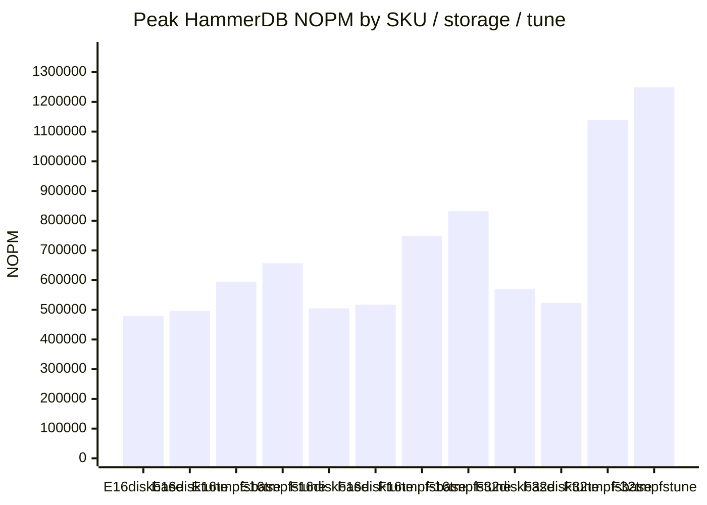
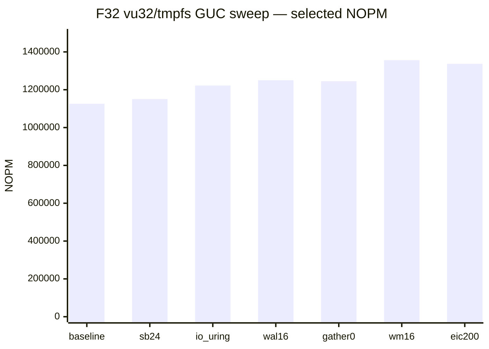

# Database benchmark results — run3

Baseline (25%/75% buffers, default I/O) vs host-tuned GUCs ([`pg_tune_gucs.py`](scripts/pg_tune_gucs.py), `io_uring` when available). All containers `--privileged`. HammerDB TPROC-C + BenchBase wikipedia/ycsb. Disk = anonymous Docker volume on Premium_LRS; tmpfs = `max(16, 50% RAM)` on `/var/lib/postgresql`.

> **Status:** run3 complete on E16 / F16 / F32 (8 suites × 3 SKUs, all rungs ok).

## Setup

| Item | Value |
|------|-------|
| Workloads | HammerDB TPROC-C; BenchBase wikipedia + ycsb |
| VU / terminal ladder | 4, 8, 16, 32, 64 |
| WH / schema sizing | 5 WH/VU (HammerDB); BenchBase SF matched to same footprint |
| Rampup / duration | 2 min / 5 min |
| Postgres | `postgres:18`, `synchronous_commit=off` |
| Baseline GUCs | 25% `shared_buffers`, 75% `effective_cache_size` |
| Tuned GUCs | `--pg-tune-host` (io_uring, OLTP sweep winners) |
| Region | Azure NewZealandNorth |

| SKU | vCPUs | RAM | baseline SB | tuned SB (disk) | tuned SB (tmpfs) |
|-----|-------|-----|-------------|-----------------|------------------|
| E16as_v6 | 16 | 126 GiB | 31 GB | 31 GB | 12 GB (10% cap) |
| F16ams_v6 | 16 | 126 GiB | 31 GB | 31 GB | 12 GB (10% cap) |
| F32ams_v6 | 32 | 252 GiB | 62 GB | 62 GB | 24 GB (10% cap) |

## Peak HammerDB NOPM

| SKU | Storage | Baseline peak | Tuned peak | Δ |
|-----|---------|---------------|------------|---|
| E16 | disk | 478,643 (vu16) | 495,548 (vu16) | +3.5% |
| E16 | tmpfs | 594,626 (vu16) | 656,556 (vu16) | +10.4% |
| F16 | disk | 505,046 (vu16) | 516,934 (vu16) | +2.4% |
| F16 | tmpfs | 748,911 (vu16) | 832,165 (vu16) | +11.1% |
| F32 | disk | 569,925 (vu16) | 523,248 (vu16) | -8.2% |
| F32 | tmpfs | 1,138,242 (vu32) | 1,249,245 (vu32) | +9.8% |



_Each bar is labeled on the x-axis._

## Peak BenchBase TPM

| SKU | Storage | WL | Baseline peak | Tuned peak | Δ |
|-----|---------|----|---------------|------------|---|
| E16 | disk | wikipedia | 527,038 (vu16) | 506,826 (vu16) | -3.8% |
| E16 | disk | ycsb | 5,124,619 (vu16) | 3,799,978 (vu16) | -25.8% |
| E16 | tmpfs | wikipedia | 533,647 (vu16) | 536,364 (vu16) | +0.5% |
| E16 | tmpfs | ycsb | 7,315,777 (vu32) | 7,464,667 (vu16) | +2.0% |
| F16 | disk | wikipedia | 765,140 (vu16) | 728,429 (vu16) | -4.8% |
| F16 | disk | ycsb | 4,608,459 (vu16) | 3,896,383 (vu8) | -15.5% |
| F16 | tmpfs | wikipedia | 799,750 (vu16) | 797,790 (vu16) | -0.2% |
| F16 | tmpfs | ycsb | 8,042,367 (vu32) | 7,853,204 (vu32) | -2.4% |
| F32 | disk | wikipedia | 822,666 (vu32) | 829,322 (vu32) | +0.8% |
| F32 | disk | ycsb | 3,782,995 (vu8) | 3,698,095 (vu8) | -2.2% |
| F32 | tmpfs | wikipedia | 950,716 (vu32) | 946,274 (vu32) | -0.5% |
| F32 | tmpfs | ycsb | 11,939,674 (vu32) | 12,674,274 (vu32) | +6.2% |

## HammerDB — disk

### baseline

| SKU | vCPUs | VU | WH | VU/vCPU | NOPM | TPM | NOPM/VU | Build (s) |
|-----|-------|----|----|---------|------|-----|---------|-----------|
| E16 | 16 | 4 | 20 | 0.25 | 268,403 | 616,472 | 67100.8 | 85.3 |
| E16 | 16 | 8 | 40 | 0.5 | 372,917 | 859,343 | 46614.6 | 103.0 |
| E16 | 16 | 16 | 80 | 1 | 478,643 | 1,100,224 | 29915.2 | 225.7 |
| E16 | 16 | 32 | 160 | 2 | 382,906 | 879,967 | 11965.8 | 400.7 |
| E16 | 16 | 64 | 320 | 4 | 209,903 | 482,034 | 3279.7 | 777.3 |
| F16 | 16 | 4 | 20 | 0.25 | 269,496 | 621,305 | 67374.0 | 85.9 |
| F16 | 16 | 8 | 40 | 0.5 | 408,368 | 939,648 | 51046.0 | 102.6 |
| F16 | 16 | 16 | 80 | 1 | 505,046 | 1,157,239 | 31565.4 | 217.1 |
| F16 | 16 | 32 | 160 | 2 | 504,899 | 1,158,969 | 15778.1 | 389.7 |
| F16 | 16 | 64 | 320 | 4 | 281,172 | 645,234 | 4393.3 | 798.5 |
| F32 | 32 | 4 | 20 | 0.125 | 266,643 | 614,747 | 66660.8 | 86.5 |
| F32 | 32 | 8 | 40 | 0.25 | 367,413 | 843,594 | 45926.6 | 107.1 |
| F32 | 32 | 16 | 80 | 0.5 | 569,925 | 1,313,730 | 35620.3 | 246.1 |
| F32 | 32 | 32 | 160 | 1 | 526,278 | 1,206,341 | 16446.2 | 442.6 |
| F32 | 32 | 64 | 320 | 2 | 438,387 | 1,004,702 | 6849.8 | 889.0 |

```mermaid
---
config:
  themeVariables:
    xyChart:
      plotColorPalette: "#4e79a7, #f28e2b, #e15759"
---
xychart-beta
    title "NOPM vs VU (disk, baseline)"
    x-axis [vu4, vu8, vu16, vu32, vu64]
    y-axis "NOPM" 0 --> 627000
    line "E16" [268403, 372917, 478643, 382906, 209903 "E16"]
    line "F16" [269496, 408368, 505046, 504899, 281172 "F16"]
    line "F32" [266643, 367413, 569925, 526278, 438387 "F32"]
```

### tuned

| SKU | vCPUs | VU | WH | VU/vCPU | NOPM | TPM | NOPM/VU | Build (s) |
|-----|-------|----|----|---------|------|-----|---------|-----------|
| E16 | 16 | 4 | 20 | 0.25 | 263,472 | 607,435 | 65868.0 | 84.5 |
| E16 | 16 | 8 | 40 | 0.5 | 409,443 | 943,029 | 51180.4 | 102.2 |
| E16 | 16 | 16 | 80 | 1 | 495,548 | 1,140,401 | 30971.8 | 168.1 |
| E16 | 16 | 32 | 160 | 2 | 476,296 | 1,097,086 | 14884.2 | 370.6 |
| E16 | 16 | 64 | 320 | 4 | 390,769 | 900,008 | 6105.8 | 681.8 |
| F16 | 16 | 4 | 20 | 0.25 | 268,544 | 617,969 | 67136.0 | 84.8 |
| F16 | 16 | 8 | 40 | 0.5 | 485,326 | 1,114,544 | 60665.8 | 103.3 |
| F16 | 16 | 16 | 80 | 1 | 516,934 | 1,186,184 | 32308.4 | 185.6 |
| F16 | 16 | 32 | 160 | 2 | 499,077 | 1,148,433 | 15596.2 | 376.9 |
| F16 | 16 | 64 | 320 | 4 | 310,893 | 713,111 | 4857.7 | 709.8 |
| F32 | 32 | 4 | 20 | 0.125 | 259,253 | 595,316 | 64813.2 | 84.5 |
| F32 | 32 | 8 | 40 | 0.25 | 455,188 | 1,047,287 | 56898.5 | 119.3 |
| F32 | 32 | 16 | 80 | 0.5 | 523,248 | 1,202,873 | 32703.0 | 200.9 |
| F32 | 32 | 32 | 160 | 1 | 451,681 | 1,039,473 | 14115.0 | 442.3 |
| F32 | 32 | 64 | 320 | 2 | 432,615 | 994,145 | 6759.6 | 784.8 |

```mermaid
---
config:
  themeVariables:
    xyChart:
      plotColorPalette: "#4e79a7, #f28e2b, #e15759"
---
xychart-beta
    title "NOPM vs VU (disk, tuned)"
    x-axis [vu4, vu8, vu16, vu32, vu64]
    y-axis "NOPM" 0 --> 576000
    line "E16" [263472, 409443, 495548, 476296, 390769 "E16"]
    line "F16" [268544, 485326, 516934, 499077, 310893 "F16"]
    line "F32" [259253, 455188, 523248, 451681, 432615 "F32"]
```

### Baseline vs tuned (disk)

| SKU | VU | Baseline NOPM | Tuned NOPM | Δ |
|-----|----|---------------|------------|---|
| E16 | 4 | 268,403 | 263,472 | -1.8% |
| E16 | 8 | 372,917 | 409,443 | +9.8% |
| E16 | 16 | 478,643 | 495,548 | +3.5% |
| E16 | 32 | 382,906 | 476,296 | +24.4% |
| E16 | 64 | 209,903 | 390,769 | +86.2% |
| F16 | 4 | 269,496 | 268,544 | -0.4% |
| F16 | 8 | 408,368 | 485,326 | +18.8% |
| F16 | 16 | 505,046 | 516,934 | +2.4% |
| F16 | 32 | 504,899 | 499,077 | -1.2% |
| F16 | 64 | 281,172 | 310,893 | +10.6% |
| F32 | 4 | 266,643 | 259,253 | -2.8% |
| F32 | 8 | 367,413 | 455,188 | +23.9% |
| F32 | 16 | 569,925 | 523,248 | -8.2% |
| F32 | 32 | 526,278 | 451,681 | -14.2% |
| F32 | 64 | 438,387 | 432,615 | -1.3% |

## HammerDB — tmpfs

### baseline

| SKU | vCPUs | VU | WH | VU/vCPU | NOPM | TPM | NOPM/VU | Build (s) |
|-----|-------|----|----|---------|------|-----|---------|-----------|
| E16 | 16 | 4 | 20 | 0.25 | 271,218 | 623,024 | 67804.5 | 72.5 |
| E16 | 16 | 8 | 40 | 0.5 | 408,642 | 938,819 | 51080.2 | 83.2 |
| E16 | 16 | 16 | 80 | 1 | 594,626 | 1,367,113 | 37164.1 | 122.8 |
| E16 | 16 | 32 | 160 | 2 | 505,833 | 1,164,276 | 15807.3 | 229.9 |
| E16 | 16 | 64 | 320 | 4 | 433,838 | 997,837 | 6778.7 | 448.7 |
| F16 | 16 | 4 | 20 | 0.25 | 283,922 | 653,786 | 70980.5 | 72.4 |
| F16 | 16 | 8 | 40 | 0.5 | 521,862 | 1,198,987 | 65232.8 | 73.3 |
| F16 | 16 | 16 | 80 | 1 | 748,911 | 1,723,004 | 46806.9 | 105.3 |
| F16 | 16 | 32 | 160 | 2 | 645,730 | 1,486,828 | 20179.1 | 182.7 |
| F16 | 16 | 64 | 320 | 4 | 591,535 | 1,361,495 | 9242.7 | 332.0 |
| F32 | 32 | 4 | 20 | 0.125 | 279,530 | 643,333 | 69882.5 | 72.6 |
| F32 | 32 | 8 | 40 | 0.25 | 512,829 | 1,178,429 | 64103.6 | 92.3 |
| F32 | 32 | 16 | 80 | 0.5 | 800,963 | 1,843,737 | 50060.2 | 127.5 |
| F32 | 32 | 32 | 160 | 1 | 1,138,242 | 2,617,979 | 35570.1 | 180.7 |
| F32 | 32 | 64 | 320 | 2 | 972,297 | 2,235,863 | 15192.1 | 348.6 |

```mermaid
---
config:
  themeVariables:
    xyChart:
      plotColorPalette: "#4e79a7, #f28e2b, #e15759"
---
xychart-beta
    title "NOPM vs VU (tmpfs, baseline)"
    x-axis [vu4, vu8, vu16, vu32, vu64]
    y-axis "NOPM" 0 --> 1253000
    line "E16" [271218, 408642, 594626, 505833, 433838 "E16"]
    line "F16" [283922, 521862, 748911, 645730, 591535 "F16"]
    line "F32" [279530, 512829, 800963, 1138242, 972297 "F32"]
```

### tuned

| SKU | vCPUs | VU | WH | VU/vCPU | NOPM | TPM | NOPM/VU | Build (s) |
|-----|-------|----|----|---------|------|-----|---------|-----------|
| E16 | 16 | 4 | 20 | 0.25 | 275,172 | 632,798 | 68793.0 | 72.5 |
| E16 | 16 | 8 | 40 | 0.5 | 427,657 | 983,443 | 53457.1 | 83.4 |
| E16 | 16 | 16 | 80 | 1 | 656,556 | 1,510,732 | 41034.8 | 120.2 |
| E16 | 16 | 32 | 160 | 2 | 576,143 | 1,327,572 | 18004.5 | 224.4 |
| E16 | 16 | 64 | 320 | 4 | 505,725 | 1,163,397 | 7902.0 | 451.9 |
| F16 | 16 | 4 | 20 | 0.25 | 286,369 | 658,177 | 71592.2 | 72.7 |
| F16 | 16 | 8 | 40 | 0.5 | 522,855 | 1,201,636 | 65356.9 | 73.3 |
| F16 | 16 | 16 | 80 | 1 | 832,165 | 1,914,809 | 52010.3 | 94.5 |
| F16 | 16 | 32 | 160 | 2 | 732,448 | 1,684,967 | 22889.0 | 181.1 |
| F16 | 16 | 64 | 320 | 4 | 632,881 | 1,455,548 | 9888.8 | 340.9 |
| F32 | 32 | 4 | 20 | 0.125 | 284,132 | 653,724 | 71033.0 | 98.6 |
| F32 | 32 | 8 | 40 | 0.25 | 543,267 | 1,249,633 | 67908.4 | 73.5 |
| F32 | 32 | 16 | 80 | 0.5 | 1,000,845 | 2,301,136 | 62552.8 | 91.2 |
| F32 | 32 | 32 | 160 | 1 | 1,249,245 | 2,871,717 | 39038.9 | 156.6 |
| F32 | 32 | 64 | 320 | 2 | 1,090,722 | 2,510,464 | 17042.5 | 370.8 |

```mermaid
---
config:
  themeVariables:
    xyChart:
      plotColorPalette: "#4e79a7, #f28e2b, #e15759"
---
xychart-beta
    title "NOPM vs VU (tmpfs, tuned)"
    x-axis [vu4, vu8, vu16, vu32, vu64]
    y-axis "NOPM" 0 --> 1375000
    line "E16" [275172, 427657, 656556, 576143, 505725 "E16"]
    line "F16" [286369, 522855, 832165, 732448, 632881 "F16"]
    line "F32" [284132, 543267, 1000845, 1249245, 1090722 "F32"]
```

### Baseline vs tuned (tmpfs)

| SKU | VU | Baseline NOPM | Tuned NOPM | Δ |
|-----|----|---------------|------------|---|
| E16 | 4 | 271,218 | 275,172 | +1.5% |
| E16 | 8 | 408,642 | 427,657 | +4.7% |
| E16 | 16 | 594,626 | 656,556 | +10.4% |
| E16 | 32 | 505,833 | 576,143 | +13.9% |
| E16 | 64 | 433,838 | 505,725 | +16.6% |
| F16 | 4 | 283,922 | 286,369 | +0.9% |
| F16 | 8 | 521,862 | 522,855 | +0.2% |
| F16 | 16 | 748,911 | 832,165 | +11.1% |
| F16 | 32 | 645,730 | 732,448 | +13.4% |
| F16 | 64 | 591,535 | 632,881 | +7.0% |
| F32 | 4 | 279,530 | 284,132 | +1.6% |
| F32 | 8 | 512,829 | 543,267 | +5.9% |
| F32 | 16 | 800,963 | 1,000,845 | +25.0% |
| F32 | 32 | 1,138,242 | 1,249,245 | +9.8% |
| F32 | 64 | 972,297 | 1,090,722 | +12.2% |

## BenchBase — disk

### baseline

#### wikipedia

| SKU | vCPUs | VU | SF | TPM | TPS | p95 (ms) | Load (s) |
|-----|-------|----|----|-----|-----|----------|----------|
| E16 | 16 | 4 | 13 | 357,719 | 5961.98 | 1.415 | 57.4 |
| E16 | 16 | 8 | 26 | 454,856 | 7580.93 | 1.929 | 146.0 |
| E16 | 16 | 16 | 51 | 527,038 | 8783.96 | 2.695 | 265.3 |
| E16 | 16 | 32 | 103 | 306,369 | 5106.15 | 10.229 | 545.1 |
| E16 | 16 | 64 | 205 | 162,214 | 2703.57 | 36.148 | 1184.6 |
| F16 | 16 | 4 | 13 | 358,083 | 5968.04 | 1.34 | 50.8 |
| F16 | 16 | 8 | 26 | 516,716 | 8611.93 | 1.557 | 157.4 |
| F16 | 16 | 16 | 51 | 765,140 | 12752.33 | 1.93 | 264.9 |
| F16 | 16 | 32 | 103 | 466,904 | 7781.73 | 6.987 | 547.3 |
| F16 | 16 | 64 | 205 | 252,421 | 4207.02 | 22.614 | 1195.3 |
| F32 | 32 | 4 | 13 | 378,132 | 6302.21 | 1.37 | 68.3 |
| F32 | 32 | 8 | 26 | 551,498 | 9191.64 | 1.587 | 138.6 |
| F32 | 32 | 16 | 51 | 711,007 | 11850.12 | 2.018 | 261.3 |
| F32 | 32 | 32 | 103 | 822,666 | 13711.11 | 2.801 | 568.1 |
| F32 | 32 | 64 | 205 | 397,887 | 6631.45 | 12.559 | 1264.2 |

```mermaid
---
config:
  themeVariables:
    xyChart:
      plotColorPalette: "#4e79a7, #f28e2b, #e15759"
---
xychart-beta
    title "wikipedia TPM vs VU (disk, baseline)"
    x-axis [vu4, vu8, vu16, vu32, vu64]
    y-axis "TPM" 0 --> 905000
    line "E16" [357719, 454856, 527038, 306369, 162214 "E16"]
    line "F16" [358083, 516716, 765140, 466904, 252421 "F16"]
    line "F32" [378132, 551498, 711007, 822666, 397887 "F32"]
```

#### ycsb

| SKU | vCPUs | VU | SF | TPM | TPS | p95 (ms) | Load (s) |
|-----|-------|----|----|-----|-----|----------|----------|
| E16 | 16 | 4 | 1676 | 2,559,949 | 42665.81 | 0.117 | 31.5 |
| E16 | 16 | 8 | 3351 | 3,333,383 | 55556.39 | 0.15 | 62.2 |
| E16 | 16 | 16 | 6702 | 5,124,619 | 85410.32 | 0.203 | 153.3 |
| E16 | 16 | 32 | 13405 | 3,590,935 | 59848.92 | 0.409 | 325.2 |
| E16 | 16 | 64 | 26810 | 1,817,211 | 30286.85 | 0.818 | 898.5 |
| F16 | 16 | 4 | 1676 | 2,597,546 | 43292.44 | 0.105 | 31.6 |
| F16 | 16 | 8 | 3351 | 3,826,676 | 63777.93 | 0.119 | 70.1 |
| F16 | 16 | 16 | 6702 | 4,608,459 | 76807.66 | 0.22 | 153.4 |
| F16 | 16 | 32 | 13405 | 2,312,266 | 38537.76 | 0.46 | 433.1 |
| F16 | 16 | 64 | 26810 | 1,761,232 | 29353.87 | 0.722 | 903.7 |
| F32 | 32 | 4 | 1676 | 2,475,308 | 41255.14 | 0.108 | 27.3 |
| F32 | 32 | 8 | 3351 | 3,782,995 | 63049.91 | 0.112 | 52.9 |
| F32 | 32 | 16 | 6702 | 3,207,654 | 53460.89 | 0.134 | 141.8 |
| F32 | 32 | 32 | 13405 | 3,170,800 | 52846.67 | 0.26 | 362.5 |
| F32 | 32 | 64 | 26810 | 2,037,409 | 33956.82 | 0.486 | 771.2 |

```mermaid
---
config:
  themeVariables:
    xyChart:
      plotColorPalette: "#4e79a7, #f28e2b, #e15759"
---
xychart-beta
    title "ycsb TPM vs VU (disk, baseline)"
    x-axis [vu4, vu8, vu16, vu32, vu64]
    y-axis "TPM" 0 --> 5638000
    line "E16" [2559949, 3333383, 5124619, 3590935, 1817211 "E16"]
    line "F16" [2597546, 3826676, 4608459, 2312266, 1761232 "F16"]
    line "F32" [2475308, 3782995, 3207654, 3170800, 2037409 "F32"]
```

### tuned

#### wikipedia

| SKU | vCPUs | VU | SF | TPM | TPS | p95 (ms) | Load (s) |
|-----|-------|----|----|-----|-----|----------|----------|
| E16 | 16 | 4 | 13 | 365,406 | 6090.1 | 1.417 | 55.4 |
| E16 | 16 | 8 | 26 | 448,493 | 7474.89 | 1.933 | 110.0 |
| E16 | 16 | 16 | 51 | 506,826 | 8447.11 | 2.707 | 286.2 |
| E16 | 16 | 32 | 103 | 313,937 | 5232.28 | 10.032 | 534.7 |
| E16 | 16 | 64 | 205 | 171,527 | 2858.79 | 34.073 | 1105.4 |
| F16 | 16 | 4 | 13 | 386,090 | 6434.84 | 1.332 | 64.8 |
| F16 | 16 | 8 | 26 | 502,008 | 8366.81 | 1.555 | 110.8 |
| F16 | 16 | 16 | 51 | 728,429 | 12140.49 | 1.926 | 252.0 |
| F16 | 16 | 32 | 103 | 454,980 | 7583.0 | 7.015 | 540.2 |
| F16 | 16 | 64 | 205 | 259,382 | 4323.04 | 21.962 | 1101.5 |
| F32 | 32 | 4 | 13 | 373,284 | 6221.4 | 1.322 | 55.3 |
| F32 | 32 | 8 | 26 | 462,432 | 7707.2 | 1.56 | 102.5 |
| F32 | 32 | 16 | 51 | 725,561 | 12092.68 | 2.023 | 252.4 |
| F32 | 32 | 32 | 103 | 829,322 | 13822.03 | 2.793 | 559.3 |
| F32 | 32 | 64 | 205 | 478,584 | 7976.4 | 12.023 | 1055.8 |

```mermaid
---
config:
  themeVariables:
    xyChart:
      plotColorPalette: "#4e79a7, #f28e2b, #e15759"
---
xychart-beta
    title "wikipedia TPM vs VU (disk, tuned)"
    x-axis [vu4, vu8, vu16, vu32, vu64]
    y-axis "TPM" 0 --> 913000
    line "E16" [365406, 448493, 506826, 313937, 171527 "E16"]
    line "F16" [386090, 502008, 728429, 454980, 259382 "F16"]
    line "F32" [373284, 462432, 725561, 829322, 478584 "F32"]
```

#### ycsb

| SKU | vCPUs | VU | SF | TPM | TPS | p95 (ms) | Load (s) |
|-----|-------|----|----|-----|-----|----------|----------|
| E16 | 16 | 4 | 1676 | 2,488,562 | 41476.03 | 0.117 | 32.0 |
| E16 | 16 | 8 | 3351 | 3,217,581 | 53626.35 | 0.155 | 63.9 |
| E16 | 16 | 16 | 6702 | 3,799,978 | 63332.97 | 0.211 | 123.9 |
| E16 | 16 | 32 | 13405 | 3,006,431 | 50107.19 | 0.432 | 303.0 |
| E16 | 16 | 64 | 26810 | 1,943,566 | 32392.76 | 0.852 | 570.3 |
| F16 | 16 | 4 | 1676 | 2,507,861 | 41797.68 | 0.107 | 31.7 |
| F16 | 16 | 8 | 3351 | 3,896,383 | 64939.72 | 0.121 | 62.6 |
| F16 | 16 | 16 | 6702 | 3,544,854 | 59080.9 | 0.222 | 124.1 |
| F16 | 16 | 32 | 13405 | 2,515,972 | 41932.86 | 0.465 | 298.5 |
| F16 | 16 | 64 | 26810 | 2,239,928 | 37332.14 | 0.814 | 594.0 |
| F32 | 32 | 4 | 1676 | 2,385,071 | 39751.18 | 0.109 | 26.7 |
| F32 | 32 | 8 | 3351 | 3,698,095 | 61634.92 | 0.117 | 52.0 |
| F32 | 32 | 16 | 6702 | 3,697,223 | 61620.39 | 0.139 | 111.9 |
| F32 | 32 | 32 | 13405 | 2,512,031 | 41867.19 | 0.261 | 256.5 |
| F32 | 32 | 64 | 26810 | 2,040,978 | 34016.29 | 0.517 | 564.9 |

```mermaid
---
config:
  themeVariables:
    xyChart:
      plotColorPalette: "#4e79a7, #f28e2b, #e15759"
---
xychart-beta
    title "ycsb TPM vs VU (disk, tuned)"
    x-axis [vu4, vu8, vu16, vu32, vu64]
    y-axis "TPM" 0 --> 4287000
    line "E16" [2488562, 3217581, 3799978, 3006431, 1943566 "E16"]
    line "F16" [2507861, 3896383, 3544854, 2515972, 2239928 "F16"]
    line "F32" [2385071, 3698095, 3697223, 2512031, 2040978 "F32"]
```

## BenchBase — tmpfs

### baseline

#### wikipedia

| SKU | vCPUs | VU | SF | TPM | TPS | p95 (ms) | Load (s) |
|-----|-------|----|----|-----|-----|----------|----------|
| E16 | 16 | 4 | 13 | 374,892 | 6248.2 | 1.372 | 23.4 |
| E16 | 16 | 8 | 26 | 462,243 | 7704.05 | 1.933 | 45.7 |
| E16 | 16 | 16 | 51 | 533,647 | 8894.12 | 2.699 | 89.0 |
| E16 | 16 | 32 | 103 | 318,644 | 5310.73 | 9.921 | 182.8 |
| E16 | 16 | 64 | 205 | 170,435 | 2840.58 | 34.414 | 361.8 |
| F16 | 16 | 4 | 13 | 391,364 | 6522.73 | 1.318 | 23.3 |
| F16 | 16 | 8 | 26 | 579,929 | 9665.48 | 1.549 | 45.2 |
| F16 | 16 | 16 | 51 | 799,750 | 13329.17 | 1.924 | 92.0 |
| F16 | 16 | 32 | 103 | 472,991 | 7883.19 | 6.678 | 183.5 |
| F16 | 16 | 64 | 205 | 259,845 | 4330.76 | 21.776 | 358.3 |
| F32 | 32 | 4 | 13 | 388,616 | 6476.94 | 1.316 | 22.3 |
| F32 | 32 | 8 | 26 | 582,498 | 9708.3 | 1.529 | 48.4 |
| F32 | 32 | 16 | 51 | 761,610 | 12693.5 | 2.03 | 88.5 |
| F32 | 32 | 32 | 103 | 950,716 | 15845.26 | 2.722 | 178.9 |
| F32 | 32 | 64 | 205 | 522,309 | 8705.16 | 11.582 | 357.9 |

```mermaid
---
config:
  themeVariables:
    xyChart:
      plotColorPalette: "#4e79a7, #f28e2b, #e15759"
---
xychart-beta
    title "wikipedia TPM vs VU (tmpfs, baseline)"
    x-axis [vu4, vu8, vu16, vu32, vu64]
    y-axis "TPM" 0 --> 1046000
    line "E16" [374892, 462243, 533647, 318644, 170435 "E16"]
    line "F16" [391364, 579929, 799750, 472991, 259845 "F16"]
    line "F32" [388616, 582498, 761610, 950716, 522309 "F32"]
```

#### ycsb

| SKU | vCPUs | VU | SF | TPM | TPS | p95 (ms) | Load (s) |
|-----|-------|----|----|-----|-----|----------|----------|
| E16 | 16 | 4 | 1676 | 2,546,456 | 42440.93 | 0.118 | 4.3 |
| E16 | 16 | 8 | 3351 | 3,630,358 | 60505.97 | 0.165 | 7.2 |
| E16 | 16 | 16 | 6702 | 7,186,837 | 119780.61 | 0.224 | 12.9 |
| E16 | 16 | 32 | 13405 | 7,315,777 | 121929.62 | 0.488 | 24.4 |
| E16 | 16 | 64 | 26810 | 7,287,354 | 121455.91 | 0.809 | 47.6 |
| F16 | 16 | 4 | 1676 | 2,584,232 | 43070.53 | 0.106 | 4.2 |
| F16 | 16 | 8 | 3351 | 4,933,275 | 82221.26 | 0.117 | 6.9 |
| F16 | 16 | 16 | 6702 | 6,992,911 | 116548.52 | 0.211 | 12.4 |
| F16 | 16 | 32 | 13405 | 8,042,367 | 134039.44 | 0.411 | 23.7 |
| F16 | 16 | 64 | 26810 | 6,558,353 | 109305.88 | 1.101 | 46.7 |
| F32 | 32 | 4 | 1676 | 2,559,707 | 42661.79 | 0.107 | 3.7 |
| F32 | 32 | 8 | 3351 | 5,025,358 | 83755.97 | 0.11 | 5.8 |
| F32 | 32 | 16 | 6702 | 8,492,601 | 141543.35 | 0.14 | 9.8 |
| F32 | 32 | 32 | 13405 | 11,939,674 | 198994.57 | 0.252 | 18.2 |
| F32 | 32 | 64 | 26810 | 10,791,348 | 179855.8 | 0.527 | 34.8 |

```mermaid
---
config:
  themeVariables:
    xyChart:
      plotColorPalette: "#4e79a7, #f28e2b, #e15759"
---
xychart-beta
    title "ycsb TPM vs VU (tmpfs, baseline)"
    x-axis [vu4, vu8, vu16, vu32, vu64]
    y-axis "TPM" 0 --> 13134000
    line "E16" [2546456, 3630358, 7186837, 7315777, 7287354 "E16"]
    line "F16" [2584232, 4933275, 6992911, 8042367, 6558353 "F16"]
    line "F32" [2559707, 5025358, 8492601, 11939674, 10791348 "F32"]
```

### tuned

#### wikipedia

| SKU | vCPUs | VU | SF | TPM | TPS | p95 (ms) | Load (s) |
|-----|-------|----|----|-----|-----|----------|----------|
| E16 | 16 | 4 | 13 | 368,570 | 6142.83 | 1.395 | 25.3 |
| E16 | 16 | 8 | 26 | 466,470 | 7774.5 | 1.905 | 46.6 |
| E16 | 16 | 16 | 51 | 536,364 | 8939.4 | 2.695 | 91.2 |
| E16 | 16 | 32 | 103 | 318,339 | 5305.64 | 9.947 | 177.4 |
| E16 | 16 | 64 | 205 | 170,725 | 2845.42 | 34.23 | 348.9 |
| F16 | 16 | 4 | 13 | 394,853 | 6580.89 | 1.309 | 23.2 |
| F16 | 16 | 8 | 26 | 577,482 | 9624.7 | 1.571 | 48.6 |
| F16 | 16 | 16 | 51 | 797,790 | 13296.51 | 1.904 | 90.8 |
| F16 | 16 | 32 | 103 | 469,858 | 7830.97 | 6.734 | 176.1 |
| F16 | 16 | 64 | 205 | 261,147 | 4352.45 | 22.187 | 350.0 |
| F32 | 32 | 4 | 13 | 393,227 | 6553.78 | 1.308 | 24.0 |
| F32 | 32 | 8 | 26 | 583,861 | 9731.01 | 1.52 | 46.4 |
| F32 | 32 | 16 | 51 | 766,906 | 12781.76 | 2.011 | 90.5 |
| F32 | 32 | 32 | 103 | 946,274 | 15771.24 | 2.744 | 182.4 |
| F32 | 32 | 64 | 205 | 520,848 | 8680.8 | 11.642 | 356.4 |

```mermaid
---
config:
  themeVariables:
    xyChart:
      plotColorPalette: "#4e79a7, #f28e2b, #e15759"
---
xychart-beta
    title "wikipedia TPM vs VU (tmpfs, tuned)"
    x-axis [vu4, vu8, vu16, vu32, vu64]
    y-axis "TPM" 0 --> 1041000
    line "E16" [368570, 466470, 536364, 318339, 170725 "E16"]
    line "F16" [394853, 577482, 797790, 469858, 261147 "F16"]
    line "F32" [393227, 583861, 766906, 946274, 520848 "F32"]
```

#### ycsb

| SKU | vCPUs | VU | SF | TPM | TPS | p95 (ms) | Load (s) |
|-----|-------|----|----|-----|-----|----------|----------|
| E16 | 16 | 4 | 1676 | 2,557,644 | 42627.41 | 0.118 | 4.0 |
| E16 | 16 | 8 | 3351 | 3,856,053 | 64267.54 | 0.15 | 6.8 |
| E16 | 16 | 16 | 6702 | 7,464,667 | 124411.12 | 0.22 | 11.5 |
| E16 | 16 | 32 | 13405 | 7,266,384 | 121106.4 | 0.502 | 22.0 |
| E16 | 16 | 64 | 26810 | 7,434,964 | 123916.07 | 0.879 | 42.9 |
| F16 | 16 | 4 | 1676 | 2,561,089 | 42684.81 | 0.108 | 3.8 |
| F16 | 16 | 8 | 3351 | 4,909,768 | 81829.47 | 0.121 | 6.3 |
| F16 | 16 | 16 | 6702 | 6,922,931 | 115382.19 | 0.215 | 11.2 |
| F16 | 16 | 32 | 13405 | 7,853,204 | 130886.74 | 0.428 | 21.3 |
| F16 | 16 | 64 | 26810 | 6,681,845 | 111364.09 | 1.144 | 41.7 |
| F32 | 32 | 4 | 1676 | 2,550,105 | 42501.75 | 0.109 | 3.3 |
| F32 | 32 | 8 | 3351 | 4,985,846 | 83097.43 | 0.115 | 5.0 |
| F32 | 32 | 16 | 6702 | 8,418,711 | 140311.85 | 0.144 | 8.4 |
| F32 | 32 | 32 | 13405 | 12,674,274 | 211237.9 | 0.247 | 16.7 |
| F32 | 32 | 64 | 26810 | 11,040,548 | 184009.13 | 0.554 | 31.1 |

```mermaid
---
config:
  themeVariables:
    xyChart:
      plotColorPalette: "#4e79a7, #f28e2b, #e15759"
---
xychart-beta
    title "ycsb TPM vs VU (tmpfs, tuned)"
    x-axis [vu4, vu8, vu16, vu32, vu64]
    y-axis "TPM" 0 --> 13942000
    line "E16" [2557644, 3856053, 7464667, 7266384, 7434964 "E16"]
    line "F16" [2561089, 4909768, 6922931, 7853204, 6681845 "F16"]
    line "F32" [2550105, 4985846, 8418711, 12674274, 11040548 "F32"]
```

## GUC sweep (F32ams_v6, HammerDB vu32 / tmpfs)

Calibration run that produced the OLTP defaults in [`pg_tune_gucs.py`](scripts/pg_tune_gucs.py). Host: Azure `Standard_F32ams_v6` (32 vCPU / 252 GiB), HammerDB TPROC-C **32 VU / 160 WH**, Postgres data on **tmpfs**, privileged Debian `postgres:18`. Reference baseline (archived run2-tmpfs F32 vu32): **1,131,026 NOPM**. Script: [`guc_sweep_vu32.py`](scripts/guc_sweep_vu32.py).

### Headline

| Item | Value |
|------|-------|
| Best config | `H_workmem_16MB` |
| Best NOPM | 1,356,244 (+19.9% vs ref) |
| Live A_baseline (same session) | 1,126,050 |
| Experiments | 21/21 ok |

Winners folded into `--pg-tune-host` for OLTP/tmpfs:

- `shared_buffers` ≈ **10% RAM** (cap **24 GiB**) — large buffers double-buffer vs tmpfs
- `io_method=io_uring` (needs privileged + liburing image)
- `work_mem=16MB`, `max_parallel_workers_per_gather=0`
- `wal_buffers=16MB`, `wal_compression=lz4`, `jit=off`

### Full matrix (Δ vs archived run2-tmpfs F32 vu32)

| Phase | Config | SB | NOPM | Δ vs ref | Notes |
|-------|--------|----|------|----------|-------|
| A/B baseline & first host-tune | `A_baseline` | 62 GB | 1,126,050 | -0.4% | run2-style GUCs (25% SB, no io_uring) |
|  | `B_host_tune_tmpfs` | 62 GB | 1,146,102 | +1.3% | early host-tune (still 62 GB SB) |
| C shared_buffers on tmpfs | `C_sb8` | 8 GB | 1,134,364 | +0.3% |  |
|  | `C_sb16` | 16 GB | 1,143,964 | +1.1% |  |
|  | `C_sb24` | 24 GB | 1,150,653 | +1.7% | best SB-only on tmpfs |
|  | `C_sb32` | 32 GB | 1,141,240 | +0.9% |  |
|  | `C_sb48` | 48 GB | 1,130,669 | -0.0% |  |
| D io_method × shared_buffers | `D_sb16_io_uring` | 16 GB | 1,222,440 | +8.1% | io_uring ≫ worker at SB=16 |
|  | `D_sb16_worker` | 16 GB | 1,185,027 | +4.8% | worker AIO baseline |
|  | `D_sb62_io_uring` | 62 GB | 1,193,686 | +5.5% |  |
|  | `D_sb62_worker` | 62 GB | 1,158,062 | +2.4% |  |
| E/F WAL | `E_walcomp_off` | 16 GB | 1,168,165 | +3.3% |  |
|  | `F_walbuf_16MB` | 16 GB | 1,250,272 | +10.5% | 16 MB WAL buffers beat 64/256 |
|  | `F_walbuf_256MB` | 16 GB | 1,220,479 | +7.9% |  |
| G parallel gather | `G_pergather_0` | 16 GB | 1,245,092 | +10.1% | disable parallel gather for OLTP |
| H work_mem (+ gather=0) | `H_workmem_8MB` | 16 GB | 1,337,995 | +18.3% | close second |
|  | `H_workmem_16MB` | 16 GB | 1,356,244 | +19.9% | **sweep champion** |
|  | `H_workmem_64MB` | 16 GB | 1,238,924 | +9.5% |  |
| I effective_io_concurrency | `I_eic_128` | 16 GB | 1,226,665 | +8.5% |  |
|  | `I_eic_200` | 16 GB | 1,337,182 | +18.2% | eic=200 strong with gather=0 |
| J maintenance-heavy | `J_maint_heavy` | 16 GB | 1,228,693 | +8.6% | 8 GB maint mem not helpful at runtime |



_Each bar is labeled on the x-axis._

### vu4 regression check

Same winning settings at **4 VU / 20 WH** vs archived run2-tmpfs F32 vu4 (269,933 NOPM):

| Config | NOPM | Δ vs archived vu4 |
|--------|------|-------------------|
| `vu4_sb24_merge` | 282,347 | 4.6% |
| `vu4_h_workmem16` | 281,467 | 4.27% |

No regression at low concurrency (≈ +4% vs archived vu4).

### Takeaway

On **tmpfs**, avoid oversized `shared_buffers`, prefer **io_uring**, keep OLTP `work_mem` modest, and turn **parallel gather off**. Those settings are what `--pg-tune-host` applies today for `storage=tmpfs` (disk still uses 25% `shared_buffers` + the same OLTP worker/WAL knobs).

## Next: benchmark runtime effects + GCP SKUs

Workload for this follow-up: **BenchBase wikipedia only** (no HammerDB, no YCSB). Harness: [`scripts/run_benchbase_sizing_eval.py`](scripts/run_benchbase_sizing_eval.py); options map to BenchBase’s XML `<works>/<work>` phase (`DBWorkload.java`, `config/postgres/sample_wikipedia_config.xml`).

### Measurement duration

Run3 used **2 min warmup / 5 min measurement**. Follow-up on each GCP SKU asks whether longer windows change mean TPM or only shrink variance.

**Design ([`run4-wikipedia/`](run4-wikipedia/)):** BenchBase wikipedia @ terminals=`nproc`, SF from HammerDB 5 WH/VU sizing, 2 min warmup, measure ∈ {5, 10, 15, 30} min. **5 independent trials per duration**, **interleaved** schedule (rep1×all durations, then rep2×…). GUCs from [pgtune.leopard.in.ua](https://pgtune.leopard.in.ua/) form defaults (`web` / SSD). Postgres `postgres:18 --privileged --network host`. Fresh create+load each trial. Harness: [`scripts/run_wikipedia_duration_eval.py`](scripts/run_wikipedia_duration_eval.py) (`--replicates 5 --schedule interleaved`).

Per-duration stats in each instance tree: `summary.csv` / `summary.json` (mean, stdev, CV%, 95% t-CI, Welch Δ% vs 5 min).

> **Verdict: keep 5 min measurement.** Across all three SKUs, mean TPM at 10/15/30 min stays within ~2% of the 5 min mean; CIs overlap; longer windows do **not** systematically tighten CV (run-to-run noise dominates). Prefer more independent short trials over fewer long ones when budget is fixed.

#### Results — n=5 interleaved

Wall clock ~6.5–7.5 h/host (2026-07-21 17:21Z → ~00:00–01:00Z). Terminals / SF: 16/51, 32/103, 16/51.

**Mean TPM ± 95% t-CI (CV%)**

| Instance | 5 min | 10 min | 15 min | 30 min |
|----------|------:|-------:|-------:|------:|
| `t2d-standard-16` | 580 228 ± 3 585 (0.50%) | 578 237 ± 3 503 (0.49%) | 576 567 ± 3 560 (0.50%) | 576 145 ± 3 009 (0.42%) |
| `t2d-standard-32` | 690 881 ± 7 723 (0.90%) | 691 927 ± 21 263 (2.48%) | 677 111 ± 30 259 (3.60%) | 686 730 ± 19 205 (2.25%) |
| `e2-highmem-16` | 260 997 ± 7 045 (2.17%) | 261 574 ± 11 845 (3.65%) | 264 425 ± 5 489 (1.67%) | 260 321 ± 12 490 (3.86%) |

**Δ mean % vs 5 min (Welch t)**

| Instance | 10 min | 15 min | 30 min |
|----------|-------:|------:|------:|
| `t2d-standard-16` | −0.34% (−1.10) | −0.63% (−2.01) | −0.70% (−2.42) |
| `t2d-standard-32` | +0.15% (+0.13) | −1.99% (−1.22) | −0.60% (−0.56) |
| `e2-highmem-16` | +0.22% (+0.12) | +1.31% (+1.07) | −0.26% (−0.13) |

Notes:

- **Bias:** no practical duration bias. Worst mean shift is −1.99% (`t2d-32` @ 15 min), driven partly by one low outlier (rep05 = 636 689); 30 min on the same host is only −0.60%.
- **Variance:** longer measure does **not** reliably reduce CV. On `t2d-32` and `e2-highmem-16`, 5 min often has the *smallest* CV; 10–30 min CIs are wider because occasional dips hurt a longer average as much as a short one when noise is run-to-run (load/OS/noisy neighbor), not within-run Poisson.
- **t2d-16:** extremely stable (CV ≈ 0.5%). The 30 vs 5 Welch \|t\| ≈ 2.42 is borderline at α≈0.05, but the effect is only −0.7% — not worth 6× wall time.
- **e2-highmem-16:** noisier overall (CV ~2–4%); 15 min has slightly tighter CV than 5 min, but mean is within 1.3% and 30 min is *worse* again — no consistent gain from stretching the measure phase.

#### Takeaway

For wikipedia throughput ranking / SKU compare at fixed terminals=nproc on these GCP hosts: **2 min warmup + 5 min measure is enough**. Spend budget on **replicates** (or more SKUs/configs), not on 10–30 min windows. Raw: [`run4-wikipedia/*/summary.csv`](run4-wikipedia/t2d-standard-16/summary.csv), [`results.csv`](run4-wikipedia/t2d-standard-16/results.csv).

### BenchBase wikipedia runtime options we use

Written by `write_config()` for every timed execute (load uses the same XML shape with `terminals=1`, `warmup=0`, `time=10`, `--execute=false`).

| Knob | Where | Our value | Notes |
|------|-------|-----------|-------|
| workload | CLI `-b` | `wikipedia` | |
| `--create` / `--load` / `--execute` | CLI | create+load, then execute-only | fresh DB each rung |
| `isolation` | XML | `TRANSACTION_READ_COMMITTED` | sample config uses `SERIALIZABLE` |
| `batchsize` | XML | `128` | same as sample |
| `reconnectOnConnectionFailure` | XML | `true` | |
| `scalefactor` | XML | SF ≈ HammerDB `5 WH/VU` schema GiB | `SF = round(VU×5×0.095 / 0.14803)` |
| `terminals` | XML | = ladder VU (4 / 8 / 16 / 32 / 64) | one terminal ≈ one concurrent client |
| `<warmup>` | XML work | `--rampup-min` × 60 s (default **120**) | BenchBase WARMUP phase; not counted in TPM |
| `<time>` | XML work | `--duration-min` × 60 s (default **300**) | MEASURE phase; **varied in this study** |
| `<rate>` | XML work | `unlimited` | not rate-limited (sample uses `1000`) |
| `<weights>` | XML work | `1,1,7,90,1` | AddWatchList, RemoveWatchList, UpdatePage, GetPageAnonymous, GetPageAuthenticated |
| `serial` | XML work | omitted → `false` | random txn mix, not one-shot serial |
| `@arrival` | XML work attr | omitted → `regular` | not Poisson |
| `active_terminals` | XML work | omitted → all `terminals` | |

Txn mix (90% anonymous page reads):

| Procedure | Weight |
|-----------|--------|
| AddWatchList | 1 |
| RemoveWatchList | 1 |
| UpdatePage | 7 |
| GetPageAnonymous | 90 |
| GetPageAuthenticated | 1 |

### GCP counterparts (pd-ssd)

Azure run3 SKUs mapped to GCP AMD instances (same zone / disk recipe). Provisioned with sc-runner; boot disk **200 GiB `pd-ssd`** (closest to Azure `Premium_LRS`), Ubuntu 24.04:

```bash
sc-runner create gcp --zone us-central1-a \
  --public-key "ssh-ed25519 AAAAC3NzaC1lZDI1NTE5AAAAIEPMwX6HY8inovVAqUrAKvqY0zabNoWfmN/7UlNsBvZ4 info@sparecores.com" \
  --instance <INSTANCE> \
  --disk-size 200 \
  --bootdisk-init-opts '{"image":"ubuntu-2404-lts-amd64","type":"pd-ssd"}'
```

| Azure (run3) | GCP instance | Family | vCPU / cores | HT | CPU | RAM | Role |
|--------------|--------------|--------|--------------|----|-----|-----|------|
| `Standard_F16ams_v6` | `t2d-standard-16` | t2d | 16 / 16 | no | EPYC 7B13 | 64 GiB | no-HT pair |
| `Standard_F32ams_v6` | `t2d-standard-32` | t2d | 32 / 32 | no | EPYC 7B13 | 128 GiB | no-HT pair |
| `Standard_E16as_v6` | `e2-highmem-16` | e2 | 16 / 8 | yes | EPYC 7B12 | 128 GiB | older HT |

Per-instance result trees: `run4-wikipedia/<instance>/` (`t2d-standard-16`, `t2d-standard-32`, `e2-highmem-16`).

## Notes

- Compare SKUs at the same **VU/vCPU** ratio (and each machine’s peak), not only at the same absolute VU.
- Tuned GUCs come from [`pg_tune_gucs.py`](scripts/pg_tune_gucs.py): on tmpfs, `shared_buffers` ≈ 10% RAM (capped); `io_method=io_uring`; `work_mem=16MB`; `max_parallel_workers_per_gather=0`; `wal_buffers=16MB`.
- Containers always use `--privileged` / `seccomp=unconfined` / `memlock=-1:-1` (needed for `io_uring`).
- Outputs kept lean (`--skip-raw`): `results.csv` + `meta.json` only.
- **tmpfs + tuned** lifts HammerDB peak NOPM vs baseline tmpfs (F16 +11.1%, F32 +9.8%). Disk tuned is mixed / near-flat vs baseline on these SKUs.
- On disk, absolute peaks stay around **vu16**; on tmpfs, F32 peaks at **vu32** (baseline and tuned).

## Raw data

| Path |
|------|
| [`run3/Standard_E16as_v6/hammerdb_disk_baseline/results.csv`](run3/Standard_E16as_v6/hammerdb_disk_baseline/results.csv) |
| [`run3/Standard_E16as_v6/hammerdb_disk_tuned/results.csv`](run3/Standard_E16as_v6/hammerdb_disk_tuned/results.csv) |
| [`run3/Standard_E16as_v6/hammerdb_tmpfs_baseline/results.csv`](run3/Standard_E16as_v6/hammerdb_tmpfs_baseline/results.csv) |
| [`run3/Standard_E16as_v6/hammerdb_tmpfs_tuned/results.csv`](run3/Standard_E16as_v6/hammerdb_tmpfs_tuned/results.csv) |
| [`run3/Standard_E16as_v6/benchbase_disk_baseline/results.csv`](run3/Standard_E16as_v6/benchbase_disk_baseline/results.csv) |
| [`run3/Standard_E16as_v6/benchbase_disk_tuned/results.csv`](run3/Standard_E16as_v6/benchbase_disk_tuned/results.csv) |
| [`run3/Standard_E16as_v6/benchbase_tmpfs_baseline/results.csv`](run3/Standard_E16as_v6/benchbase_tmpfs_baseline/results.csv) |
| [`run3/Standard_E16as_v6/benchbase_tmpfs_tuned/results.csv`](run3/Standard_E16as_v6/benchbase_tmpfs_tuned/results.csv) |
| [`run3/Standard_F16ams_v6/hammerdb_disk_baseline/results.csv`](run3/Standard_F16ams_v6/hammerdb_disk_baseline/results.csv) |
| [`run3/Standard_F16ams_v6/hammerdb_disk_tuned/results.csv`](run3/Standard_F16ams_v6/hammerdb_disk_tuned/results.csv) |
| [`run3/Standard_F16ams_v6/hammerdb_tmpfs_baseline/results.csv`](run3/Standard_F16ams_v6/hammerdb_tmpfs_baseline/results.csv) |
| [`run3/Standard_F16ams_v6/hammerdb_tmpfs_tuned/results.csv`](run3/Standard_F16ams_v6/hammerdb_tmpfs_tuned/results.csv) |
| [`run3/Standard_F16ams_v6/benchbase_disk_baseline/results.csv`](run3/Standard_F16ams_v6/benchbase_disk_baseline/results.csv) |
| [`run3/Standard_F16ams_v6/benchbase_disk_tuned/results.csv`](run3/Standard_F16ams_v6/benchbase_disk_tuned/results.csv) |
| [`run3/Standard_F16ams_v6/benchbase_tmpfs_baseline/results.csv`](run3/Standard_F16ams_v6/benchbase_tmpfs_baseline/results.csv) |
| [`run3/Standard_F16ams_v6/benchbase_tmpfs_tuned/results.csv`](run3/Standard_F16ams_v6/benchbase_tmpfs_tuned/results.csv) |
| [`run3/Standard_F32ams_v6/hammerdb_disk_baseline/results.csv`](run3/Standard_F32ams_v6/hammerdb_disk_baseline/results.csv) |
| [`run3/Standard_F32ams_v6/hammerdb_disk_tuned/results.csv`](run3/Standard_F32ams_v6/hammerdb_disk_tuned/results.csv) |
| [`run3/Standard_F32ams_v6/hammerdb_tmpfs_baseline/results.csv`](run3/Standard_F32ams_v6/hammerdb_tmpfs_baseline/results.csv) |
| [`run3/Standard_F32ams_v6/hammerdb_tmpfs_tuned/results.csv`](run3/Standard_F32ams_v6/hammerdb_tmpfs_tuned/results.csv) |
| [`run3/Standard_F32ams_v6/benchbase_disk_baseline/results.csv`](run3/Standard_F32ams_v6/benchbase_disk_baseline/results.csv) |
| [`run3/Standard_F32ams_v6/benchbase_disk_tuned/results.csv`](run3/Standard_F32ams_v6/benchbase_disk_tuned/results.csv) |
| [`run3/Standard_F32ams_v6/benchbase_tmpfs_baseline/results.csv`](run3/Standard_F32ams_v6/benchbase_tmpfs_baseline/results.csv) |
| [`run3/Standard_F32ams_v6/benchbase_tmpfs_tuned/results.csv`](run3/Standard_F32ams_v6/benchbase_tmpfs_tuned/results.csv) |
| [`guc_sweep_f32/sweep.csv`](guc_sweep_f32/sweep.csv) |
| [`guc_sweep_f32/summary.json`](guc_sweep_f32/summary.json) |
| [`guc_sweep_f32/vu4_summary.json`](guc_sweep_f32/vu4_summary.json) |
| [`run4-wikipedia/t2d-standard-16/summary.csv`](run4-wikipedia/t2d-standard-16/summary.csv) |
| [`run4-wikipedia/t2d-standard-16/results.csv`](run4-wikipedia/t2d-standard-16/results.csv) |
| [`run4-wikipedia/t2d-standard-32/summary.csv`](run4-wikipedia/t2d-standard-32/summary.csv) |
| [`run4-wikipedia/t2d-standard-32/results.csv`](run4-wikipedia/t2d-standard-32/results.csv) |
| [`run4-wikipedia/e2-highmem-16/summary.csv`](run4-wikipedia/e2-highmem-16/summary.csv) |
| [`run4-wikipedia/e2-highmem-16/results.csv`](run4-wikipedia/e2-highmem-16/results.csv) |

