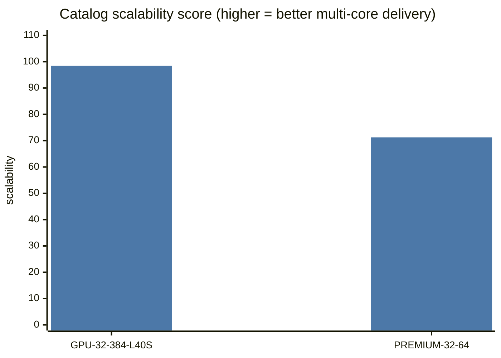
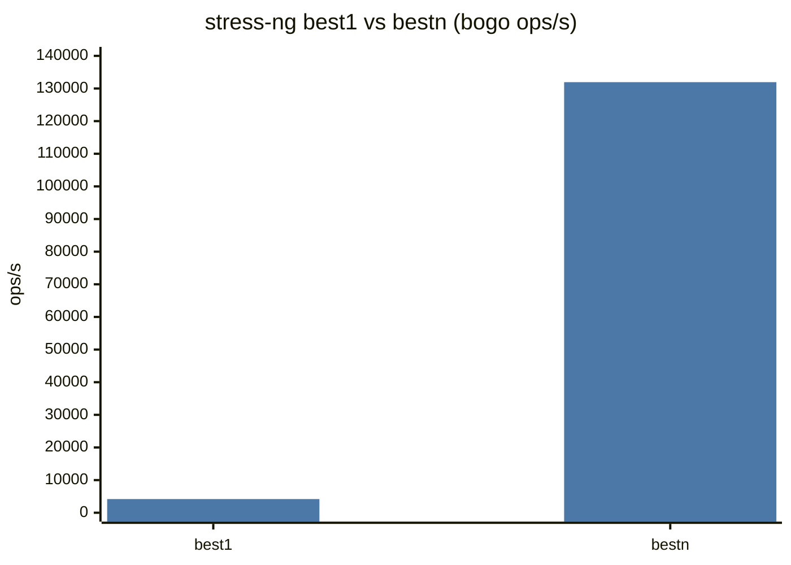
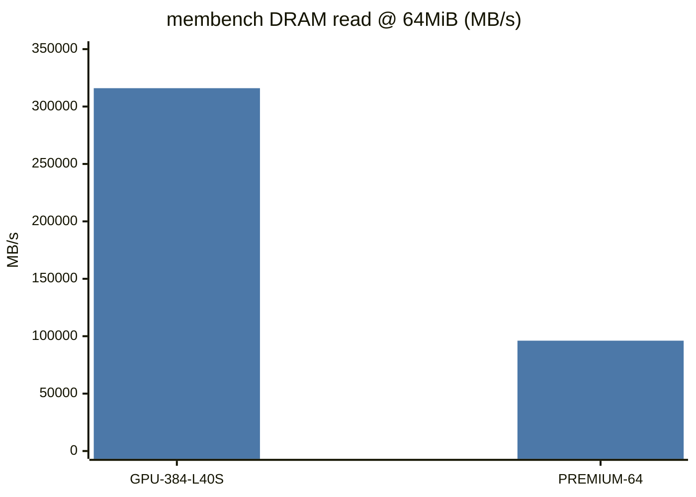

# UpCloud pgbench: GPU-32xCPU-384GB-2xL40S vs PREMIUM-32xCPU-64GB

> **Finding under test:** Metadata shows identical CPU type and vCPU count, yet `GPU-32xCPU-384GB-2xL40S` delivers ~3× the pgbench throughput of `PREMIUM-32xCPU-64GB`.

**Data sources:** `~/tmp/sc-data-all.db` + `sc-inspector-data/data/upcloud/`. Charts follow the mermaid style in [`RESULTS.md`](RESULTS.md).

---

## Executive summary

1. **CPU model strings match:** both guests report **AMD EPYC 9575F**, **32 vCPUs**, 1 thread/core, same advertised L1/L2/L3 topology.
2. **Measured peak pgbench gap is 2.32×** (6,103 vs 2,629 TPM), not a full 3× — still a large, real difference. (DRAM read bandwidth is ~3.3×, which may be what motivated the “3×” claim.)
3. **They are not the same machine class.** GPU SKU has **384 GiB** RAM vs **64 GiB**; on-demand price **$3.75/h vs $0.92/h**. Catalog `scalability` is **98.4 vs 71.3**.
4. **Root cause is host quality / memory subsystem + multi-core delivery, not the CPU model label.**
   - Single-core stress-ng is only **~8%** apart → same silicon class.
   - Full-thread stress-ng bestn is **1.49×**; PassMark CPU Mark **1.66×**; stress parallel efficiency **0.99 vs 0.71**.
   - membench DRAM read **3.3×**, write **2.2×**, PassMark memory latency **95 vs 174 ns**.
5. **Postgres GUC sizing differs with RAM** (`shared_buffers` 96 GB vs 16 GB), but the RO schema is only **~0.17 GiB**, so buffer sizing is **not** the driver of this gap.

**Bottom line:** “Identical CPU in metadata” is true as a *model string*. Effective CPU + memory performance on the PREMIUM host is degraded (contention / packing / weaker memory path). The GPU node behaves like a near-dedicated Turin host.

---

## 1. What metadata claims vs what differs

| Field | GPU-32xCPU-384GB-2xL40S | PREMIUM-32xCPU-64GB | Same? |
|-------|------------------------:|--------------------:|:-----:|
| `cpu_model` | EPYC **9575F** | EPYC **9575F** | ✓ |
| `vcpus` | 32 | 32 | ✓ |
| Guest lscpu model | AMD EPYC 9575F 64-Core | AMD EPYC 9575F 64-Core | ✓ |
| Guest L3 | 512 MiB (32×) | 512 MiB (32×) | ✓ |
| `memory_amount` | **393,216 MiB (384 GB)** | **65,536 MiB (64 GB)** | ✗ |
| `gpu_count` / model | 2× L40S | 0 | ✗ |
| Catalog `scalability` | **98.44** | **71.25** | ✗ |
| On-demand $/h | **3.75** | **0.92** | ✗ |



Control neighbor: `PREMIUM-32xCPU-128GB` (same CPU family, 128 GB) scores **3,745** TPM and scalability **81.25** — between the two, confirming a **memory-tier / packing** gradient inside PREMIUM as well.

---

## 2. Confirming the pgbench gap

Heavy RO peak TPM (`pgbench:heavy_read_only:peak`):

| Instance | Peak TPM | Single TPM | Peak@32 | Peak@16 | Peak@64 |
|----------|---------:|-----------:|--------:|--------:|--------:|
| GPU-32xCPU-384GB-2xL40S | **6,103** | 246 | 6,103 | 3,384 | 5,888 |
| PREMIUM-32xCPU-64GB | **2,629** | 170 | 2,629 | 1,911 | 2,539 |
| Ratio GPU/PREMIUM-64 | **2.32** | 1.45 | 2.32 | 1.77 | 2.32 |
| PREMIUM-32xCPU-128GB | 3,745 | 177 | 3,745 | 2,258 | 3,676 |
| GPU / PREMIUM-128 | 1.63 | 1.39 | | | |

```mermaid
---
config:
  themeVariables:
    xyChart:
      plotColorPalette: "#4c78a8, #c44e52, #76b7b2"
---
xychart-beta
    title "pgbench heavy RO TPM vs concurrency"
    x-axis [1, 16, 32, 64]
    y-axis "TPM" 0 --> 6500
    line "GPU-384-L40S" [246, 3384, 6103, 5888 "GPU"]
    line "PREMIUM-64" [170, 1911, 2629, 2539 "P64"]
    line "PREMIUM-128" [177, 2258, 3745, 3676 "P128"]
```

Latency at the peak rung (conc=32): GPU **314 ms** avg vs PREMIUM-64 **729 ms** — the slow host is saturated earlier.

### Why not exactly “3×”?

Catalog peak ratio is **2.32×**. Closest ~3× signals in the same pair:

| Metric | GPU | PREMIUM-64 | Ratio |
|--------|----:|-----------:|------:|
| membench read @ 64 MiB | 315,987 MB/s | 96,103 MB/s | **3.29** |
| membench read @ 32 KiB | 4,222,663 | 2,103,763 | 2.01 |
| redis SET pipeline=1 | 5.43M | 2.32M | 2.34 |
| pgbench peak | 6,103 | 2,629 | 2.32 |

So the finding is directionally right; the clean headline number for *pgbench* is **~2.3×**, while *DRAM bandwidth* is the true ~3×.

---

## 3. Postgres config: different RAM, same tiny schema

| | GPU-384 | PREMIUM-64 |
|--|--------:|-----------:|
| `db_mem_gib` | 377.7 | 62.8 |
| `shared_buffers` | 96,512 MB | 15,872 MB |
| `effective_cache_size` | 289,536 MB | 47,616 MB |
| `schema_gib` | **0.17** | **0.17** |
| Dataset | `pgbench-ro-cpu-v1` | same |

The RO CPU dataset fits in L3 alone on either box. Inflating `shared_buffers` on the GPU SKU therefore **cannot** explain a 2×+ TPM gap for this workload. The gap must come from **CPU delivery and/or memory latency/bandwidth under load**.

---

## 4. Microbenchmarks — where the gap actually is

### stress-ng: same core, worse package on PREMIUM

| Metric | GPU-384-L40S | PREMIUM-64 | Ratio |
|--------|-------------:|-----------:|------:|
| `stress_ng:best1` | 4,187 | 3,891 | **1.08** |
| `stress_ng:bestn` | 131,938 | 88,572 | **1.49** |
| Parallel efficiency `bestn/(best1×32)` | **0.985** | **0.711** | |
| `cpu` @1 thread | 2,565 | 2,123 | 1.21 |
| `cpu` @32 | 77,321 | 55,195 | 1.40 |
| `memcpy` @32 | 26,275 | 11,811 | **2.22** |



_Bars are GPU; PREMIUM-64 is 3891 / 88572 — nearly the same single-core, ~⅓ lower multi-core._

**Interpretation:** guests see the same CPU *name*, but PREMIUM cannot deliver 32 full cores worth of work (efficiency 0.71 ≈ the catalog scalability of 71). That is the signature of **CPU oversubscription / noisy neighbors**, not a different CPU SKU.

### Memory: PREMIUM is much weaker

| Metric | GPU-384 | PREMIUM-64 | Ratio (GPU better) |
|--------|--------:|-----------:|-------------------:|
| PassMark memory latency (ns, lower better) | 95.3 | 174.2 | **1.83× lower lat** |
| PassMark memory mark | 2,688 | 1,581 | 1.70 |
| PassMark memory write | 35,430 | 29,570 | 1.20 |
| membench read 64 MiB | 315,987 | 96,103 | **3.29** |
| membench write 64 MiB | 146,289 | 65,438 | **2.24** |
| membench copy 64 MiB | 91,949 | 48,636 | 1.89 |
| membench lat 64 MiB (ns) | 114 | 208 | 1.82× |



```mermaid
---
config:
  themeVariables:
    xyChart:
      plotColorPalette: "#59a14f"
---
xychart-beta
    title "GPU/PREMIUM-64 ratios by workload (>1 = GPU faster)"
    x-axis [stress1, stressN, pg single, pg peak, memcpy32, DRAM rd, DRAM wr]
    y-axis "ratio" 0 --> 3.5
    line "ratio" [1.08, 1.49, 1.45, 2.32, 2.22, 3.29, 2.24 "r"]
```

pgbench peak sits between multi-core CPU delivery (~1.5×) and DRAM movement (~2.2–3.3×) — exactly where a concurrent shared-memory Postgres RO run should land.

### PassMark CPU / Redis

| Metric | GPU | PREMIUM-64 | Ratio |
|--------|----:|-----------:|------:|
| PassMark CPU Mark | 87,135 | 52,444 | 1.66 |
| Redis SET (pipeline 1) | 5.43M | 2.32M | 2.34 |
| Redis SET (pipeline 64) | 48.9M | 20.1M | 2.43 |

Redis again tracks ~2.3× — same shape as pgbench, independent of SQL.

---

## 5. Causal model

```text
Metadata says:  same EPYC 9575F, same 32 vCPUs
                    │
                    ▼
         ┌──────────────────────┐     ┌──────────────────────────┐
         │ GPU-32…384GB-2xL40S  │     │ PREMIUM-32xCPU-64GB      │
         │ ~dedicated GPU host  │     │ commodity shared PREMIUM │
         │ 384 GB, $3.75/h      │     │ 64 GB, $0.92/h           │
         │ scalability ≈ 98     │     │ scalability ≈ 71         │
         └──────────┬───────────┘     └────────────┬─────────────┘
                    │                              │
         best1 ≈ same silicon              best1 only −8%
         bestn / memcpy / DRAM strong      bestn −33%, DRAM −70%
         pgbench 6103 TPM                  pgbench 2629 TPM
```

| Hypothesis | Verdict | Evidence |
|------------|---------|----------|
| Different CPU models despite metadata | **Rejected** | Identical lscpu model + near-equal stress best1 |
| Postgres buffer sizing causes the gap | **Rejected** | 0.17 GiB schema ≪ either `shared_buffers` |
| GPU itself accelerates pgbench | **Rejected** | Workload is CPU Postgres; L40S unused |
| PREMIUM is CPU-oversubscribed | **Accepted** | scalability 71, stress efficiency 0.71, CPU Mark 1.66× gap |
| PREMIUM has weaker effective memory path | **Accepted** | DRAM BW ~3×, latency ~2×, memcpy 2.2× |
| More RAM alone explains it | **Partial** | PREMIUM-128 (2× RAM) only recovers to 3,745 TPM (1.63× behind GPU); packing/memory quality still worse |

---

## 6. Practical takeaways

1. **Do not treat UpCloud “same CPU model + same vCPUs” as performance-equivalent** across PREMIUM vs GPU families.
2. For pgbench-like CPU OLTP on UpCloud 32 vCPU: GPU-memory SKUs (and likely other high-RAM dedicated hosts) deliver **~2×+** vs PREMIUM-64; PREMIUM-128 closes only part of the gap.
3. Trust **`scalability`, stress-ng bestn/efficiency, and membench DRAM** over the CPU model string when comparing these SKUs.
4. The marketed “3×” matches **memory bandwidth** more cleanly than peak pgbench (**2.3×**).

---

## 7. Method notes

- Instances: `GPU-32xCPU-384GB-2xL40S`, `PREMIUM-32xCPU-64GB`, control `PREMIUM-32xCPU-128GB` / `GPU-32xCPU-384GB-2xL4`.
- pgbench = `pgbench:heavy_read_only:*` from catalog; GUCs confirmed from inspector `pgbench_postgres_ro_durable/stdout`.
- Microbenchmarks from `benchmark_score` + `stressng_benchmarks` / `membench` raw where noted.
- Prices: `server_price` ONDEMAND minima in the snapshot DB.
