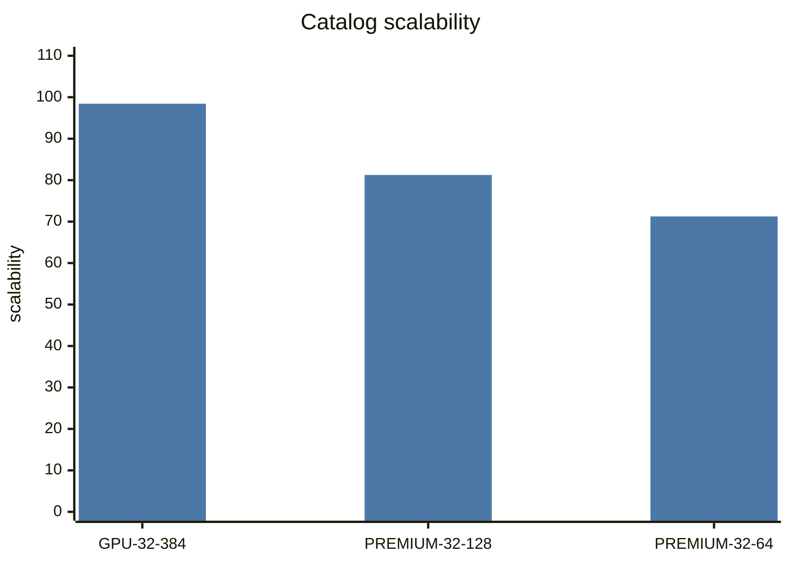
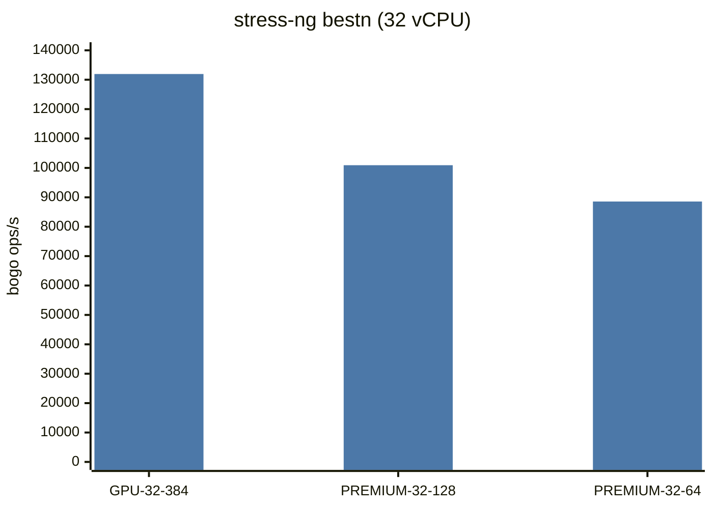
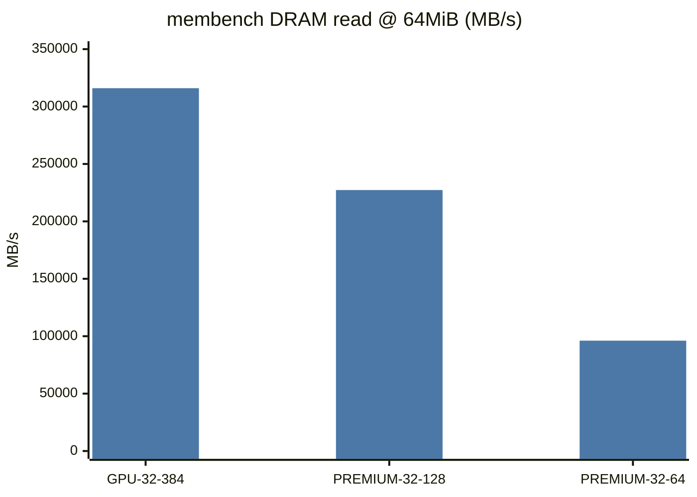

# UpCloud pgbench: GPU-32xCPU-384GB-2xL40S vs PREMIUM

> **Finding under test:** Metadata shows identical CPU type and vCPU count, yet `GPU-32xCPU-384GB-2xL40S` delivers ~3× the pgbench throughput of `PREMIUM-32xCPU-64GB`.
>
> **No-GPU counterpart:** Among UpCloud SKUs with **`cpu_model=9575F`**, **no GPU**, and **pgbench results**, the largest is **`PREMIUM-32xCPU-128GB`** (32 vCPU / 128 GB).

**Instances in this report (all have pgbench):** `GPU-32xCPU-384GB-2xL40S`, `PREMIUM-32xCPU-128GB`, `PREMIUM-32xCPU-64GB`.

**Data sources:** `~/tmp/sc-data-all.db` + `sc-inspector-data/data/upcloud/`. Charts follow the mermaid style in [`RESULTS.md`](RESULTS.md).

---

## Executive summary

1. **GPU vs PREMIUM-64:** both **EPYC 9575F** / **32 vCPUs**. Peak pgbench **6,103 vs 2,629 TPM (2.32×)**. DRAM read ~3.3×. Cause: PREMIUM packing + weaker memory (scalability **71 vs 98**), not a different CPU string. stress best1 nearly equal (**~8%**).
2. **Biggest no-GPU 9575F with pgbench:** **`PREMIUM-32xCPU-128GB`** → **3,745 TPM**. Still **1.63×** behind the GPU SKU despite same vCPU count and 2× the PREMIUM-64 RAM.
3. **PREMIUM-128 sits between the two** on almost every axis (scalability 81, DRAM, redis, stress efficiency) — a memory/packing gradient inside PREMIUM, not “GPU-384 without cards.”
4. **GUCs track RAM**, but the RO schema is **~0.17 GiB**, so buffers do not explain these gaps.

---

## 1. Instances compared

Filter for the no-GPU control: `cpu_model='9575F'`, `gpu_count=0`, has `pgbench:heavy_read_only:peak`, order by `vcpus DESC, memory_amount DESC` → **`PREMIUM-32xCPU-128GB`**.

| Instance | vCPUs | RAM | GPU | pgbench peak |
|----------|------:|----:|----:|-------------:|
| GPU-32xCPU-384GB-2xL40S | 32 | 384 GB | 2× L40S | **6,103** |
| PREMIUM-32xCPU-128GB | 32 | 128 GB | — | **3,745** |
| PREMIUM-32xCPU-64GB | 32 | 64 GB | — | **2,629** |

---

## 2. Metadata comparison

| Field | GPU-32…384-2xL40S | PREMIUM-32…128 | PREMIUM-32…64 |
|-------|------------------:|---------------:|--------------:|
| `cpu_model` | **9575F** | **9575F** | **9575F** |
| `vcpus` | 32 | 32 | 32 |
| RAM | **384 GB** | 128 GB | 64 GB |
| GPU | 2× L40S | 0 | 0 |
| Catalog `scalability` | **98.44** | 81.25 | **71.25** |
| On-demand $/h | 3.75 | 1.14 | 0.92 |



---

## 3. pgbench heavy RO

| Instance | Peak TPM | Single | @16 | @32 | @64 | Peak lat (ms) |
|----------|---------:|-------:|----:|----:|----:|--------------:|
| GPU-32xCPU-384GB-2xL40S | **6,103** | 246 | 3,384 | 6,103 | 5,888 | 314 |
| PREMIUM-32xCPU-128GB | **3,745** | 177 | 2,258 | 3,745 | 3,676 | 512 |
| PREMIUM-32xCPU-64GB | **2,629** | 170 | 1,911 | 2,629 | 2,539 | 729 |

| Ratio | Value |
|-------|------:|
| GPU / PREMIUM-64 | **2.32** |
| GPU / PREMIUM-128 | **1.63** |
| PREMIUM-128 / PREMIUM-64 | 1.42 |

```mermaid
---
config:
  themeVariables:
    xyChart:
      plotColorPalette: "#4c78a8, #f28e2b, #c44e52"
---
xychart-beta
    title "pgbench heavy RO TPM vs concurrency"
    x-axis [1, 16, 32, 64]
    y-axis "TPM" 0 --> 6500
    line "GPU-32-384" [246, 3384, 6103, 5888 "GPU"]
    line "PREMIUM-128" [177, 2258, 3745, 3676 "P128"]
    line "PREMIUM-64" [170, 1911, 2629, 2539 "P64"]
```

### Why not exactly “3×” vs PREMIUM-64?

Peak pgbench is **2.32×**. Closest ~3× signal:

| Metric | GPU | PREMIUM-64 | Ratio |
|--------|----:|-----------:|------:|
| membench read @ 64 MiB | 315,987 | 96,103 | **3.29** |
| redis SET p=1 | 5.43M | 2.32M | 2.34 |
| pgbench peak | 6,103 | 2,629 | 2.32 |

---

## 4. Postgres GUCs — RAM-tied, tiny schema

| | GPU-32-384 | PREMIUM-32-128 | PREMIUM-32-64 |
|--|-----------:|---------------:|--------------:|
| `db_mem_gib` | 377.7 | 125.8 | 62.8 |
| `shared_buffers` | 96,512 MB | 32,000 MB | 15,872 MB |
| `schema_gib` | **0.17** | **0.17** | **0.17** |

Dataset fits in L3 everywhere → buffer sizing is not the driver. GPU vs PREMIUM-128 still differs by **1.63×** with the same vCPU count.

---

## 5. Microbenchmarks

### stress-ng

| Metric | GPU-32-384 | PREMIUM-32-128 | PREMIUM-32-64 |
|--------|-----------:|---------------:|--------------:|
| best1 | 4,187 | 3,884 | 3,891 |
| bestn | **131,938** | 100,921 | 88,572 |
| bestn / vCPU | **4,123** | 3,154 | 2,768 |
| efficiency | **0.985** | 0.812 | 0.711 |



best1 ≈ same Turin class on all three; multi-core delivery degrades PREMIUM-128 → PREMIUM-64.

### Memory

| Metric | GPU-32-384 | PREMIUM-32-128 | PREMIUM-32-64 |
|--------|-----------:|---------------:|--------------:|
| PassMark mem latency (ns, ↓) | **95.3** | 112.1 | 174.2 |
| membench read 64 MiB | **315,987** | 227,280 | 96,103 |
| membench write 64 MiB | **146,288** | 108,536 | 65,438 |



### PassMark / Redis / ratios vs GPU

| Metric | GPU | P-128 | P-64 | GPU/P128 | GPU/P64 |
|--------|----:|------:|-----:|---------:|--------:|
| PassMark CPU Mark | 87,135 | 56,071 | 52,444 | 1.55 | 1.66 |
| Redis SET p=1 | 5.43M | 3.79M | 2.32M | 1.43 | 2.34 |
| pgbench peak | 6,103 | 3,745 | 2,629 | **1.63** | **2.32** |
| stress bestn | 131,938 | 100,921 | 88,572 | 1.31 | 1.49 |
| DRAM read 64 MiB | 315,987 | 227,280 | 96,103 | 1.39 | 3.29 |

```mermaid
---
config:
  themeVariables:
    xyChart:
      plotColorPalette: "#59a14f, #e15759"
---
xychart-beta
    title "GPU / PREMIUM ratios (>1 = GPU faster)"
    x-axis [best1, bestn, pg peak, DRAM rd, redis]
    y-axis "ratio" 0 --> 3.5
    line "vs P-128" [1.08, 1.31, 1.63, 1.39, 1.43 "128"]
    line "vs P-64" [1.08, 1.49, 2.32, 3.29, 2.34 "64"]
```

---

## 6. Causal model

```text
         Same cpu_model: EPYC 9575F, 32 vCPUs
                              │
          ┌───────────────────┼───────────────────┐
          ▼                   ▼                   ▼
   GPU-32…384-2xL40S   PREMIUM-32…128        PREMIUM-32…64
   ~dedicated host     bigger PREMIUM RAM    small PREMIUM
   scal≈98, $3.75/h    scal≈81, $1.14/h      scal≈71, $0.92/h
          │                   │                   │
   best1 strong        best1 ≈ GPU           best1 ≈ GPU
   bestn/DRAM strong   mid                   weak
   pgbench 6103        pgbench 3745          pgbench 2629
```

| Hypothesis | Verdict | Evidence |
|------------|---------|----------|
| Different CPUs despite metadata | **Rejected** | Same 9575F; best1 within ~8% |
| Buffer sizing drives the gap | **Rejected** | 0.17 GiB schema |
| GPU cards accelerate pgbench | **Rejected** | CPU-only workload |
| PREMIUM is oversubscribed | **Accepted** | scal 71–81 vs 98; efficiency 0.71–0.81 vs 0.99 |
| More PREMIUM RAM closes the gap | **Partial** | P-128 recovers vs P-64 (+42% TPM) but still 1.63× behind GPU |
| Largest no-GPU 9575F with pgbench ≈ GPU host | **Rejected** | PREMIUM-128 still clearly slower |

---

## 7. Practical takeaways

1. **GPU-32-384 vs PREMIUM-32-64:** ~2.3× pgbench; ~3× DRAM — do not equate on CPU model string alone.
2. **Biggest no-GPU 9575F with pgbench is `PREMIUM-32xCPU-128GB`** (3,745 TPM) — still **1.63×** behind the GPU SKU.
3. Prefer **`scalability` + stress bestn + membench DRAM`** over the CPU label when picking UpCloud SKUs for CPU OLTP.

---

## 8. Method notes

- Instances (all with pgbench): `GPU-32xCPU-384GB-2xL40S`, `PREMIUM-32xCPU-128GB`, `PREMIUM-32xCPU-64GB`.
- No-GPU control = max `vcpus` then `memory` among `9575F` + `gpu_count=0` + existing `pgbench:heavy_read_only:peak`.
- Prices: `server_price` ONDEMAND minima in the snapshot DB.
